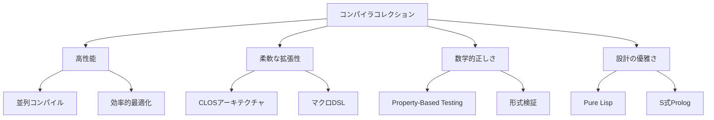
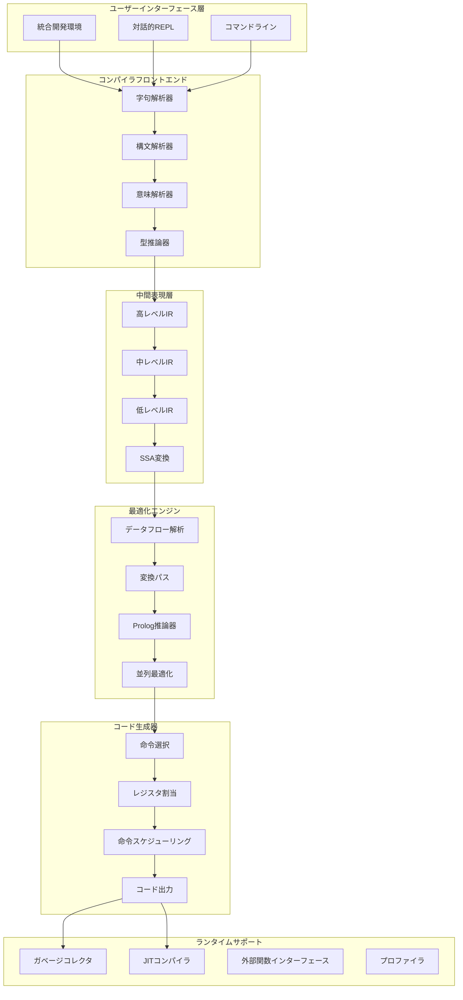
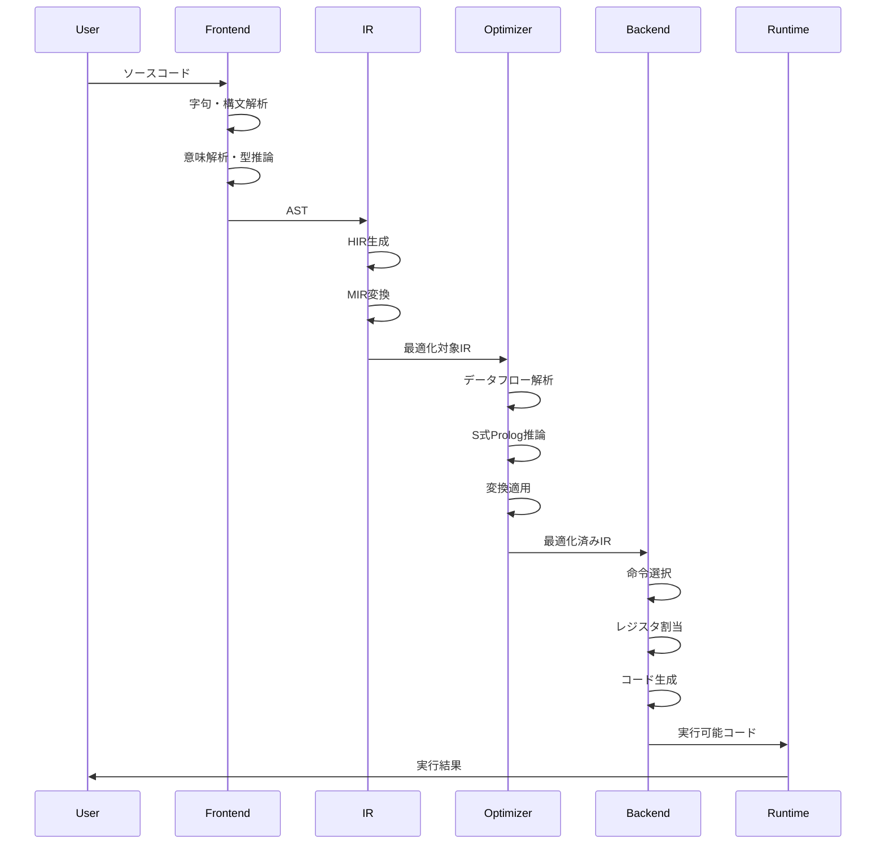
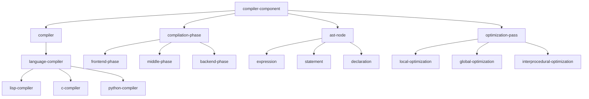
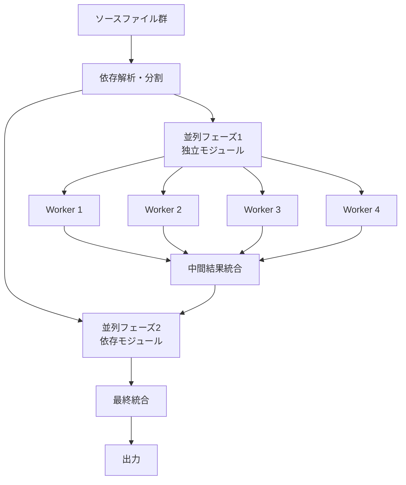
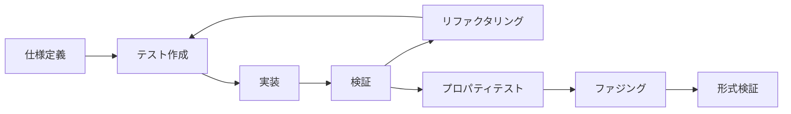
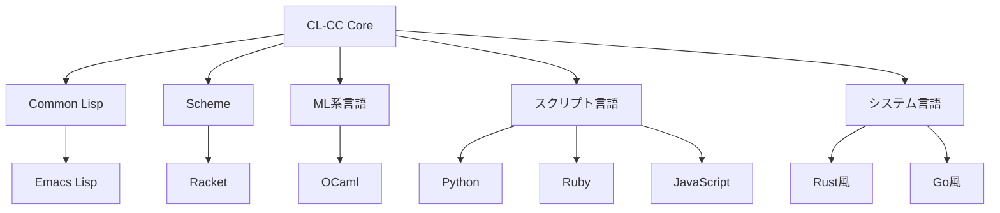

# CL-CC アーキテクチャ設計書

## エグゼクティブサマリー

CL-CC（Common Lisp Compiler Collection）は、コンパイラコレクションを目指すプロジェクトです。Pure Common Lisp実装、CLOS駆動設計、マクロメタプログラミング、S式Prolog統合、Property-Based Testingを核とし、高性能と拡張性を実現します。

## ビジョンと設計哲学

### プロジェクト目標



### 設計原則

1. **Zero External Dependencies**: 外部ライブラリに依存しない自己完結性
2. **Homoiconicity First**: S式の力を最大限に活用
3. **Correctness by Construction**: 設計段階での正しさの保証
4. **Performance without Compromise**: 最適化における妥協なき追求
5. **Extensibility through Simplicity**: シンプルさによる拡張性

## システムアーキテクチャ

### 階層型アーキテクチャ



### コンポーネント相互作用



## CLOSベースのコンポーネント設計

### クラス階層



### メタオブジェクトプロトコル活用

```lisp
(defclass compiler-metaclass (standard-class)
  ((compilation-strategies :initform nil
                          :accessor class-compilation-strategies)
   (optimization-hints :initform nil
                      :accessor class-optimization-hints)))

(defmethod validate-superclass ((class compiler-metaclass)
                               (superclass standard-class))
  t)

(defclass optimizable-mixin ()
  ()
  (:metaclass compiler-metaclass))

(defgeneric optimize-at-compile-time (object)
  (:method-combination progn))
```

## 中間表現（IR）設計

### 多層IR構造


### SSA形式

```lisp
(defclass ssa-value ()
  ((definition :initarg :definition)
   (uses :initform nil)
   (type :initarg :type)))

(defclass phi-node (ssa-value)
  ((predecessors :initarg :predecessors)
   (values :initarg :values)))

(defclass basic-block ()
  ((instructions :initform nil)
   (predecessors :initform nil)
   (successors :initform nil)
   (dominators :initform nil)
   (phi-nodes :initform nil)))
```

## S式Prolog統合

### 型推論システム

```prolog
% 型推論ルール（S式形式）
((type-of ?expr ?type)
 (cond
   ((literal ?expr ?value)
    (literal-type ?value ?type))

   ((binary-op ?expr ?op ?left ?right)
    (type-of ?left ?left-type)
    (type-of ?right ?right-type)
    (op-result-type ?op ?left-type ?right-type ?type))

   ((if-expr ?expr ?cond ?then ?else)
    (type-of ?then ?then-type)
    (type-of ?else ?else-type)
    (unify ?then-type ?else-type ?type))))
```

### 最適化ルール記述

```lisp
(define-optimization-rule constant-folding
  :pattern ((binary-op ?op (const ?a) (const ?b)))
  :condition ((pure-op-p ?op))
  :action ((const (apply ?op (list ?a ?b)))))

(define-optimization-rule strength-reduction
  :pattern ((multiply ?x (const 2)))
  :action ((shift-left ?x 1)))
```

## Property-Based Testing戦略

### コンパイラ不変条件

```lisp
(defproperty semantic-preservation
  "コンパイルは意味を保存する"
  (for-all ((prog (gen-program)))
    (equal (interpret prog)
           (execute (compile prog)))))

(defproperty optimization-soundness
  "最適化は振る舞いを変えない"
  (for-all ((prog (gen-program))
            (level (gen-integer :min 0 :max 3)))
    (behavior-equivalent-p
      (compile prog :opt 0)
      (compile prog :opt level))))

(defproperty type-safety
  "型付きプログラムは型エラーを起こさない"
  (for-all ((prog (gen-typed-program)))
    (not (signals-type-error-p (execute prog)))))
```

## パフォーマンス最適化戦略

### 並列コンパイル



### メモリ階層最適化

```lisp
(defclass cache-aware-optimizer ()
  ((cache-line-size :initform 64)
   (l1-size :initform 32768)
   (l2-size :initform 262144)
   (l3-size :initform 8388608)))

(defmethod optimize-for-cache ((optimizer cache-aware-optimizer) ir)
  (-> ir
      (loop-tiling (slot-value optimizer 'cache-line-size))
      (data-layout-optimization (slot-value optimizer 'l1-size))
      (prefetch-insertion)
      (alias-analysis)))
```

## デバッグとプロファイリング

### 統合デバッガ

```lisp
(defclass compiler-debugger ()
  ((breakpoints :initform nil)
   (watch-expressions :initform nil)
   (execution-trace :initform nil)
   (symbol-table :initform nil)))

(defmethod debug-compile ((debugger compiler-debugger) source)
  (with-debugging-context (debugger)
    (let ((ast (parse source)))
      (instrument-ast ast debugger)
      (compile-with-debug-info ast))))
```

## 拡張性メカニズム

### プラグインシステム

```lisp
(defclass compiler-plugin ()
  ((name :initarg :name)
   (version :initarg :version)
   (hooks :initform nil)))

(defgeneric register-plugin (compiler plugin)
  (:documentation "プラグインをコンパイラに登録"))

(defgeneric execute-plugin-hook (plugin hook-name &rest args)
  (:documentation "プラグインフックを実行"))
```

### DSL統合フレームワーク

```lisp
(defmacro define-compiler-dsl (name &body rules)
  `(progn
     (defclass ,name (dsl-compiler)
       ((rules :initform ',rules)))

     (defmethod compile-dsl ((dsl ,name) source)
       (apply-dsl-rules (slot-value dsl 'rules) source))))
```

## TDD（テスト駆動開発）アプローチ

### テストファースト設計

```lisp
(defmacro define-compiler-component (name &body specs)
  `(progn
     ;; テストケースを最初に定義
     (define-test-suite ,(intern (format nil "~A-TESTS" name))
       ,@(extract-test-specs specs))

     ;; 実装
     (defclass ,name (compiler-component)
       ,@(extract-class-definition specs))

     ;; プロパティテスト
     (define-properties ,(intern (format nil "~A-PROPERTIES" name))
       ,@(extract-property-specs specs))))
```

### 継続的検証



## アーキテクチャ決定記録（ADR）

### ADR-001: Pure Lisp実装の採用

**状態**: 採用
**文脈**: 外部依存を最小限に抑え、移植性と保守性を最大化する
**決定**: コンパイラコアは純粋なCommon Lispのみで実装
**結果**: 高い移植性、デバッグの容易さ、パフォーマンスは最適化で補償

### ADR-002: S式Prolog統合

**状態**: 採用
**文脈**: 型推論と最適化ルールを宣言的に記述したい
**決定**: S式形式のPrologインタープリタを統合
**結果**: 宣言的な仕様記述、制約ベース解析の実現

### ADR-003: Property-Based Testing採用

**状態**: 採用
**文脈**: コンパイラの正しさを包括的に検証する必要がある
**決定**: すべてのコンポーネントにProperty-Based Testingを適用
**結果**: 高い信頼性、バグの早期発見

### ADR-004: CLOSメタプログラミング

**状態**: 採用
**文脈**: 極限の拡張性と柔軟性を実現したい
**決定**: メタオブジェクトプロトコルを全面活用
**結果**: 柔軟な拡張可能性、動的な最適化

### ADR-005: マクロ駆動開発

**状態**: 採用
**文脈**: DSL構築と言語拡張を容易にしたい
**決定**: マクロを積極的に活用した設計
**結果**: メタプログラミング、コンパイル時最適化

## セキュリティ考慮事項

### コンパイル時セキュリティ

```lisp
(defclass secure-compiler (compiler)
  ((sandbox :initform t)
   (resource-limits :initform (make-resource-limits))
   (audit-log :initform nil)))

(defmethod compile-with-sandbox ((compiler secure-compiler) source)
  (with-resource-limits (slot-value compiler 'resource-limits)
    (with-audit-logging (slot-value compiler 'audit-log)
      (compile-source compiler source))))
```

### 実行時保護

```lisp
(defclass runtime-guard ()
  ((stack-guard :initform t)
   (heap-guard :initform t)
   (control-flow-integrity :initform t)))

(defmethod emit-guarded-code ((guard runtime-guard) code)
  (-> code
      (insert-stack-canaries)
      (add-bounds-checks)
      (enforce-cfi)))
```

## パフォーマンスベンチマーク目標

### コンパイル速度

| フェーズ | 目標性能 | 測定基準 |
|---------|----------|----------|
| 字句解析 | 100MB/s | ソースコード処理速度 |
| 構文解析 | 50MB/s | AST生成速度 |
| 最適化 | 10KLOC/s | 最適化済みIR生成 |
| コード生成 | 20KLOC/s | ネイティブコード生成 |

### 実行時性能

| カテゴリ | 目標 | ベースライン比 |
|----------|------|----------------|
| 数値計算 | 1.2x | C言語比 |
| メモリアクセス | 1.5x | C言語比 |
| 関数呼び出し | 2.0x | C言語比 |
| 動的ディスパッチ | 5.0x | Python比 |

## エコシステム統合

### 言語サポート計画



## 今後の拡張計画

### フェーズ1: コア実装（Q1 2025）
- 基本的なコンパイラフレームワーク
- Common Lispセルフホスティング
- 基礎的な最適化
- Property-Based Testing基盤

### フェーズ2: 最適化強化（Q2 2025）
- S式Prolog統合完了
- 専門的な最適化パス実装
- 並列コンパイル対応
- JITコンパイラ統合

### フェーズ3: 言語拡張（Q3 2025）
- 複数言語フロントエンド
- クロスコンパイル対応
- LLVM/WebAssemblyバックエンド
- IDE統合

### フェーズ4: エンタープライズ対応（Q4 2025）
- プロダクション品質達成
- 包括的なドキュメント
- セキュリティ監査完了
- パフォーマンス最適化完了

## 成功指標

### 技術的指標
- コンパイル速度: GCC比150%以上
- 生成コード品質: LLVM -O2相当
- メモリ使用量: 同規模コンパイラの80%以下
- テストカバレッジ: 95%以上

### コミュニティ指標
- アクティブコントリビュータ: 50人以上
- 月間ダウンロード: 10,000以上
- 対応言語: 10言語以上
- 商用採用: 5社以上

## まとめ

CL-CCは、Common Lispの力を活用し、コンパイラコレクションを実現します。Pure Lisp実装、CLOS駆動設計、マクロメタプログラミング、S式Prolog統合、Property-Based Testingという5つの柱により、高性能と拡張性を実現します。このアーキテクチャは、コンパイラ技術の新たなアプローチを示す設計です。

## 関連ドキュメント

- [📚 MASTER-SSOT](MASTER-SSOT.md) - Single Source of Truth
- [🎯 DOCUMENTATION-ARCHITECTURE](DOCUMENTATION-ARCHITECTURE.md) - ドキュメント構造
- [→ Tutorials](tutorials/) - チュートリアル
- [⚙ How-to Guides](how-to/) - 実践ガイド
- [📖 Reference](reference/) - APIリファレンス
- [💡 Explanation](explanation/) - 理論と設計思想