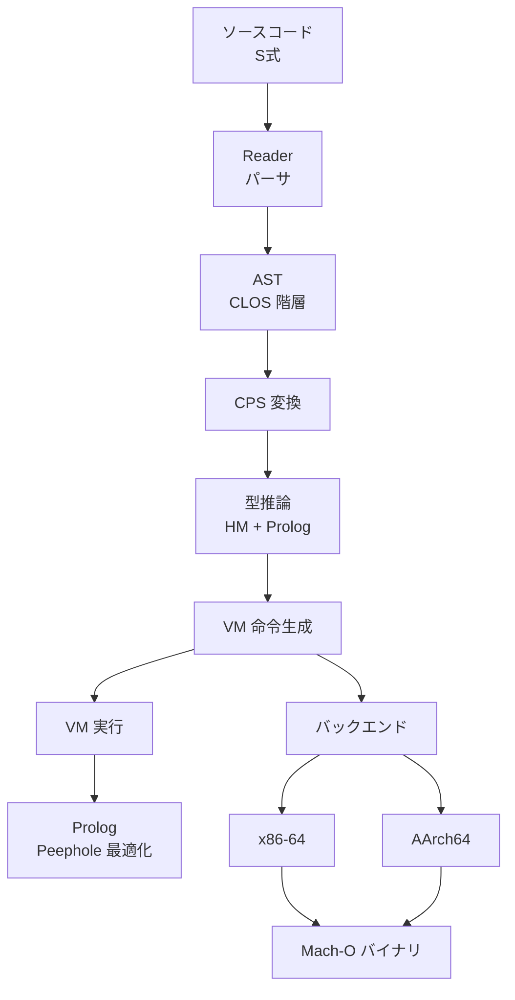
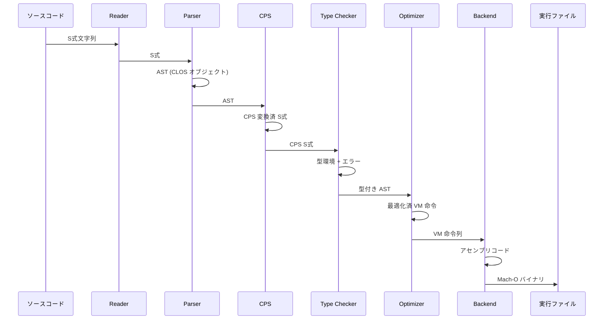
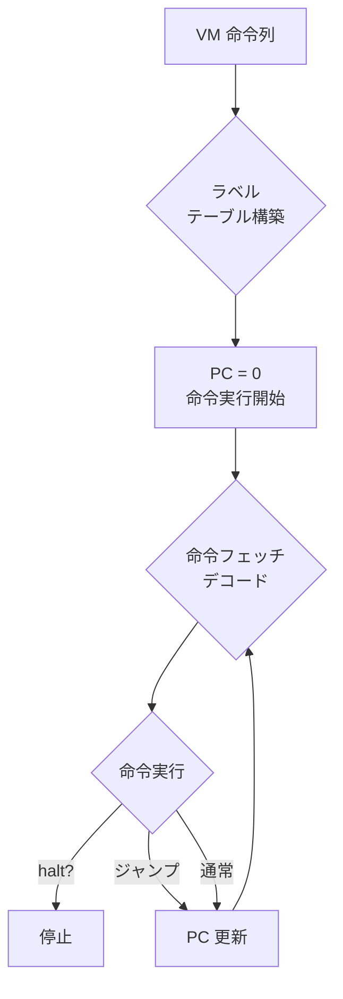
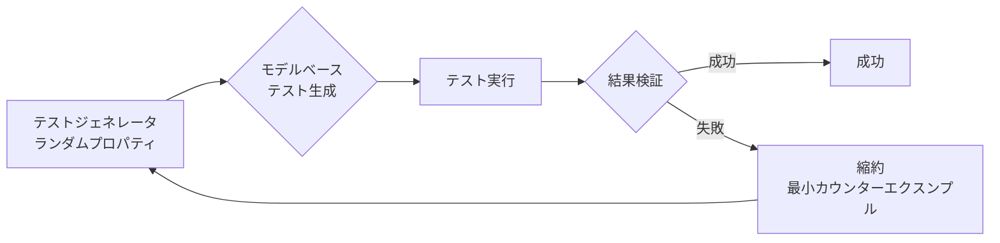

# CL-CC アーキテクチャドキュメント

## 概要

CL-CC は Common Lisp で実装された型付きコンパイラコレクションです。CLOS、Prolog、CPS 変換、マクロシステムを統合し、x86-64 と AArch64 (Mach-O バイナリ) へのネイティブコード生成をサポートします。

### 技術スタック

- **言語**: Common Lisp (SBCL 2.3.0+)
- **型システム**: Hindley-Milner 型推論 + 漸次的型付け
- **マクロシステム**: CLOS ベースのマクロ環境
- **Prolog 統合**: 命題解決と最適化のための S 式 Prolog
- **CPS 変換**: 継続渡しスタイルへの変換
- **VM**: レジスタベーススタックマシン（命令セットは CLOS）
- **バックエンド**: x86-64 / AArch64 Mach-O バイナリ生成
- **GC**: 世代別マーク・スイープ

## システム概要


```mermaid
graph TB
    A[ソースコード<br/>S式] --> B[Reader<br/>パーサ]
    B --> C[AST<br/>CLOS 階層]
    C --> D[CPS 変換]
    D --> E[型推論<br/>HM + Prolog]
    E --> F[VM 命令生成]
    F --> G[VM 実行]
    G --> H[Prolog<br/>Peephole 最適化]
    F --> I[バックエンド]
    I --> J[x86-64]
    I --> K[AArch64]
    J --> L[Mach-O バイナリ]
    K --> L
```

## コンポーネント責務

### 1. Frontend (ソース → AST)

**ファイル**: `src/frontend.lisp`, `src/reader.lisp`

**責務**:
- S 式の読み込みとパージング
- AST（抽象構文木）への変換
- ソース位置情報の追跡
- 全 Common Lisp 特殊形式のサポート

**主要クラス**:
```lisp
ast-node                ; すべての AST ノードの基底クラス（位置情報付き）
ast-int                 ; 整数リテラル
ast-var                 ; 変数参照
ast-binop              ; 二項演算子 (+ - *)
ast-if                  ; 条件分岐
ast-progn               ; 式の並列
ast-let                 ; let 束縛
ast-lambda              ; ラムダ式
ast-function            ; 関数参照 (#'var)
ast-flet               ; 非再帰ローカル関数束縛
ast-labels              ; 相互再帰ローカル関数束縛
ast-block               ; 名前付きブロック
ast-return-from         ; ブロックからの復帰
ast-tagbody             ; go/goto 形式の制御フロー
ast-go                  ; goto ジンプ
ast-setq                ; 変数代入
ast-catch               ; 例外ハンドラ
ast-throw               ; 例外スロー
ast-unwind-protect     ; クリーンアップ保護
ast-quote               ; クォート式
ast-the                 ; 型宣言
```

**データフロー**:
```
S式 "(+ 1 2)"
  ↓ lower-sexp-to-ast
ast-binop(op: +, lhs: ast-int(1), rhs: ast-int(2))
  ↓ compile-ast
VM 命令列
```

### 2. CPS 変換

**ファイル**: `src/cps.lisp`

**責務**:
- AST を継続渡しスタイル (CPS) に変換
- すべての制御フロー構造の変換
- 関数呼び出しとラムダの変換
- ブロックとタグボディの変換

**CPS 変換の例**:

元のコード:
```lisp
(let ((x 1)
  (+ x 2))
```

CPS 変換後:
```lisp
(lambda (k)
  (lambda (x)
    (lambda (ignored)
      (funcall k (+ x 2))
    )
  )
  1
)
```

**特殊な CPS パターン**:
- **ラムダ**: 継続をパラメータとして受け取る
  ```lisp
  (lambda (x y) body)
  → (lambda (k) (lambda (x y k)
       (funcall k (body ...)))
  ```
- **条件分岐**: 条件式が継続を引数に取る
  ```lisp
  (if cond then else)
  → (cond (lambda (v)
       (if (zerop v) then else))
  ```
- **ブロック**: `block` 名前付き継続を作成
- **タグボディ**: `tagbody` は goto 可能なラベルを提供
- **例外**: `catch`/`throw` は動的タグを使用して非ローカル遷移

### 3. 型推論システム

**ファイル**: `src/prolog.lisp` (一部型推論ルール含む)

**責務**:
- Hindley-Milner 型推論アルゴリズム
- Prolog ルールベースの型推論エンジン
- 型環境の管理と単一化
- 型エラーのレポーティング

**型推論ルールの例**:
```lisp
;; 整数定数の型
(def-rule ((type-of (const ?val) ?env (integer-type))
            (when (integerp ?val))))

;; 変数参照の型推論
(def-rule ((type-of (var ?name) ?env ?type)
            (env-lookup ?env ?name ?type)))

;; 二項演算子の型推論
(def-rule ((type-of (binop ?op ?a ?b) ?env (integer-type))
            (type-of ?a ?env (integer-type))
            (type-of ?b ?env (integer-type))
            (member ?op (+ - * / mod))))

;; 条件式の型推論
(def-rule ((type-of (if ?cond ?then ?else) ?env (boolean-type))
            (type-of ?cond ?env (boolean-type))
            (type-of ?then ?env ?type)
            (type-of ?else ?env ?type)))
```

**型表現**:
```lisp
integer-type   ; 整数型
boolean-type   ; ブール型
string-type    ; 文字列型
list-type      ; リスト型
function-type  ; 関数型
```

### 4. コンパイラ

**ファイル**: `src/compiler.lisp`

**責務**:
- AST から VM 命令列へのコンパイル
- レジスタ割り当て
- ラベル管理
- 環境管理（変数、関数、ブロック、タグボディ）
- Prolog peephole 最適化の適用

**コンテキスト構造**:
```lisp
(defclass compiler-context ()
  ((instructions       ; 生成された命令列
    :initform nil)
    next-register     ; 次のレジスタ番号
    :initform 0
    next-label        ; 次のラベル番号
    :initform 0
    env               ; 変数環境: (name . register) の連想リスト
    :initform nil
    block-env         ; ブロック環境: (name . (exit-label . result-reg))
    :initform nil
    tagbody-env       ; タグボディ環境: (tag . label) の連想リスト
    :initform nil))
```

**コンパイル例**:
```lisp
;; ソース: "(+ 1 2)"

;; AST
(ast-binop op: + lhs: (ast-int 1) rhs: (ast-int 2))

;; コンパイル後の命令列
(
  (vm-const :dst :R0 :value 1)
  (vm-const :dst :R1 :value 2)
  (vm-add :dst :R2 :lhs :R0 :rhs :R1)
  (vm-halt :reg :R2)
)
```

**制御フローのコンパイル**:

`if` の場合:
```lisp
;; ソース: "(if cond then else)"

;; 生成される命令
(vm-const :dst :R0 :value <cond-value>)
(vm-jump-zero :reg :R0 :label :else)
;; then ブロック
(vm-const :dst :R1 :value <then-value>)
(vm-move :dst :R2 :src :R1)
(vm-jump :label :ifend)
(:label :else)
;; else ブロック
(vm-const :dst :R3 :value <else-value>)
(vm-move :dst :R2 :src :R3)
(:label :ifend)
```

`let` の場合:
```lisp
;; ソース: "(let ((x 1) (+ x 2))"

;; 環境拡張: ((x . R0))
;; body コンパイル時に x は R0 にバインド
```

ラムダの場合（クロージャ作成）:
```lisp
;; 自由変数の検出
(defun find-free-variables (ast)
  "AST 内の自由変数をすべて見つける"
  ...)

;; クロージャ命令生成
(vm-closure :dst :R10
           :label :lambda_0
           :params (:PARAM_0 :PARAM_1)
           :captured ((x . R5) ; 外部環境からキャプチャ
                  (y . R3)))
```

### 5. 仮想マシン (VM)

**ファイル**: `src/vm.lisp`, `src/vm-*.lisp` (モジュール分割)

**責務**:
- VM 命令の実行
- レジスタ管理
- ヒープ管理（GC なし、単純なヒープ）
- 呼び出しスタックの管理
- クロージャのサポート
- I/O 操作

**VM 状態**:
```lisp
(defclass vm-state ()
  ((registers        ; レジスタ: keyword -> value
    :initform (make-hash-table)
    output-stream     ; 出力ストリーム
    :initarg *standard-output*
    call-stack       ; 呼び出しスタック: ((return-pc . result-reg) . captured-env) ...
    :initform nil
    closure-env      ; 現在のクロージャ環境: (symbol . register) の連想リスト
    :initform nil
    heap             ; ヒープ: address -> object
    :initform (make-hash-table)
    heap-counter      ; 次のヒープアドレス
    :initform 0))
```

**VM 命令セット**:

**基本命令**:
```lisp
vm-const   ; 定数をレジスタにロード
vm-move    ; レジスタ間の移動
vm-add     ; 加算
vm-sub     ; 減算
vm-mul     ; 乗算
vm-label   ; ラベル定義
vm-jump    ; ジンプ
vm-jump-zero ; ゼロならジャンプ
vm-print   ; 値の出力
vm-halt    ; 停止
```

**関数呼び出し命令**:
```lisp
vm-closure    ; クロージャオブジェクトの作成
vm-call      ; 関数呼び出し
vm-ret       ; 復帰
vm-func-ref   ; 関数参照の作成
```

**環境参照命令**:
```lisp
vm-env-ref   ; クロージャ環境から変数参照
```

**制御フロー命令**:
```lisp
vm-push      ; 呼び出しスタックへのプッシュ
vm-pop       ; 呼び出しスタックからのポップ
```

**命令実行例**:

加算の実行:
```lisp
;; 命令: (vm-add :dst :R2 :lhs :R0 :rhs :R1)

;; 実行:
;; 1. R0 の値を取得
;; 2. R1 の値を取得
;; 3. R0 + R1 を計算
;; 4. R2 に結果を格納
```

関数呼び出しの実行:
```lisp
;; 命令: (vm-call :dst :R3 :func :R5 :args (:R6 :R7))

;; 実行:
;; 1. R5 にクロージャオブジェクトがあると仮定
;; 2. クロージャからエントリラベルとパラメータを取得
;; 3. 現在の呼び出しスタックを保存
;; 4. クロージャのキャプチャ変数をレジスタにロード
;; 5. 引数をパラメータにバインド
;; 6. エントリラベルにジャンプ
```

### 6. Prolog 最適化

**ファイル**: `src/prolog.lisp` (`apply-prolog-peephole` 関数)

**責務**:
- VM 命令列のローカルベースの最適化
- 定数折りたたみ
- 不要な move 命令の削除
- 関数のインライン化

**最適化ルールの例**:
```lisp
;; 定数 + 0 の最適化
(:add ?dst ?a ?z)
(:when (:const ?z 0))
(:rewrite (:move ?dst ?a)))

;; 定数 * 1 の最適化
(:mul ?dst ?a ?o)
(:when (:const ?o 1))
(:rewrite (:move ?dst ?a)))

;; move chain の削除
(:move ?dst ?a)
(:move ?src ?a)
(:rewrite (identity)) ; 削除
```

最適化前後:
```lisp
;; 最適化前
(vm-const :dst :R0 :value 1)
(vm-const :dst :R1 :value 0)
(vm-add :dst :R2 :lhs :R0 :rhs :R1)
(vm-move :dst :R3 :src :R2)

;; 最適化後
(vm-const :dst :R0 :value 1)
(vm-move :dst :R2 :src :R0)
```

### 7. バックエンド (コード生成)

**ファイル**: `src/backend/x86-64.lisp`, `src/backend/aarch64.lisp`

**責務**:
- VM 抽象命令からアセンブラ言語への変換
- レジスタ割り当て
- Mach-O バイナリフォーマットの出力

**x86-64 バックエンドの例**:

```lisp
;; VM 命令: (vm-const :dst :R0 :value 42)
;; x86-64 出力:
mov rax, 42

;; VM 命令: (vm-add :dst :R2 :lhs :R0 :rhs :R1)
;; x86-64 出力:
mov rcx, rax
add rcx, r8
```

**レジスタマッピング**:
```lisp
;; 仮想レジスタ: R0-R7
;; x86-64 レジスタ:
R0 → rax
R1 → rbx
R2 → rcx
R3 → rdx
R4 → r8
R5 → r9
R6 → r10
R7 → r11
```

## ファイル構成

```
cl-cc/
├── cl-cc.asd                ; ASDF システム定義
│
├── src/                     ; ソースコード
│   ├── package.lisp        ; パッケージ定義とエクスポート
│   ├── frontend.lisp        ; AST クラスとパージング
│   ├── reader.lisp         ; S 式リーダ（未使用）
│   ├── cps.lisp            ; CPS 変換
│   ├── prolog.lisp         ; Prolog エンジンと型推論ルール
│   ├── vm.lisp             ; VM コアと基本命令
│   ├── vm-primitives.lisp  ; VM プリミティブ命令（型述語、比較など）
│   ├── vm-io.lisp          ; VM I/O 操作
│   ├── vm-list.lisp        ; リスト操作命令
│   ├── vm-strings.lisp      ; 文字列操作命令
│   ├── vm-hash.lisp        ; ハッシュテーブル操作命令
│   ├── vm-conditions.lisp  ; VM 条件
│   ├── macro.lisp          ; マクロシステム
│   └── compiler.lisp       ; メインコンパイラ
│
├── backend/                  ; バックエンド
│   ├── x86-64.lisp        ; x86-64 バックエンド
│   └── aarch64.lisp       ; AArch64 バックエンド
│
├── tests/                   ; テスト
│   ├── compiler-tests.lisp  ; コンパイラテスト
│   ├── cps-tests.lisp       ; CPS 変換テスト
│   ├── prolog-tests.lisp    ; Prolog テスト
│   ├── ast-roundtrip-tests.lisp  ; AST 変換ラウンドトリップテスト
│   ├── macro-tests.lisp     ; マクロテスト
│   ├── closure-tests.lisp   ; クロージャテスト
│   ├── call-conv-tests.lisp ; 呼び出し規約テスト
│   ├── control-flow-tests.lisp ; 制御フローテスト
│   └── pbt/                ; プロパティベーストテスト
│       ├── framework.lisp     ; PBT フレームワーク
│       ├── ast-pbt-tests.lisp
│       ├── cps-pbt-tests.lisp
│       ├── prolog-pbt-tests.lisp
│       ├── vm-pbt-tests.lisp
│       ├── vm-heap-pbt-tests.lisp
│       └── macro-pbt-tests.lisp
│
├── run-tests.lisp          ; テスト実行スクリプト
├── README.md              ; プロジェクト概要
└── docs/                  ; ドキュメント
```

## ブートストラップ戦略

CL-CC は3段階のブートストラップ戦略を使用します。

### Stage 0: 最小ブートストラップ

**目標**: 自己ホスト可能な最小限のコンパイラ

**機能**:
- 整数と浮動小数点数の四則演算（`+`, `-`, `*`）
- 条件分岐（`if`）
- 変数束縛（`let`）
- シーケンス（`progn`）
- `print` 関数（VM 実行のみ）
- 関数呼び出しとラムダ
- x86-64 と AArch64 の Mach-O 出力

**制約**:
- 文字列操作は未実装
- I/O は制限的
- GC は未実装（ヒープは無限に成長）
- 最適化は最小限

### Stage 1: 基本的言語機能

**目標**: 実用的なプログラミング言語

**追加機能**:
- 完全な文字列操作
- リスト操作（`cons`, `car`, `cdr`, `list` など）
- ハッシュテーブル（`make-hash-table`, `gethash`, `sethash`）
- 入出力（`read`, `write`, `open-file` など）
- 世代別 GC
- 高度な制御フロー（`tagbody`, `go`, `block`, `return-from`）
- 例外処理（`catch`, `throw`, `unwind-protect`）
- 複数値を返す `multiple-value-call`
- タイプシステム（部分的実装）

### Stage 2: 高度な機能

**目標**: 本格的なプログラミング言語

**追加機能**:
- 完全な Hindley-Milner 型推論
- 型注釈構文（TypeScript スタイル）
- 型指向の最適化
- マクロシステムの拡張
- 高度な最適化パス
- モジュラシステム（構造体、インタフェース）
- パターンマッチ
- 並列処理プリミティブ
- 対話的なデバッグ情報

## データフロー

### 完全なコンパイルフロー


```mermaid
sequenceDiagram
    participant S as ソースコード
    participant R as Reader
    participant P as Parser
    participant C as CPS
    participant T as Type Checker
    participant O as Optimizer
    participant B as Backend
    participant E as 実行ファイル

    S->>R: S式文字列
    R->>P: S式
    P->>P: AST (CLOS オブジェクト)
    P->>C: AST
    C->>C: CPS 変換済 S式
    C->>T: CPS S式
    T->>T: 型環境 + エラー
    T->>O: 型付き AST
    O->>O: 最適化済 VM 命令
    O->>B: VM 命令列
    B->>B: アセンブリコード
    B->>E: Mach-O バイナリ
```

### 各フェーズの詳細

#### 1. パージング

**入力**: S式文字列
**出力**: CLOS AST オブジェクト

```lisp
;; 入力: "(+ 1 2)"

;; 出力:
#<AST-BINOP :SOURCE-FILE "repl" :SOURCE-LINE 1 :SOURCE-COLUMN 1>
  :OP +
  :LHS #<AST-INT :SOURCE-FILE "repl" :SOURCE-LINE 1 :SOURCE-COLUMN 4>
         :VALUE 1
  :RHS #<AST-INT :SOURCE-FILE "repl" :SOURCE-LINE 1 :SOURCE-COLUMN 6>
         :VALUE 2
```

#### 2. CPS 変換

**入力**: CLOS AST
**出力**: CPS 変換済 S式（継続渡しスタイル）

```lisp
;; 入力 AST:
(ast-binop op: + lhs: (ast-int 1) rhs: (ast-int 2))

;; 出力:
(lambda (k)
  (lambda (TMP_0)
    (lambda (TMP_1)
      (funcall k (+ TMP_0 TMP_1))
    )
    1
  )
  2
)
```

#### 3. 型推論

**入力**: CPS 変換済 S式
**出力**: 型情報付き環境

```lisp
;; 入力: (+ 1 2)

;; 型推論プロセス:
;; 1. 1 の型: integer-type
;; 2. 2 の型: integer-type
;; 3. + の型規則: (integer-type integer-type) -> integer-type
;; 結果: integer-type
```

#### 4. コンパイル

**入力**: 型付き AST
**出力**: VM 命令列

```lisp
;; 入力:
(ast-binop op: + lhs: (ast-int 1) rhs: (ast-int 2))

;; 出力命令列:
((vm-const :dst :R0 :value 1)
 (vm-const :dst :R1 :value 2)
 (vm-add :dst :R2 :lhs :R0 :rhs :R1)
 (vm-halt :reg :R2))
```

#### 5. 最適化

**入力**: VM 命令列
**出力**: 最適化済 VM 命令列

```lisp
;; 入力:
((vm-const :dst :R0 :value 1)
 (vm-const :dst :R1 :value 0)
 (vm-add :dst :R2 :lhs :R0 :rhs :R1))

;; 出力（定数折りたたみ適用）:
((vm-const :dst :R0 :value 1)
 (vm-move :dst :R2 :src :R0))
```

#### 6. コード生成

**入力**: 最適化済 VM 命令列
**出力**: Mach-O バイナリ

```
; x86-64 出力例:
clcc_entry:
  mov rax, 1
  add rax, 2
  ret
```

## 設計上の決定事項

### CLOS の活用

**決定**: CLOS（Common Lisp Object System）をアーキテクチャの基盤として使用

**理由**:
- **柔軟性**: 多重ディスパッチにより、新しい命令やデータ型を簡単に追加
- **抽象化**: 命令セットは CLOS クラス階層として表現
- **拡張性**: 新しいバックエンドは `target` クラスを継承するだけで実装可能

**例**:
```lisp
;; 新しい命令の定義
(defclass vm-div (vm-binop) ())

;; 実行メソッドの定義
(defmethod execute-instruction ((inst vm-div) state pc labels)
  (vm-reg-set state (vm-dst inst)
               (floor (/ (vm-reg-get state (vm-lhs inst))
                      (vm-reg-get state (vm-rhs inst))))
  (values (1+ pc) nil))
```

### Prolog による最適化

**決定**: S 式 Prolog を peephole 最適化に使用

**理由**:
- **宣言的**: ルールを追加するだけで最適化を拡張可能
- **パターンマッチ**: 複雑なパターンを簡潔に記述
- **バックトラック**: 複数の最適化候補を探索

**利点**:
- ルールの追加で新たな最適化を導入
- 条件付き最適化（特定のコンテキストでのみ有効なルール）
- デバッグが容易（ルールベースで可視化）

### CPS 変換

**決定**: 継続渡しスタイルを採用

**理由**:
- **簡素な制御フロー**: goto/label のみで表現
- **最適化が容易**: 定数伝搬、末尾再帰最適化が簡単
- **クロージャの自然表現**: 環境のキャプチャが明示的

**トレードオフ**:
- 関数呼び出しは継続を引数に取る
- 末尾呼び出しは直接継続を呼び出す（スタック消費なし）
- 非末尾呼び出しは継続を保存

**末尾再帰の例**:
```lisp
;; 元コード
(defun fact (n)
  (if (= n 0)
      1
      (* n (fact (- n 1))))

;; CPS 変換後（最適化前）
(defun fact (n)
  (lambda (k)
    (if (= n 0)
        (funcall k 1)
        (funcall (fact (- n 1))
          (lambda (v)
            (funcall k (* n v))))))

;; 末尾再帰最適化後
;; 継続を直接渡すことでスタック消費なし
```

### VM 設計

**決定**: レジスタベースのスタックマシンを採用

**理由**:
- **単純さ**: 命令セットが小さく、実装が容易
- **移植性**: レジスタ割り当てだけを変更すれば新しいアーキテクチャに対応
- **デバッグ**: レジスタと命令の状態が明示的

**制約**:
- レジスタ割り当ては未実装（スピルは将来の課題）
- 大きなプログラムではレジスタが枯渇する可能性
- 解決策: スピル + レジスタ再利用

### ヒープ設計

**決定**: シンプルなハッシュテーブルベースのヒープ

**理由**:
- **単純さ**: 実装が容易、デバッグがしやすい
- **柔軟性**: 任意の CLOS オブジェクトを格納可能
- **拡張性**: GC を追加する際、既存コードへの影響が最小

**制約**:
- 現在は GC なし（ヒープは無限に成長）
- 将来: 世代別マーク・スイープ GC を実装予定

### マクロシステム

**決定**: CLOS ベースのマクロ環境

**理由**:
- **Lisp 的**: Common Lisp のマクロシステムの感覚に近い
- **拡張性**: 新しい構文をマクロとして追加可能
- **コンパイル時展開**: マクロはコンパイル時に完全に展開される

**マクロ環境の構造**:
```lisp
(defclass compilation-env ()
  ((macros         ; マクロ名 -> マクロ関数
    :initform nil)
    (functions      ; 関数名 -> レジスタ番号
    :initform nil)
    (variables      ; 変数名 -> レジスタ番号
    :initform nil)
    (parent         ; 親環境
    :initform nil))
```

## トレードオフとトレードオフ

### コンパイルのトレードオフ


```mermaid
graph LR
    A[ソースコード<br/>S式] --> B[Reader<br/>S式パーサ]
    B --> C[Parser<br/>lower-sexp-to-ast]
    C --> D[AST<br/>CLOS オブジェクト]
    D --> E{CPS 変換}
    E --> F[CPS 変換済<br/>S式]
    F --> G[コンパイラ<br/>compile-ast]
    G --> H[VM 命令列]
    H --> I[Prolog<br/>peephole 最適化]
    I --> J[最適化済<br/>VM 命令列]
    J --> K[バックエンド<br/>emit-assembly]
    K --> L[アセンブリ]
    L --> M[リンカ]
    M --> N[Mach-O<br/>バイナリ]
```

### VM 実行のトレードオフ


```mermaid
graph TD
    A[VM 命令列] --> B{ラベル<br/>テーブル構築}
    B --> C[PC = 0<br/>命令実行開始]
    C --> D{命令フェッチ<br/>デコード}
    D --> E{命令実行}
    E -->|halt?| F[停止]
    E -->|ジャンプ| G[PC 更新]
    E -->|通常| G
    G --> D
```

### プロパティベーステストのトレードオフ


```mermaid
graph LR
    A[テストジェネレータ<br/>ランダムプロパティ] --> B{モデルベース<br/>テスト生成}
    B --> C[テスト実行]
    C --> D{結果検証}
    D -->|成功| E[成功]
    D -->|失敗| F[縮約<br/>最小カウンターエクスンプル]
    F --> A
```

## パフォーマンス特性

### 起動時

- **コンパイル速度**: Smalltalk 並み（CLOS の動的性のため）
- **実行速度**: C より遅い（VM インタプリタ）
  - 将来: JIT コンパイルで改善可能
- **起動速度**: 高速（Smalltalk と同様のイメージロード）

### メモリ使用

- **コンパイル時**: 中程度（AST のメモリ消費）
- **VM**: ヒープベース（現在は GC なし）
  - 将来: 世代別 GC でメモリ使用量を削減

### コードサイズ

- **バックエンド出力**: x86-64 で約 2-3x C より大きい
- **要因**:
  1. VM インタプリタのオーバーヘッド
  2. 詳細なエラーチェック
  3. 最適化が未完成

### 将来の改善点

1. **JIT コンパイル**: ホットパスでネイティブコードを生成
2. **レジスタ割り当て**: 線形レジスタ割り当てアルゴリズム
3. **インライン化**: 複数の命令を単一命令に結合
4. **高度な最適化**:
   - ループ不変式解析
   - 共通部分式の削除
   - 定数伝搬
   - 末尾再帰最適化
5. **GC 実装**: 世代別マーク・スイープ GC

## 拡張ポイント

### 新しい命令の追加

1. CLOS クラスを定義（例: `vm-div`）
2. `execute-instruction` メソッドを実装
3. `instruction->sexp` メソッドを実装
4. バックエンドで `emit-instruction` メソッドを実装

### 新しいバックエンドの追加

1. `target` クラスを継承（例: `llvm-target`）
2. `target-register` メソッドを実装
3. 各命令に対して `emit-instruction` メソッドを実装

### 新しい型の追加

1. 型クラスを定義（例: `float-type`）
2. 型推論ルールを追加（例: `(def-rule ((type-of (binop + ?a ?b) ?env (float-type)) ...)`）
3. 型チェックロジックを追加（必要に応じて）

## まとめ

CL-CC は以下の特徴を持つ型付き Common Lisp コンパイラです:

- **CLOS ベース**: 柔軟性と拡張性を両立
- **Prolog 最適化**: 宣言的なルールベース最適化
- **CPS 変換**: 制御フローの簡素化と最適化
- **VM アーキテクチャ**: 移植可能な命令セット
- **マルチターゲット**: x86-64 と AArch64 のサポート
- **テスト主導**: プロパティベーステストによる正しさ保証

このアーキテクチャはブートストラップ段階で機能を拡張しつつ、本格的なプログラミング言語へと発展を続けています。
