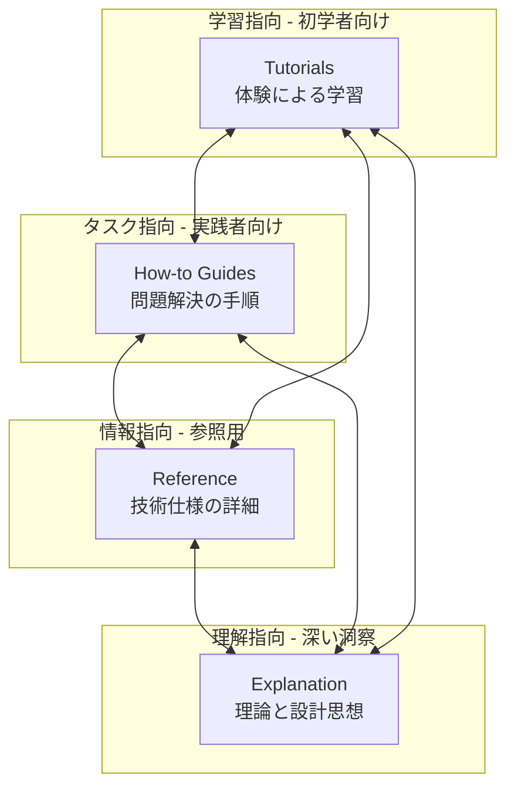
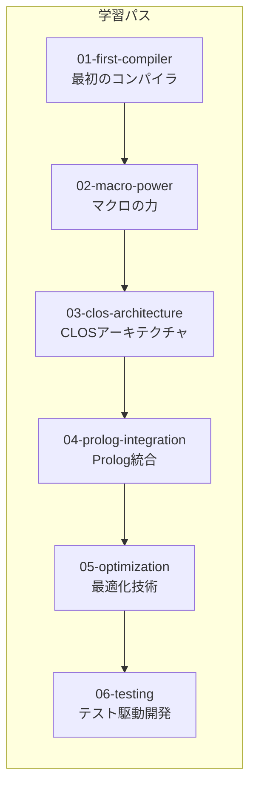
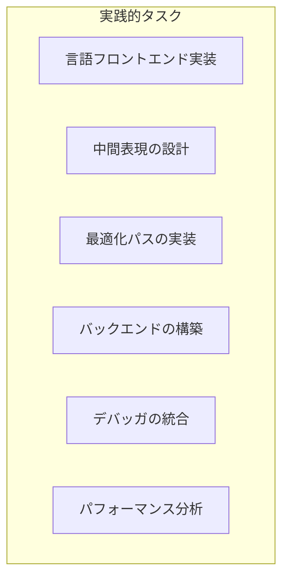
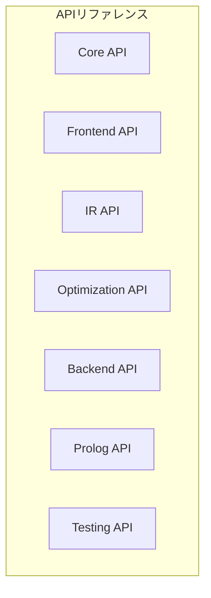
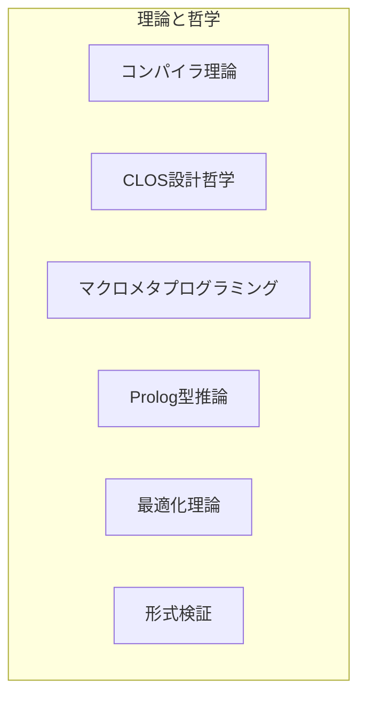
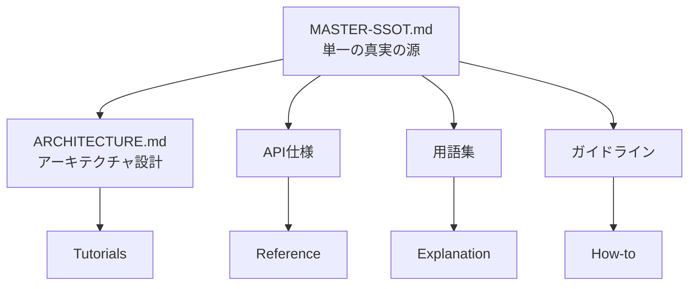
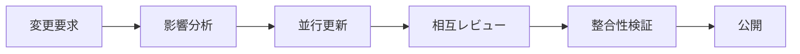
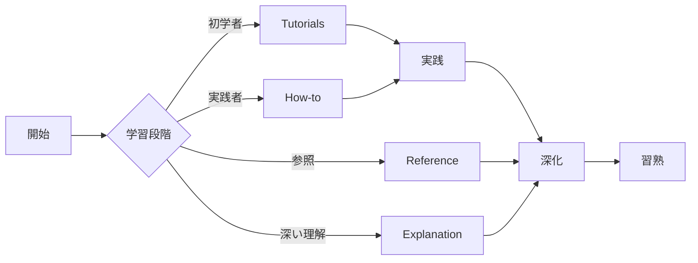
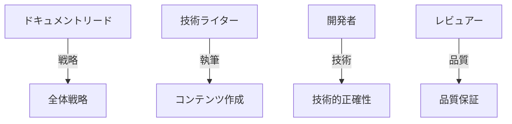
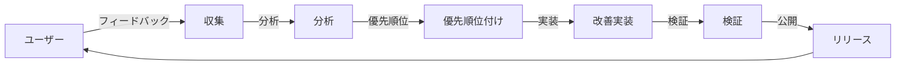

# CL-CC ドキュメントアーキテクチャ

## 概要

CL-CC（Common Lisp Compiler Collection）のドキュメントは、Diátaxisフレームワークに準拠し、学習・実践・参照・理解の4つの象限で構成されています。本ドキュメントは、すべてのドキュメントの構造と関係性を定義し、Single Source of Truth (SSOT) の原則を徹底します。

## Diátaxisフレームワーク構造

## ドキュメント構造マッピング

### 1. Tutorials（チュートリアル）
**目的**: 初学者が手を動かしながら学ぶ

### 2. How-to Guides（ハウツーガイド）
**目的**: 特定の問題を解決する

### 3. Reference（リファレンス）
**目的**: 完全で正確な技術仕様

### 4. Explanation（説明）
**目的**: 深い理解と設計思想

## 相互参照マトリックス

| トピック | Tutorial | How-to | Reference | Explanation |
|---------|----------|---------|-----------|-------------|
| **コンパイラコア** | 01-first-compiler | implement-frontend | core-api | compiler-theory |
| **マクロシステム** | 02-macro-power | macro-dsl-creation | macro-api | metaprogramming |
| **CLOS** | 03-clos-architecture | class-hierarchy | clos-api | clos-philosophy |
| **Prolog統合** | 04-prolog-integration | prolog-rules | prolog-api | type-inference |
| **最適化** | 05-optimization | optimization-pass | optimization-api | optimization-theory |
| **テスト** | 06-testing | property-testing | testing-api | formal-verification |

## ドキュメント品質基準

### 必須要素

#### Tutorials
- [ ] 明確な学習目標
- [ ] ステップバイステップの手順
- [ ] 実行可能なコード例
- [ ] 期待される出力
- [ ] トラブルシューティング

#### How-to Guides
- [ ] 明確な問題定義
- [ ] 前提条件の明示
- [ ] 具体的な解決手順
- [ ] 代替アプローチ
- [ ] 関連リソースへのリンク

#### Reference
- [ ] 完全なAPI仕様
- [ ] パラメータの詳細説明
- [ ] 返り値の仕様
- [ ] エラー条件
- [ ] 使用例

#### Explanation
- [ ] 背景と文脈
- [ ] 理論的基礎
- [ ] 設計決定の根拠
- [ ] トレードオフの説明
- [ ] 将来の展望

## SSOT原則の実装

### 情報の一元管理

### バージョン管理戦略

1. **Semantic Versioning**: すべてのドキュメントはセマンティックバージョニングに従う
2. **変更追跡**: 重要な変更はCHANGELOG.mdに記録
3. **レビュープロセス**: すべての変更は技術レビューを経る

### 更新プロトコル

## ドキュメント間のナビゲーション

### クロスリファレンス規則

- `[→ Tutorial: タイトル](path/to/tutorial.md)` - チュートリアルへのリンク
- `[⚙ How-to: タイトル](path/to/howto.md)` - ハウツーガイドへのリンク
- `[📖 Reference: API名](path/to/reference.md#api)` - リファレンスへのリンク
- `[💡 Explanation: 概念](path/to/explanation.md)` - 説明へのリンク

### ナビゲーションパス

## 品質保証プロセス

### ドキュメントレビューチェックリスト

#### 技術的正確性
- [ ] コード例が動作することを確認
- [ ] API仕様が正確であることを確認
- [ ] 理論的説明が正確であることを確認

#### 一貫性
- [ ] 用語の統一性を確認
- [ ] スタイルガイドラインに準拠
- [ ] 相互参照が正しいことを確認

#### 完全性
- [ ] すべての必須セクションが存在
- [ ] 例が十分に提供されている
- [ ] エッジケースが説明されている

#### アクセシビリティ
- [ ] 明確で簡潔な文章
- [ ] 適切な図表の使用
- [ ] 段階的な複雑性の増加

## メンテナンスガイドライン

### 定期レビュースケジュール

| 頻度 | 対象 | アクション |
|------|------|------------|
| 毎週 | 新規追加ドキュメント | 技術レビューと統合 |
| 毎月 | 既存ドキュメント | 更新と改善 |
| 四半期 | 全体構造 | 構造の最適化 |
| 年次 | 完全監査 | 包括的な品質評価 |

### 責任分担

## 継続的改善

### フィードバックループ

### メトリクス

- **利用頻度**: 各ドキュメントのアクセス数
- **完了率**: チュートリアルの完了率
- **満足度**: ユーザーフィードバックスコア
- **更新頻度**: ドキュメントの鮮度
- **エラー率**: 報告されたエラーの数

## まとめ

このドキュメントアーキテクチャは、CL-CCプロジェクトの知識体系を体系的に組織化し、すべてのステークホルダーが必要な情報に効率的にアクセスできることを保証します。Diátaxisフレームワークの原則に従い、学習、実践、参照、理解の各側面から包括的なドキュメンテーションを提供します。