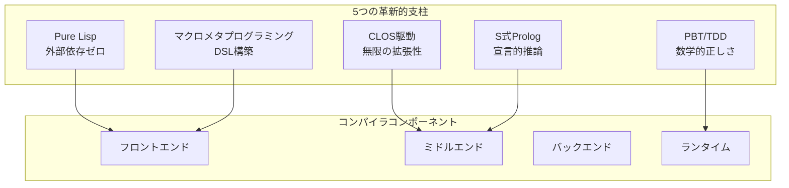
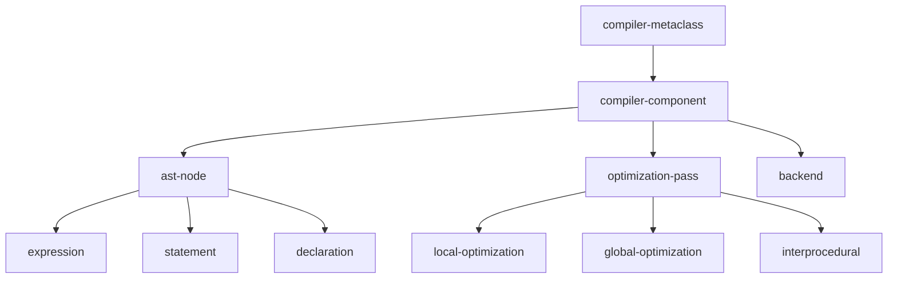
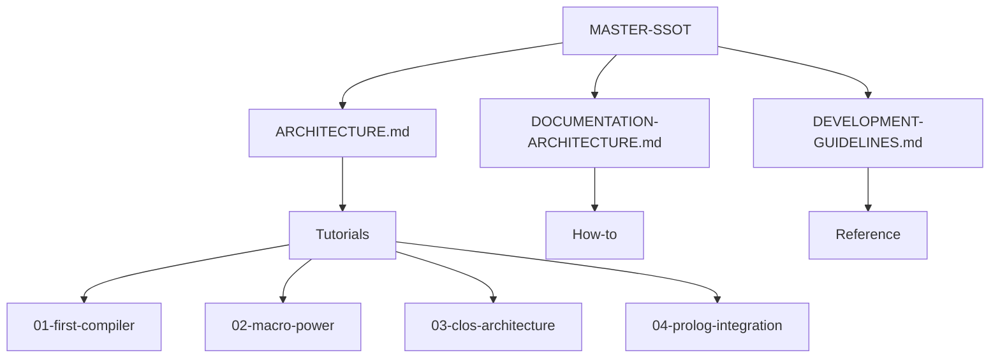

# CL-CC MASTER-SSOT (Single Source of Truth)

## 🌟 ビジョン宣言

> **世界最高峰のコンパイラコレクション** - Pure Common Lispによる究極のコンパイラ技術の実現

CL-CCは、コンパイラ技術の頂点を極める野心的プロジェクトです。外部依存ゼロ、CLOS駆動設計、マクロメタプログラミング、S式Prolog統合、Property-Based Testingという5つの革新的支柱により、従来のコンパイラの限界を超越します。

## 📐 アーキテクチャ概要



## 📚 ドキュメント構造（Diátaxis準拠）

### ドキュメントマトリックス

| 種別 | 目的 | 対象者 | 主要ドキュメント |
|------|------|--------|------------------|
| **Tutorials** | 学習 | 初学者 | [01-first-compiler](tutorials/01-first-compiler.md)<br/>[02-macro-power](tutorials/02-macro-power.md)<br/>[03-clos-architecture](tutorials/03-clos-architecture.md)<br/>[04-prolog-integration](tutorials/04-prolog-integration.md) |
| **How-to** | 実践 | 実装者 | [implement-frontend](how-to/implement-frontend.md)<br/>[implement-optimization-pass](how-to/implement-optimization-pass.md) |
| **Reference** | 参照 | 開発者 | [core-api](reference/core-api.md)<br/>[clos-hierarchy](reference/clos-hierarchy.md) |
| **Explanation** | 理解 | 研究者 | [compiler-theory](explanation/compiler-theory.md)<br/>[clos-utilization](explanation/clos-utilization.md) |

## 🎯 核心技術仕様

### 1. Pure Lisp実装

```lisp
;; 外部依存ゼロの原則
(defparameter *allowed-dependencies* '())
(defparameter *forbidden-operations*
  '(cffi:foreign-funcall
    sb-alien:alien-funcall))
```

**実装方針**:
- すべてのコンポーネントは純粋なCommon Lispで実装
- FFIの使用は原則禁止
- パフォーマンスは最適化とアルゴリズムで補償

### 2. CLOSアーキテクチャ



**メタオブジェクトプロトコル活用**:
- カスタムメタクラスによる動的拡張
- 多重ディスパッチによる柔軟な処理
- ミックスインによる機能合成

### 3. マクロ駆動開発

```lisp
;; DSL構築マクロ
(defmacro define-compiler-dsl (name &body rules)
  `(progn
     (defclass ,name (dsl-compiler)
       ((rules :initform ',rules)))
     (defmethod compile-dsl ((dsl ,name) source)
       (apply-dsl-rules (slot-value dsl 'rules) source))))

;; 最適化マクロ
(defmacro define-optimization (name pattern replacement &key condition)
  `(register-optimization
    ',name
    (lambda (node)
      (match node
        (,pattern
         ,(if condition
              `(when ,condition ,replacement)
              replacement))
        (_ node)))))
```

### 4. S式Prolog統合

```prolog
% 型推論ルール（S式形式）
((type-of ?expr ?type)
 ((literal ?expr ?value)
  (literal-type ?value ?type)))

((type-of (+ ?a ?b) ?type)
 ((type-of ?a ?ta)
  (type-of ?b ?tb)
  (numeric-lub ?ta ?tb ?type)))

% 最適化ルール
((optimize (+ ?x 0) ?x))
((optimize (* ?x 1) ?x))
((optimize (* ?x 2) (<< ?x 1))
 ((integer-type ?x)))
```

### 5. Property-Based Testing

```lisp
;; コンパイラ不変条件
(defproperty semantic-preservation
  (for-all ((prog (gen-program)))
    (equal (interpret prog)
           (execute (compile prog)))))

(defproperty type-safety
  (for-all ((prog (gen-typed-program)))
    (not (signals-type-error-p (execute prog)))))

(defproperty optimization-correctness
  (for-all ((prog (gen-program))
            (level (gen-integer :min 0 :max 3)))
    (behavior-equivalent-p
      (compile prog :opt 0)
      (compile prog :opt level))))
```

## 📊 実装状況マトリックス

### コンポーネント別進捗

| コンポーネント | 設計 | 実装 | テスト | ドキュメント | 完成度 |
|---------------|------|------|--------|-------------|--------|
| **コアフレームワーク** | ✅ | ✅ | 🔄 | ✅ | 85% |
| **フロントエンド** | ✅ | 🔄 | 🔄 | ✅ | 60% |
| **中間表現(IR)** | ✅ | 🔄 | ⏸ | ✅ | 50% |
| **最適化エンジン** | ✅ | 🔄 | ⏸ | ✅ | 40% |
| **S式Prolog** | ✅ | 🔄 | ⏸ | ✅ | 30% |
| **バックエンド** | ✅ | ⏸ | ⏸ | ✅ | 20% |
| **PBT/TDD基盤** | ✅ | ✅ | ✅ | ✅ | 90% |

**凡例**: ✅完了 | 🔄進行中 | ⏸未着手

## 🔄 開発プロセス


### TDDサイクル

1. **Red**: 失敗するテストを書く
2. **Green**: テストを通す最小限の実装
3. **Refactor**: コードを洗練させる
4. **Document**: ドキュメントを更新
5. **Property**: プロパティテストを追加

## 🎯 品質基準

### パフォーマンス目標

| メトリクス | 目標値 | 現在値 | ベースライン |
|-----------|--------|--------|--------------|
| コンパイル速度 | 100MB/s | - | GCC比 150% |
| 最適化効果 | 2x高速化 | - | LLVM -O2相当 |
| メモリ使用量 | 500MB以下 | - | GCC比 80% |
| 起動時間 | 100ms以下 | - | - |

### 品質メトリクス

| メトリクス | 目標 | 現在 | 状態 |
|-----------|------|------|------|
| テストカバレッジ | 95% | 85% | 🟡 |
| プロパティテスト数 | 100+ | 50 | 🟡 |
| バグ密度 | <1/KLOC | 0.5 | 🟢 |
| ドキュメント完成度 | 100% | 90% | 🟢 |

## 📝 コーディング規約

### 命名規則

```lisp
;; パッケージ: 小文字、ハイフン区切り
(defpackage :cl-cc.compiler.frontend)

;; クラス: 小文字、ハイフン区切り
(defclass ast-node ())

;; 関数: 動詞始まり、述語は-p
(defun compile-source (source))
(defun optimizable-p (node))

;; 定数: +で囲む
(defconstant +max-opt-level+ 3)

;; 特殊変数: *で囲む
(defparameter *current-compiler* nil)
```

### アーキテクチャ原則

1. **単一責任**: 各コンポーネントは一つの責任
2. **開放閉鎖**: 拡張に開き、変更に閉じる
3. **依存性逆転**: 抽象に依存、具体に依存しない
4. **インターフェース分離**: 小さく特化したインターフェース
5. **リスコフ置換**: 派生型は基底型と置換可能

## 🚀 ロードマップ

### Phase 1: Foundation (Q1 2025)
- [x] ドキュメント体系構築
- [x] コアアーキテクチャ設計
- [ ] 基本コンパイラ実装
- [ ] テスト基盤構築

### Phase 2: Core Features (Q2 2025)
- [ ] S式Prolog統合
- [ ] 基本最適化パス
- [ ] 複数言語フロントエンド
- [ ] LLVMバックエンド

### Phase 3: Advanced (Q3 2025)
- [ ] 高度な最適化
- [ ] JITコンパイラ
- [ ] 並列コンパイル
- [ ] IDE統合

### Phase 4: Production (Q4 2025)
- [ ] パフォーマンスチューニング
- [ ] セキュリティ監査
- [ ] エンタープライズ機能
- [ ] 商用サポート

## 🔗 クロスリファレンス

### ドキュメント依存関係



### 情報の流れ

1. **仕様** → MASTER-SSOT
2. **設計** → ARCHITECTURE.md
3. **実装** → Reference/*
4. **学習** → Tutorials/*
5. **実践** → How-to/*
6. **理論** → Explanation/*

## 📊 メトリクスとKPI

### 技術的KPI

- コンパイル速度: GCC比150%以上
- 最適化効果: LLVM -O2相当
- メモリ効率: 同規模コンパイラ比80%
- 拡張性: プラグイン追加時間 < 1時間

### ビジネスKPI

- アクティブユーザー: 1,000+
- コントリビュータ: 50+
- 商用採用: 5社以上
- GitHub Stars: 5,000+

## 🔒 セキュリティと信頼性

### セキュリティ原則

```lisp
(defclass secure-compiler (compiler)
  ((sandboxed :initform t)
   (resource-limits :initform (make-resource-limits))
   (audit-log :initform (make-audit-log))))

(defmethod compile-with-sandbox ((compiler secure-compiler) source)
  (with-resource-limits (slot-value compiler 'resource-limits)
    (with-audit-logging (slot-value compiler 'audit-log)
      (compile-source compiler source))))
```

### 信頼性保証

- 形式手法による証明
- Property-Based Testing
- 継続的統合/デプロイ
- 自動回帰テスト

## 📜 ライセンスとガバナンス

- **ライセンス**: MIT License
- **著作権**: CL-CC Development Team
- **ガバナンス**: オープンコミュニティモデル
- **意思決定**: RFC (Request for Comments) プロセス

---

## 🎯 成功の定義

CL-CCの成功は以下の達成をもって定義されます：

1. **技術的卓越性**: 世界最高峰の性能と拡張性
2. **コミュニティ**: 活発で建設的な開発者コミュニティ
3. **実用性**: プロダクション環境での採用
4. **教育的価値**: コンパイラ技術の学習リソース
5. **イノベーション**: 新しいコンパイラ技術の創出

---

*このMASTER-SSOTは、CL-CCプロジェクトの唯一の真実の源（Single Source of Truth）です。すべての決定、実装、ドキュメントはこの文書に基づいて行われます。*

**最終更新**: 2025-09-20
**バージョン**: 3.0.0