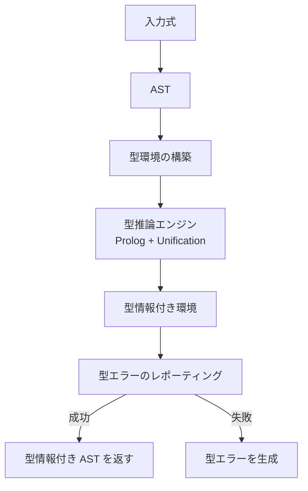
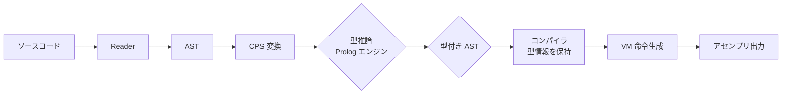

# CL-CC 型システムドキュメント

## 概要

CL-CC の型システムは Hindley-Milner 型推論に基づいた漸次的型付けを実装しています。Prolog ベースの型推論エンジンと、TypeScript 風の型注釈構文を組み合わせて、段階的に型安全性を向上させます。

## 型表現

### 基本型

**CLOS クラス階層による型表現**:

```lisp
;; 型コンストラクタの定義（将来実装予定）
(defclass type-constructor ()
  ((name :initarg :name :reader type-name)
    (type-args :initarg :args :reader type-args)
    :documentation "基本型コンストラクタ"))

;; 型の種類（例）
(defclass primitive-type (type-constructor)
  ())

(defclass function-type (type-constructor)
  ((return-type :initarg :return-type :reader type-return-type)
    (parameter-types :initarg :parameter-types :reader type-parameter-types)))

(defclass polymorphic-type (type-constructor)
  ())

(defclass type-variable (type-constructor)
  ((name :initarg :name :reader type-var-name)
    (constraints :initform nil :reader type-constraints)))
```

### 具体型

```lisp
;; 具体型を表現する例（実際の型表現）
;; コンパイル時の内部表現として使用

;; 関数型
(lambda (x) (+ x 1))
;; 内部表現: (function-type :parameter-types (integer-type) :return-type integer-type)

;; リスト型
(cons 1 (cons 2 (cons 3 nil))
;; 内部表現: (cons-type :element-type integer-type)

;; 多相型
;; 型変数を使用して多相関数を表現
```

### Prolog による型表現

**型環境**: `(symbol . type)` の連想リスト

```lisp
;; 型推論用 Prolog ルール
(def-rule ((type-of (const ?val) ?env (integer-type))
            (when (integerp ?val))))

;; 変数参照の型検索
(def-rule ((type-of (var ?name) ?env ?type)
            (env-lookup ?env ?name ?type)))

;; 二項演算子の型推論
(def-rule ((type-of (binop ?op ?a ?b) ?env (integer-type))
            (type-of ?a ?env (integer-type))
            (type-of ?b ?env (integer-type))
            (member ?op (+ - * / mod))))

;; 条件式の型推論
(def-rule ((type-of (if ?cond ?then ?else) ?env (boolean-type))
            (type-of ?cond ?env (boolean-type))
            (type-of ?then ?env ?type)
            (type-of ?else ?env ?type)))
```

## 型推論アルゴリズム

### Hindley-Milner アルゴリズムの実装

#### 1. 単一化（Unification）

```lisp
;; 変数の単一化（ocurs check 付き）
(defun unify (term1 term2 &optional (env nil))
  "二つの項 TERM1 と TERM2 を単一化し、更新された環境を返す。
   TERM1 と TERM2 は、アトム、論理変数（?x）、コンスセルのいずれか。
   ENV は現在の型環境（連想リスト）。

   成功した場合: (cons 更新された環境 . 成功マーク nil)
   失敗した場合: nil
   "
  (cond
    ;; 両方が論理変数
    ((and (logic-var-p term1) (logic-var-p term2))
     (let ((v1 (assoc term1 env))
           (v2 (assoc term2 env)))
       (cond ((and v1 v2)
              (unify (cdr v1) (cdr v2) env))
             (v1 (unify (cdr v1) term2 env))
             (v2 (unify term1 (cdr v2) env))
             (t (acons term1 term2 env)))))
    ;; term1 が論理変数
    ((logic-var-p term1)
     (let ((binding (assoc term1 env)))
       (if binding
           ;; 環境内に既にバインドされている場合、値を比較
           (unify (cdr binding) term2 env)
           ;; 無限に新しいバインディングをチェック
           (when (occurs-check term1 term2 env)
             nil)  ; 循環検出
           (acons term1 term2 env)))))
    ;; term2 が論理変数（上と対称）
    ((logic-var-p term2)
     (unify term1 (cdr (assoc term2 env)) env))
    ;; 両方がコンスセル
    ((and (consp term1) (consp term2))
     (let ((env1 (unify (car term1) (car term2) env)))
       (and env1 (unify (cdr term1) (cdr term2) env1))))
    ;; 両方が等しいアトム
    ((equal term1 term2)
     env)
    ;; 単一化失敗
    (t nil)))
```

#### 2. occurs check（循環検出）

```lisp
;; 循環検出：変数が項内に出現しているかチェック
(defun occurs-check (var term env)
  "変数 VAR が項 TERM 内に出現しているかチェック。
   無限な構造（例：?X = f(?X)）を防ぐ。
  "
  (cond
    ((logic-var-p term)
     ;; 変数が同じ変数の場合、循環
     (eq var term))
    ((consp term)
     (or (occurs-check var (car term) env)
         (occurs-check var (cdr term) env)))
    (t nil)))
```

### 型推論フロー



#### 型推論の例

**例 1: 整数リテラル**

```lisp
;; 入力: (+ 42 1)
;; 目標: integer-type

;; 推論プロセス:
;; 1. 42 の型: const 42 -> integer-type ✓
;; 2. 1 の型: const 1 -> integer-type ✓
;; 3. + の型規則: (integer-type integer-type) -> integer-type ✓
;; 結果: integer-type
```

**例 2: 変数参照**

```lisp
;; 入力: (let ((x 10)) (+ x 5))
;; 型環境: ((x . R0))

;; 推論プロセス:
;; 1. x の参照: env-lookup(x, env) -> R0
;; 2. R0 の型: 未定義（外部変数）
;; 3. x の初期化: env = ((x . integer-type), (R0 . integer-type))
;; 4. + x 5 の型推論:
;;    x: integer-type ✓
;;    5: integer-type ✓
;;    +: (integer-type integer-type) -> integer-type ✓
;; 結果: integer-type
```

**例 3: 関数呼び出し**

```lisp
;; 入力: (lambda (x) (* x 2))
;; 期待される型: (integer-type -> integer-type)

;; 型環境: ((x . integer-type))

;; 推論プロセス:
;; 1. ラムダ本体の型推論: body 型はまだ不明
;; 2. 型制約: すべてのパスは integer-type
;; 3. return 型の推論: (* x 2) -> integer-type
;; 4. ラムダの型: (integer-type -> integer-type)
;; 結果: (integer-type -> integer-type)
```

**例 4: 条件分岐**

```lisp
;; 入力: (if (= x 0) 10 20)
;; 期待される型: boolean-type

;; 推論プロセス:
;; 1. 条件式の型推論: (= x 0) -> boolean-type
;; 2. then 分岐の型推論: 10 -> integer-type
;; 3. else 分岐の型推論: 20 -> integer-type
;; 4. if 全体の型: (boolean-type integer-type integer-type) -> boolean-type
;; 結果: boolean-type
```

## 型注釈構文

### TypeScript 風の型注釈

CL-CC では、関数パラメータに型を注釈することで型情報を提供します。

**基本構文**:

```lisp
;; 変数の型注釈（整数型）
(defun add ((x fixnum) fixnum)
  (+ x y))

;; 型付きの関数呼び出し
(defun sub ((a fixnum) (b fixnum) fixnum)
  (- a b))

;; 型注釈付きのラムダ式
(lambda (x fixnum)
  (* x 2))
```

### 実装された `the` 特殊形式

**現状**: 型宣言情報の保持のみ（最適化には未使用）

```lisp
;; 型宣言（情報提供のみ、最適化には未実装）
;; ソース: "(the integer (+ 1 2))"
;; AST: (ast-the :type 'integer :value (+ 1 2))
```

**型注釈の統合計画**:

```lisp
;; 将来の型注釈構文（TypeScript スタイル）
(defun typed-add ((x fixnum) fixnum)
  "x は整数, y は整数, 返り値は整数"
  (+ x y))

;; 型注釈の AST 表現
;; (ast-lambda
;;   :params ((x :type 'integer) (y :type 'integer))
;;   :body (ast-binop
;;     :op :*
;;     :lhs (ast-var :name 'x)
;;     :rhs (ast-binop
;;       :op :*
;;       :lhs (ast-var :name 'y)
;;       :rhs (ast-int :value 2)))
;;   :return-type 'integer)
```

## 型エラーのレポーティング戦略

### エラーメータイズム

```lisp
;; 型エラーを表現する条件
(define-condition type-error (error)
  ((location :initarg :location :reader error-location)
    :expected-type :initarg :expected-type :reader error-expected-type)
    :actual-type :initarg :actual-type :reader error-actual-type
    :expression :initarg :expression :reader error-expression))
  (:report (lambda (condition stream)
              (format stream "Type error at ~A:~%"
                      (type-error-location condition)
              (format stream "~%Expected type: ~A"
                         (type-error-expected-type condition))
              (format stream "~%Actual type: ~A"
                         (type-error-actual-type condition)
              (format stream "~%Expression: ~A"
                         (type-error-expression condition)))))
```

### エラーメーメセス

```mermaid
graph TD
    A[コンパイル開始] --> B[型推論フェーズ]
    B -->|失敗| C{エラー生成}
    C --> D[エラー報告<br/>ソース位置 + 型ミスマッチ}
    D --> E[コンパイル中断]
    B -->|成功| F[VM 命令生成フェーズへ]
```

### 型エラーの例

**例 1: 型ミスマッチ**

```lisp
;; ソース: (+ 1 "hello")

;; 型推論失敗:
;; "hello" は string-type だが、integer-type が必要
;; エラーメ: Type error at line 1:10
;;   Expected type: integer-type
;;   Actual type: string-type
;;   Expression: (+ 1 "hello")
```

**例 2: 変数の未定義**

```lisp
;; ソース: (+ undefined_var 5)

;; 型推論失敗:
;; undefined_var は型環境で見つからない
;; エラーメ: Type error at line 1:10
;;   Expected type: <any>
;;   Actual type: <unbound>
;;   Expression: (+ undefined_var 5)
```

**例 3: 関数の型ミスマッチ**

```lisp
;; ソース: ((lambda (x string) x))

;; 型推論失敗:
;; x は string-type だが、*
;; * の型規則: (string-type any-type) -> string-type が必要
;; しかし実際の型は string-type なのでエラー
;; （これは型推論が不完全な場合の例）

;; エラーァ: Type error at line 1:20
;;   Expected type: (string-type any-type) -> string-type
;;   Actual type: <incompatible operator types>
;;   Expression: (* x 2)
```

## 漸次的型付け

### 型なしコード

```lisp
;; 型注釈なしのコードは動作するが、型チェックは行われない
(+ 1 "hello")  ; 実行は成功するが、型安全性は保証されない
```

### 型注釈ありコード

```lisp
;; 型注釈付きコードは型チェックが行われる
(defun typed-func ((x fixnum) fixnum)
  (+ x y))

;; コンパイル時型推論とチェックが行われる
;; 型が正しけければ成功、エラーならコンパイル中断
```

### 動的型境界

**型推論は完全ではない**: 型注釈がないコードは型推論されない

**型のサブタイピング**:
```lisp
;; サブタイピング: 型注釈のない部分でも型推論される
(defun add ((x fixnum) fixnum)  ; x は型推論される
  (+ x y))

;; タイプアノテーション: 型推論された型に基づいて最適化が行われる可能性がある
```

**型検査の強さ**:
```lisp
;; 将来: コンパイル時の型検査と実行時の型検査の選択可能

;; コンパイル時型検査（現在の計画）
(compile-string "(+ 1 2)")
  => 成功または型エラー

;; 実行時型検査（将来の計画）
(run-compiled program)
  => 実行時にも型情報を保持して検査可能
```

## 型指向の最適化機会

### 型情報の活用

**定数折りたみの最適化**:

```lisp
;; 型情報があれば、より効率的な命令列を生成可能

;; 型が整数の場合: VM 加算命令
(vm-add :dst :R2 :lhs :R0 :rhs :R1)

;; 将来: 型によって命令を切り替え
;; string-type の場合: 文字列連結命令（実装予定）
;; float-type の場合: 浮動小数点命令（実装予定）
```

**不要な型検査の削除**:

```lisp
;; 型推論によって不要な実行時型検査を削除可能

;; 型情報付きの式の場合、実行時の型チェックをスキップ
(compile-expression
  (with-type-checking nil)  ; 型チェックを無効化
  ...)
```

### 関数のインライン化

**型情報に基づくインライン化**:

```lisp
;; 同じシグネチャを持つ関数呼び出しの場合、呼び出しをループに展開

;; 型推論前:
(let ((f (lambda (x) (+ x 1)))
  (funcall f (funcall f 2)))  ; f を2 回呼び出し

;; 型推論と最適化後:
;; f: (integer-type -> integer-type)
;; -> 型情報を活用してインライン化を検討
;; (funcall f (funcall f 2)) をインライン展開可能
```

## 型推論とコンパイラの統合

### コンパイルパイプライン内での型推論



### 型情報の保持

```lisp
;; VM 命令と型情報を紐付け
(defclass vm-instruction ()
  ((value-type        ; 将来: 各命令が扱う値の型（オプショナル）
    :initform nil)
    (source-location  ; ソース位置情報
    :initform nil)))

;; 例: 加算命令
(vm-add :dst :R2 :lhs :R0 :rhs :R1
 :value-type integer-type
 :source-location "example.lisp:10")
```

### 型ガードされた最適化

**型情報を活用した最適化ルール**:

```lisp
;; 型に基づく定数折りたみ最適化
(def-rule ((optimize (const ?dst 0) (const ?dst1))
            (:when (:eq ?dst0 ?dst1))
            (:rewrite (identity)))

;; 型に基づく命令の最適化
(def-rule ((optimize (add ?dst ?a ?b ?z)
            (:when (eq ?z 0))
            (:rewrite (:move ?dst ?a)))
```

## 制約と未実装機能

### 現在の制約

1. **基本型のみサポート**: 整数、ブール、文字列、リスト
2. **多相型**: 未実装（型変数は単一化のみ）
3. **ジェネリクス**: 未実装
4. **型変数**: 未実装（型変数は論理変数として使用）
5. **型推論は Prolog に依存**: Prolog エンジンがないと型推論が行われない
6. **最適化は最小限**: 定数折りたみの最適化のみ

### 将来の拡張計画

1. **型変数**: プレイスホルダー型変数、型変数
   ```lisp
   (forall (a . List) a)
     ;; forall はすべての要素が型 T を満たす型変数
   ```

2. **多相関数**: 型クラスとジェネリクス
   ```lisp
   (defclass comparable ()
     ((<  method :initform nil)))
   (defclass number (comparable)
     ((<  method :initform nil)))

   (defclass (string (comparable)
     ((< method :initform nil)))
   ```

3. **代数的データ型**: リスト、タプル、構造体
   ```lisp
   (defclass pair-type (type-constructor)
    ((first-type :initarg :first-type :reader pair-first)
     (second-type :initarg :second-type :reader pair-second)))
   ```

4. **高度な型構文**: 交差型、ユニオン型
   ```lisp
   (type-case (or Maybe T)
     (:maybe (Maybe T))
     (:nothing Nothing))
     (:just T))
   ```

5. **型エラー回復**: エラーハンラップとレコバリ

6. **実行時型検査**: VM レベルでの型タグ付けとチェック

## 参考文献

- [Hindley 1978] "A Theory of Type Polymorphism in Programming"
- [Milner 1978] "A Theory of Type Polymorphism in Programming"
- [Pierce 2002] "Types and Programming Languages"
- [Common Lisp HyperSpec] "Common Lisp the Language"

## 用語集

- **型変数**: 型推論中で使用されるプレースホルダー変数（`?x`, `?y` など）
- **型環境**: 変数とその型のマッピング（シンボルと値のペア）
- **単一化**: 二つの項を統合するプロセス（同じ変数は同じ値を持つ）
- **occurs check**: 変数が項内に出現しているかチェックして無限再帰を防ぐ
- **型推論**: 型推論アルゴリズム。式の型を文脈的に決定するプロセス
- **Hindley-Milner**: 多相型推論アルゴリズム。型推論アルゴリズムの中で最も広く使われている
- **漸次的型付け**: 完全な型チェック（型注釈があれば推論、なければ型推論、型チェックありで動作）
- **型注釈**: 関数のパラメータに型情報を記述する構文（TypeScript 風）
