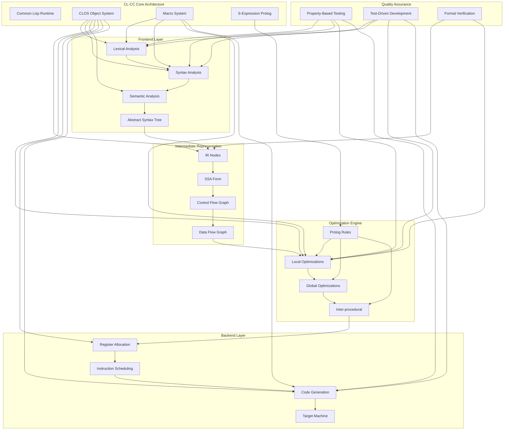
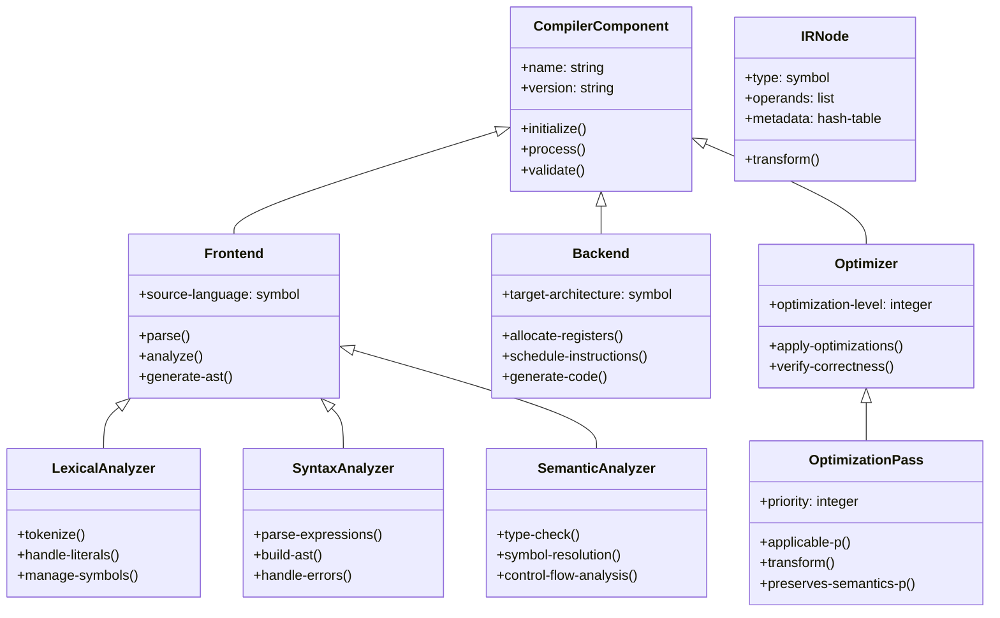
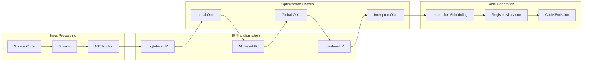
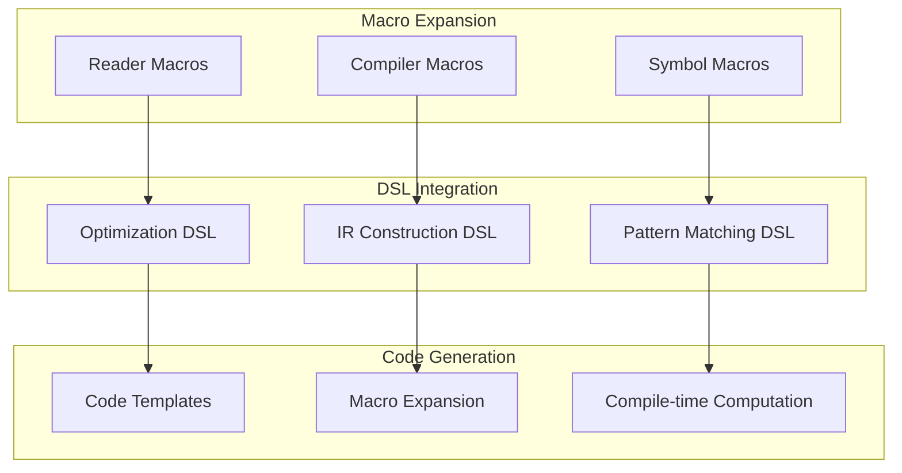
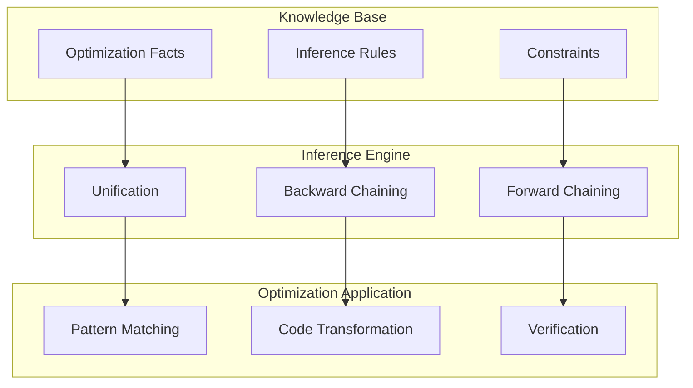
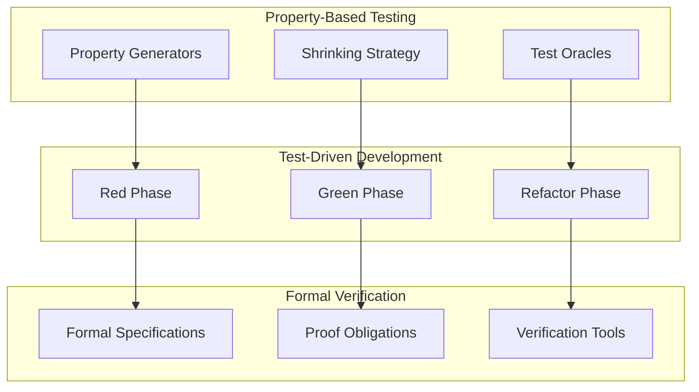
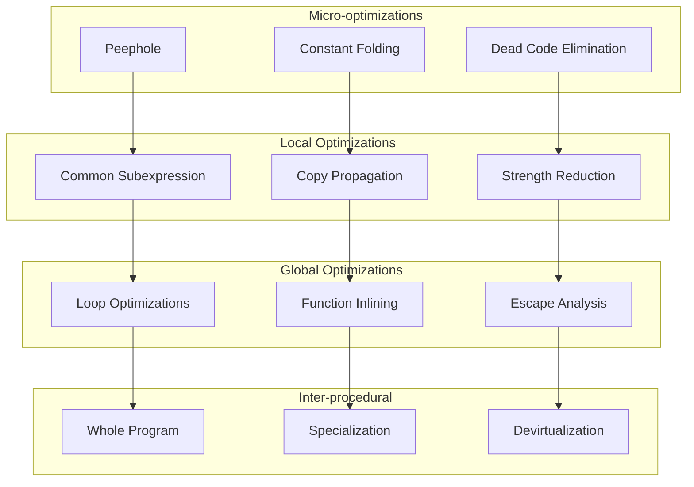

# CL-CC 概念マップ

## 全体アーキテクチャ概念図

## CLOSクラス階層

## データフロー概念図

## マクロシステム統合図

## S式Prolog推論システム

## テスト戦略マップ

## パフォーマンス最適化階層

## 概念間の関係性

| 概念 | 依存関係 | 相互作用 | 重要度 |
|------|----------|----------|--------|
| CLOS | マクロ、Prolog | 全コンポーネント | 高 |
| マクロ | CLOS | DSL、最適化 | 高 |
| S式Prolog | CLOS、マクロ | 推論、最適化 | 高 |
| IR | フロントエンド | 最適化、バックエンド | 高 |
| 最適化 | IR、Prolog | パフォーマンス | 高 |
| PBT | 全コンポーネント | 品質保証 | 高 |
| TDD | PBT | 開発プロセス | 中 |

## ナビゲーション指針

### 学習パス
1. **基礎理解**: Common Lisp → CLOS → マクロ
2. **アーキテクチャ**: コンパイラ理論 → IR設計 → 最適化
3. **実装**: フロントエンド → 最適化 → バックエンド
4. **品質保証**: TDD → PBT → 形式的検証

### 開発パス
1. **設計**: アーキテクチャ → インターフェース設計
2. **実装**: コアクラス → 具体実装 → 統合
3. **テスト**: 単体テスト → 統合テスト → システムテスト
4. **最適化**: プロファイリング → ボトルネック特定 → 改善

---

*この概念マップは、CL-CCプロジェクトの全体像を理解するための知識地図です。各概念間の関係性を理解することで、効率的な学習と開発が可能になります。*