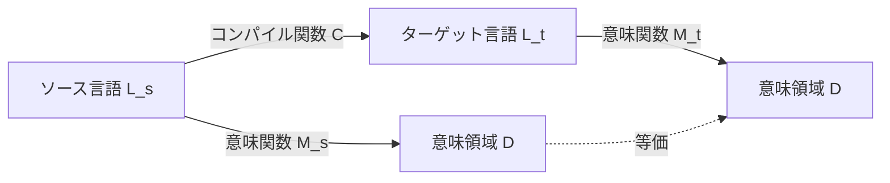
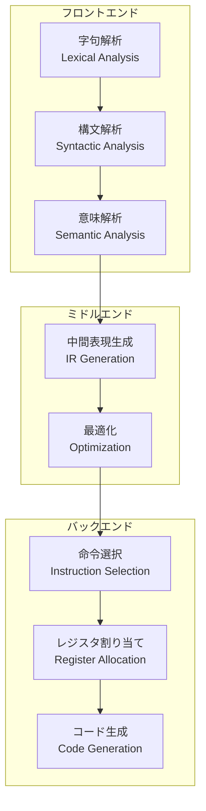
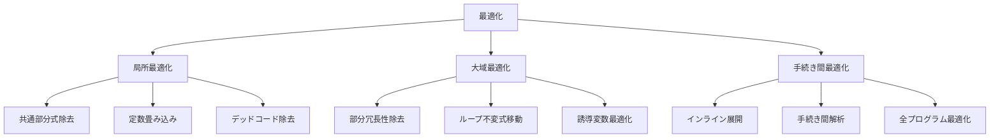

# コンパイラ理論：世界最高峰への道

## はじめに

コンパイラは、プログラミング言語の実装における最も複雑で魅力的なソフトウェアの一つです。本章では、CL-CCが目指す「世界最高峰のコンパイラコレクション」を実現するための理論的基盤を解説します。

## コンパイラの本質

### プログラム変換の数学的基礎

コンパイラの本質は、ある形式的言語から別の形式的言語への**意味保存変換**です。



**正しいコンパイラの条件**:
```
∀p ∈ L_s: M_t(C(p)) = M_s(p)
```

つまり、ソースプログラム`p`の意味とコンパイル結果の意味が等価でなければなりません。

### コンパイラの構造的分解



## 字句解析の理論

### 正規言語とオートマトン

字句解析は**正規言語**の認識問題として定式化されます。

#### 有限オートマトン（DFA）の定義

```lisp
(defstruct dfa
  states      ; 状態の集合 Q
  alphabet    ; アルファベット Σ
  transition  ; 遷移関数 δ: Q × Σ → Q
  start       ; 開始状態 q₀
  finals)     ; 受理状態の集合 F ⊆ Q
```

#### 効率的な実装：トライ構造

```lisp
(defclass trie-node ()
  ((children :initform (make-hash-table :test 'equal))
   (terminal-p :initform nil)
   (token-type :initform nil)))

(defmethod insert-pattern ((trie trie-node) pattern token-type)
  "トライにパターンを挿入"
  (loop for char across pattern
        for node = trie then next-node
        for next-node = (or (gethash char (slot-value node 'children))
                            (setf (gethash char (slot-value node 'children))
                                  (make-instance 'trie-node)))
        finally (setf (slot-value next-node 'terminal-p) t
                      (slot-value next-node 'token-type) token-type)))
```

### 最長一致の原理

字句解析における重要な原則は**最長一致（maximal munch）**です：

```lisp
(defmethod longest-match ((lexer lexer) position)
  "最長一致でトークンを認識"
  (let ((max-length 0)
        (max-token nil))
    (loop for length from 1 to (- (length (lexer-input lexer)) position)
          for substring = (subseq (lexer-input lexer) position (+ position length))
          for token = (recognize-token substring)
          when token
          do (setf max-length length
                   max-token token))
    (values max-token max-length)))
```

## 構文解析の理論

### 文脈自由文法（CFG）

構文解析は**文脈自由文法**の解析問題です。

#### CFGの形式的定義

```
G = (V, Σ, R, S)
```
- V: 非終端記号の集合
- Σ: 終端記号の集合
- R: 生成規則の集合
- S: 開始記号

### パーサーの分類

```mermaid
graph TD
    P[パーサー] --> TD[トップダウン]
    P --> BU[ボトムアップ]

    TD --> RD[再帰下降<br/>Recursive Descent]
    TD --> LL[LL(k)]

    BU --> LR[LR(k)]
    BU --> LALR[LALR(1)]
    BU --> SLR[SLR(1)]
```

### Prattパーサー：演算子優先順位解析

Prattパーサーは、演算子の優先順位と結合性を優雅に扱います：

```lisp
(defmethod parse-expression ((parser pratt-parser) min-binding-power)
  "Prattアルゴリズムによる式解析"
  (let* ((token (advance parser))
         (left (funcall (get-prefix-handler token) parser token)))
    (loop while (>= (get-binding-power (peek parser)) min-binding-power)
          do (let* ((op (advance parser))
                    (right-bp (get-right-binding-power op))
                    (right (parse-expression parser right-bp)))
               (setf left (funcall (get-infix-handler op) parser left right))))
    left))
```

#### 結合力（Binding Power）の設計

```lisp
(defparameter *binding-powers*
  '((:assignment . (1 . 2))    ; 右結合
    (:or        . (3 . 4))
    (:and       . (5 . 6))
    (:equal     . (7 . 8))
    (:plus      . (9 . 10))    ; 左結合
    (:multiply  . (11 . 12))
    (:prefix    . (nil . 13))  ; 前置演算子
    (:call      . (14 . nil)))) ; 後置演算子
```

## 意味解析の理論

### 型システムの基礎

#### Hindley-Milner型推論

最も強力な型推論アルゴリズムの一つ：

```lisp
(defgeneric unify (type1 type2 substitution)
  (:documentation "型の単一化"))

(defmethod unify ((t1 type-var) (t2 type-expr) subst)
  "型変数と型式の単一化"
  (cond
    ((occurs-check t1 t2) (error "Infinite type"))
    ((bound-p t1 subst) (unify (lookup t1 subst) t2 subst))
    (t (extend-subst t1 t2 subst))))

(defmethod infer-type ((expr lambda-expr) env)
  "ラムダ式の型推論"
  (let* ((param-type (make-type-var))
         (new-env (extend-env (lambda-param expr) param-type env))
         (body-type (infer-type (lambda-body expr) new-env)))
    (make-arrow-type param-type body-type)))
```

### スコープと名前解決

#### 環境の階層的管理

```lisp
(defclass lexical-environment ()
  ((bindings :initform (make-hash-table :test 'equal))
   (parent :initarg :parent :initform nil)))

(defmethod lookup ((env lexical-environment) name)
  "階層的な名前解決"
  (or (gethash name (slot-value env 'bindings))
      (when (slot-value env 'parent)
        (lookup (slot-value env 'parent) name))
      (error "Unbound variable: ~A" name)))
```

## 中間表現（IR）の設計

### Static Single Assignment (SSA)形式

SSA形式は最適化に適した中間表現です：

```lisp
(defclass ssa-form ()
  ((basic-blocks :initform nil)
   (dominance-tree :initform nil)
   (phi-functions :initform nil)))

(defmethod to-ssa ((cfg control-flow-graph))
  "CFGをSSA形式に変換"
  ;; 1. 支配木の構築
  (let ((dom-tree (build-dominance-tree cfg)))
    ;; 2. 支配辺境の計算
    (let ((dom-frontiers (compute-dominance-frontiers dom-tree)))
      ;; 3. φ関数の配置
      (insert-phi-functions cfg dom-frontiers)
      ;; 4. 変数のリネーミング
      (rename-variables cfg dom-tree))))
```

### 継続渡しスタイル（CPS）

関数型言語に適した中間表現：

```lisp
(defgeneric to-cps (expr cont)
  (:documentation "CPS変換"))

(defmethod to-cps ((expr literal) cont)
  `(,cont ,expr))

(defmethod to-cps ((expr if-expr) cont)
  (let ((test-var (gensym)))
    `(to-cps ,(if-test expr)
             (lambda (,test-var)
               (if ,test-var
                   ,(to-cps (if-then expr) cont)
                   ,(to-cps (if-else expr) cont))))))
```

## 最適化理論

### データフロー解析

#### 到達定義解析（Reaching Definitions）

```lisp
(defmethod compute-reaching-definitions ((cfg control-flow-graph))
  "到達定義の計算"
  (let ((in (make-hash-table))
        (out (make-hash-table))
        (changed t))
    (loop while changed
          do (setf changed nil)
          do (dolist (block (cfg-blocks cfg))
               (let* ((old-out (gethash block out))
                      (new-in (union-sets
                               (mapcar (lambda (pred)
                                         (gethash pred out))
                                       (block-predecessors block))))
                      (new-out (union (set-difference new-in (kill block))
                                      (gen block))))
                 (setf (gethash block in) new-in
                       (gethash block out) new-out)
                 (when (not (set-equal old-out new-out))
                   (setf changed t)))))
    (values in out)))
```

### 最適化カタログ



## S式Prologによる制約解決

### 論理プログラミングとコンパイラ

Prologを使った宣言的な型推論：

```prolog
% 型推論ルール
type(X, int) :- literal(X, N), integer(N).
type(X, float) :- literal(X, N), float(N).
type(X, T) :- binary(X, +, A, B), type(A, T1), type(B, T2), lub(T1, T2, T).
type(X, func(A, B)) :- lambda(X, Param, Body), type(Param, A), type(Body, B).

% 最小上界（Least Upper Bound）
lub(int, int, int).
lub(int, float, float).
lub(float, int, float).
lub(float, float, float).
lub(T, T, T).
```

### 制約ベース解析

```lisp
(defclass constraint ()
  ((left :initarg :left)
   (relation :initarg :relation)
   (right :initarg :right)))

(defmethod solve-constraints ((constraints list))
  "制約を解く"
  (let ((substitution nil))
    (loop for constraint in constraints
          do (case (constraint-relation constraint)
               (:equal (setf substitution
                            (unify (constraint-left constraint)
                                   (constraint-right constraint)
                                   substitution)))
               (:subtype (add-subtype-constraint
                         (constraint-left constraint)
                         (constraint-right constraint)))))
    substitution))
```

## Property-Based Testingによる検証

### コンパイラの性質

```lisp
(defproperty compilation-preserves-semantics
  (for-all ((program (gen-program)))
    (let* ((compiled (compile-program program))
           (interpreted (interpret program))
           (executed (execute compiled)))
      (is (equal interpreted executed)))))

(defproperty optimization-preserves-behavior
  (for-all ((program (gen-program))
            (opt-level (gen-integer :min 0 :max 3)))
    (let ((unoptimized (compile-program program :optimization 0))
          (optimized (compile-program program :optimization opt-level)))
      (is (behavior-equivalent-p unoptimized optimized)))))
```

## 形式手法による証明

### コンパイラの正しさの証明

```lisp
;; Coqスタイルの証明スケッチ
(deftheorem compiler-correctness
  "コンパイラの正しさの定理"
  :statement
  (forall (p : source-program)
    (equals (semantics (compile p))
            (semantics p)))

  :proof
  (by-induction-on p
    :base-case (literal n)
      (equals (semantics (compile (literal n)))
              (semantics (literal n)))

    :inductive-case (binary-op op e1 e2)
      (assume (equals (semantics (compile e1)) (semantics e1))
      (assume (equals (semantics (compile e2)) (semantics e2))
      (show (equals (semantics (compile (binary-op op e1 e2)))
                    (semantics (binary-op op e1 e2))))))))
```

## 並列コンパイルの理論

### タスク並列性

```lisp
(defmethod parallel-compile ((compiler compiler) modules)
  "モジュールの並列コンパイル"
  (let ((dependency-graph (build-dependency-graph modules)))
    (parallel-topological-sort dependency-graph
      (lambda (module)
        (compile-module compiler module)))))
```

### データ並列性

```lisp
(defmethod parallel-optimization ((ast ast-forest))
  "ASTフォレストの並列最適化"
  (parallel-map
    (lambda (tree)
      (optimize-tree tree))
    (split-independent-subtrees ast)))
```

## まとめ：世界最高峰への道

CL-CCが目指す世界最高峰のコンパイラコレクションは、以下の理論的基盤の上に構築されます：

1. **数学的厳密性**: 形式手法による正しさの保証
2. **効率的実装**: 最先端のアルゴリズムとデータ構造
3. **拡張性**: CLOSとマクロによる柔軟な設計
4. **検証可能性**: Property-Based Testingによる品質保証
5. **宣言的記述**: S式Prologによる高レベル仕様

これらの理論を実装に落とし込むことで、真に革新的なコンパイラコレクションを実現します。

## 参考文献

- Aho, Lam, Sethi, Ullman. "Compilers: Principles, Techniques, and Tools"
- Appel. "Modern Compiler Implementation in ML"
- Pierce. "Types and Programming Languages"
- Nielson, Nielson, Hankin. "Principles of Program Analysis"

## 関連ドキュメント

- [→ Tutorial: 最初のコンパイラを作る](../tutorials/01-first-compiler.md)
- [⚙ How-to: 最適化パスの実装](../how-to/implement-optimization-pass.md)
- [📖 Reference: Optimization API](../reference/optimization-api.md)