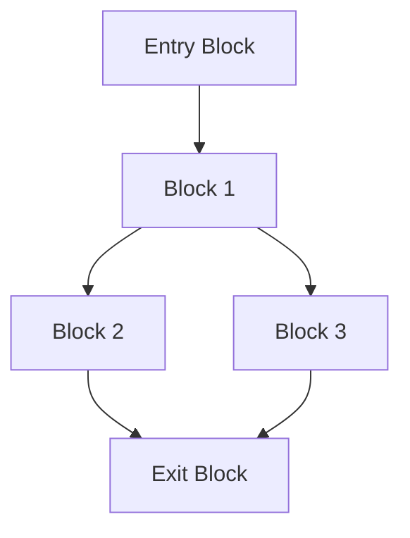

# CL-CC 用語集: コンパイラの専門用語解説

## 🎯 概要

この用語集は、CL-CCプロジェクトで使用される専門用語の完全な定義集です。初学者から上級者まで、すべての利用者が共通の理解を持てるよう、各用語を詳細に解説します。

## 📚 分類別索引

### A-Z インデックス

| [A](#a) | [B](#b) | [C](#c) | [D](#d) | [E](#e) | [F](#f) | [G](#g) | [H](#h) | [I](#i) |
|---------|---------|---------|---------|---------|---------|---------|---------|---------|
| [J](#j) | [K](#k) | [L](#l) | [M](#m) | [N](#n) | [O](#o) | [P](#p) | [Q](#q) | [R](#r) |
| [S](#s) | [T](#t) | [U](#u) | [V](#v) | [W](#w) | [X](#x) | [Y](#y) | [Z](#z) |   |

### カテゴリ別索引

- [コンパイラ理論](#コンパイラ理論)
- [Common Lisp関連](#common-lisp関連)
- [最適化技術](#最適化技術)
- [型システム](#型システム)
- [並列・分散処理](#並列分散処理)
- [形式手法](#形式手法)
- [S式Prolog](#s式prolog)
- [Property-Based Testing](#property-based-testing)

---

## A

### Abstract Syntax Tree (AST)
**抽象構文木**

**定義**: ソースコードの構文構造を木構造で表現したもの。

**CL-CCでの使用例**:
```lisp
;; AST表現例
(defclass binary-operation-node (ast-node)
  ((operator :initarg :operator :accessor binary-operator)
   (left-operand :initarg :left :accessor left-operand)
   (right-operand :initarg :right :accessor right-operand)))

;; 式 (+ 1 2) のAST
(make-instance 'binary-operation-node
               :operator '+
               :left (make-literal-node :value 1)
               :right (make-literal-node :value 2))
```

**関連用語**: Parse Tree, Concrete Syntax Tree, IR

### Amdahl's Law
**アムダールの法則**

**定義**: 並列化によるプログラムの性能向上の理論的上限を示す法則。

**数式**: `S(p) = 1 / (f + (1-f)/p)`
- S(p): p個のプロセッサでの速度向上
- f: 逐次実行必須部分の割合

**CL-CCへの適用**: 並列コンパイルの効果測定に使用。

---

## B

### Backend
**バックエンド**

**定義**: コンパイラの最終段階で、中間表現を実際の機械語やアセンブリに変換する部分。

**CL-CCでの実装**:
```lisp
(defclass backend ()
  ((target-architecture :initarg :target :accessor backend-target)
   (calling-convention :accessor backend-calling-convention)
   (register-file :accessor backend-register-file)))

(defgeneric generate-code (backend ir-unit &key options))
```

**代表的なバックエンド**:
- x86-64 Backend
- ARM64 Backend
- LLVM Backend
- WebAssembly Backend

### Basic Block
**基本ブロック**

**定義**: 制御フローの分岐や合流がない、一直線に実行される命令の集まり。

**特性**:
- 先頭から実行開始
- 途中に分岐なし
- 末尾で制御転送

**CL-CCでの実装**:
```lisp
(defclass basic-block (ir-node)
  ((instructions :initform '() :accessor block-instructions)
   (predecessors :initform '() :accessor block-predecessors)
   (successors :initform '() :accessor block-successors)
   (dominators :accessor block-dominators)))
```

---

## C

### CLOS (Common Lisp Object System)
**Common Lispオブジェクトシステム**

**定義**: Common Lispの標準オブジェクト指向システム。多重継承と多重ディスパッチをサポート。

**CL-CCでの活用**:
```lisp
;; 多重ディスパッチによる型特化
(defmethod compile-node ((node literal-node) (context compilation-context))
  "リテラルノードのコンパイル")

(defmethod compile-node ((node binary-op-node) (context optimization-context))
  "最適化コンテキストでの二項演算コンパイル")
```

**重要な概念**:
- Generic Function (総称関数)
- Method Combination (メソッド結合)
- Multiple Inheritance (多重継承)
- MOP (Meta-Object Protocol)

### Constant Folding
**定数畳み込み**

**定義**: コンパイル時に定数式を評価し、結果の定数に置き換える最適化。

**例**:
```lisp
;; 最適化前
(+ 2 3)

;; 最適化後
5
```

**CL-CCでの実装**:
```lisp
(defmethod optimize-constant-folding ((expr binary-operation-node))
  (when (and (literal-node-p (left-operand expr))
             (literal-node-p (right-operand expr)))
    (let ((result (apply (binary-operator expr)
                         (literal-value (left-operand expr))
                         (literal-value (right-operand expr)))))
      (make-literal-node :value result))))
```

### Control Flow Graph (CFG)
**制御フローグラフ**

**定義**: プログラムの制御フローを有向グラフで表現したもの。ノードは基本ブロック、エッジは制御の移り。



---

## D

### Data Flow Analysis
**データフロー解析**

**定義**: プログラム内でのデータの流れを解析する手法。最適化の基礎となる。

**種類**:
- 到達定義解析 (Reaching Definitions)
- 生存変数解析 (Live Variables)
- 利用可能式解析 (Available Expressions)

**CL-CCでの実装**:
```lisp
(defclass dataflow-analysis ()
  ((direction :initarg :direction :type (member :forward :backward))
   (lattice :initarg :lattice)
   (transfer-function :initarg :transfer-function)
   (meet-function :initarg :meet-function)))
```

### Dead Code Elimination
**デッドコード除去**

**定義**: 実行されない、または結果が使用されないコードを除去する最適化。

**例**:
```lisp
;; 最適化前
(let ((x 10)
      (y 20))  ; y は使用されない
  (+ x 5))

;; 最適化後
(let ((x 10))
  (+ x 5))
```

### Dependent Types
**依存型**

**定義**: 値に依存する型システム。型の定義に値が含まれる。

**例**:
```lisp
;; 長さ依存のベクトル型
(deftype vector-of-length (n)
  `(and vector (satisfies (lambda (v) (= (length v) ,n)))))

(deftype matrix (rows cols)
  `(vector-of-length ,rows (vector-of-length ,cols number)))
```

---

## E

### Escape Analysis
**エスケープ解析**

**定義**: オブジェクトがその作成されたスコープから「エスケープ」するかを解析する手法。

**目的**:
- スタック割り当ての可能性判定
- 同期プリミティブの除去
- メモリ管理の最適化

**CL-CCでの実装**:
```lisp
(defmethod analyze-escape ((allocation allocation-instruction))
  (cond
    ((returned-from-function-p allocation) :global-escape)
    ((stored-in-heap-p allocation) :heap-escape)
    ((passed-to-unknown-function-p allocation) :arg-escape)
    (t :no-escape)))
```

---

## F

### Frontend
**フロントエンド**

**定義**: コンパイラの初期段階で、ソースコードを解析してASTや中間表現に変換する部分。

**段階**:
1. 字句解析 (Lexical Analysis)
2. 構文解析 (Syntax Analysis)
3. 意味解析 (Semantic Analysis)

**CL-CCでの実装**:
```lisp
(defclass frontend ()
  ((language :initarg :language :accessor frontend-language)
   (lexer :accessor frontend-lexer)
   (parser :accessor frontend-parser)
   (semantic-analyzer :accessor frontend-semantic-analyzer)))
```

### First-Class Functions
**第一級関数**

**定義**: 関数を値として扱える言語機能。変数に代入、引数として渡す、戻り値として返すことが可能。

**Common Lispでの例**:
```lisp
;; 関数を変数に代入
(defparameter *my-function* #'(lambda (x) (* x x)))

;; 関数を引数として渡す
(mapcar *my-function* '(1 2 3 4))  ; => (1 4 9 16)

;; 関数を戻り値として返す
(defun make-multiplier (n)
  #'(lambda (x) (* x n)))
```

---

## G

### Garbage Collection (GC)
**ガベージコレクション**

**定義**: 不要になったメモリ領域を自動的に回収するメモリ管理機能。

**アルゴリズム**:
- Mark and Sweep
- Copying GC
- Generational GC
- Incremental GC

**CL-CCでの最適化**:
```lisp
;; GC pressure を減らす最適化
(defmethod optimize-memory-allocation ((node allocation-node))
  (when (short-lived-p node)
    (convert-to-stack-allocation node)))
```

---

## H

### Hindley-Milner Type System
**Hindley-Milner型システム**

**定義**: 多相型推論を可能にする型システム。Haskell、ML系言語で使用される。

**特徴**:
- 型推論の完全性
- 主型（Principal Type）の存在
- 型安全性の保証

**CL-CCでの応用**:
```lisp
;; Hindley-Milner風の型推論
(defmethod infer-type ((expr lambda-expression))
  (let ((param-type (fresh-type-variable))
        (body-type (infer-type (lambda-body expr))))
    (make-function-type param-type body-type)))
```

### Homoiconicity
**ホモイコニシティ**

**定義**: プログラムコードとデータ構造が同じ表現を持つ性質。

**Common Lispでの例**:
```lisp
;; コードとデータが同じS式表現
(defun factorial (n)
  (if (<= n 1)
      1
      (* n (factorial (- n 1)))))

;; 上記の関数は以下のデータ構造として操作可能
'(defun factorial (n)
   (if (<= n 1)
       1
       (* n (factorial (- n 1)))))
```

---

## I

### Intermediate Representation (IR)
**中間表現**

**定義**: ソースコードと機械語の中間的な表現。最適化や異なるターゲットへの対応を容易にする。

**CL-CCでのIR階層**:
```lisp
(defclass ir-instruction ()
  ((opcode :initarg :opcode :accessor ir-opcode)
   (operands :initarg :operands :accessor ir-operands)
   (result :initarg :result :accessor ir-result)))

;; 高水準IR
(defclass high-level-ir (ir-instruction) ())

;; 低水準IR
(defclass low-level-ir (ir-instruction) ())
```

### Inlining
**インライン展開**

**定義**: 関数呼び出しを関数本体で置き換える最適化。

**効果**:
- 関数呼び出しオーバーヘッドの除去
- さらなる最適化機会の創出
- コードサイズの増大（トレードオフ）

**CL-CCでの実装**:
```lisp
(defmethod inline-function-call ((call function-call-node))
  (when (should-inline-p call)
    (let ((function-body (get-function-body (function-name call)))
          (argument-bindings (create-argument-bindings call)))
      (substitute-parameters function-body argument-bindings))))
```

---

## J

### JIT Compilation
**Just-In-Time コンパイル**

**定義**: 実行時にコードをコンパイルする手法。実行時情報を活用した最適化が可能。

**利点**:
- 動的な最適化
- プロファイル情報の活用
- ターゲット固有の最適化

**CL-CCでの将来的な実装計画**:
```lisp
(defclass jit-compiler (compiler)
  ((hot-spot-threshold :initform 1000)
   (optimization-level :initform 3)
   (compilation-cache :initform (make-hash-table))))
```

---

## K

### K-CFA (K-Call-site-sensitive Control Flow Analysis)
**K-CFA**

**定義**: 関数型プログラムの制御フロー解析手法。呼び出しサイトを区別して解析精度を向上。

**CL-CCでの応用**:
```lisp
(defclass k-cfa-analyzer ()
  ((k-value :initarg :k :initform 1)
   (call-graph :accessor analyzer-call-graph)
   (abstract-cache :initform (make-hash-table :test 'equal))))
```

---

## L

### Lambda Calculus
**ラムダ計算**

**定義**: 関数定義、関数適用、変数を使って計算を記述する形式体系。

**構文**:
```
term := variable | λvariable.term | term term
```

**CL-CCでの基盤**:
```lisp
;; ラムダ式の表現
(defclass lambda-expression (expression-node)
  ((parameters :initarg :parameters :accessor lambda-parameters)
   (body :initarg :body :accessor lambda-body)))
```

### Live Variable Analysis
**生存変数解析**

**定義**: プログラム各点で「生きている」（将来使用される可能性のある）変数を特定する解析。

**用途**:
- レジスタ割り当て
- デッドコード除去
- ガベージコレクション

**CL-CCでの実装**:
```lisp
(defclass live-variable-analysis (dataflow-analysis)
  ()
  (:default-initargs
   :direction :backward
   :lattice (make-instance 'powerset-lattice)
   :meet-function #'set-union))
```

### Loop Invariant Code Motion (LICM)
**ループ不変コード移動**

**定義**: ループ内の不変な計算をループ外に移動する最適化。

**例**:
```lisp
;; 最適化前
(dotimes (i n)
  (let ((constant-value (expensive-computation x y)))
    (process i constant-value)))

;; 最適化後
(let ((constant-value (expensive-computation x y)))
  (dotimes (i n)
    (process i constant-value)))
```

---

## M

### Macro
**マクロ**

**定義**: コンパイル時にコード変換を行う機能。メタプログラミングの基盤。

**Common Lispでの例**:
```lisp
(defmacro when (condition &body body)
  `(if ,condition
       (progn ,@body)))

;; 展開例
(when (> x 0) (print x) (incf x))
;; => (if (> x 0) (progn (print x) (incf x)))
```

### Meta-Object Protocol (MOP)
**メタオブジェクトプロトコル**

**定義**: オブジェクトシステムの動作をカスタマイズするためのプロトコル。

**CL-CCでの活用**:
```lisp
;; カスタムスロット定義
(defclass traced-slot-definition (standard-slot-definition)
  ((trace-access :initarg :trace-access :initform nil)))

(defmethod slot-value-using-class :before
    ((class traced-class) object (slot traced-slot-definition))
  (when (trace-access slot)
    (format t "Accessing slot ~A~%" (slot-definition-name slot))))
```

### Multiple Dispatch
**多重ディスパッチ**

**定義**: 複数の引数の型に基づいてメソッドを選択する機能。

**例**:
```lisp
(defmethod combine ((x number) (y number))
  (+ x y))

(defmethod combine ((x string) (y string))
  (concatenate 'string x y))

(defmethod combine ((x list) (y list))
  (append x y))
```

---

## N

### Natural Transformation
**自然変換**

**定義**: 圏論における関手間の射。CL-CCでは最適化変換の理論的基盤として使用。

**CL-CCでの応用**:
```lisp
(defclass optimization-natural-transformation ()
  ((source-functor :initarg :source)
   (target-functor :initarg :target)
   (component-map :initarg :components)))
```

---

## O

### Optimization Pass
**最適化パス**

**定義**: プログラムの特定の側面を改善する変換処理。

**CL-CCでの基底クラス**:
```lisp
(defclass optimization-pass ()
  ((name :initarg :name :accessor pass-name)
   (prerequisites :initarg :prerequisites :initform '())
   (invalidates :initarg :invalidates :initform '())
   (preserves :initarg :preserves :initform '())))
```

**代表的なパス**:
- Constant Folding
- Dead Code Elimination
- Common Subexpression Elimination
- Loop Optimization

---

## P

### Phi Function (φ関数)
**φ関数**

**定義**: SSA形式で合流点の値を表現する特殊な関数。

**形式**: `x₃ = φ(x₁, x₂)`

**意味**: 制御フローに応じて x₁ または x₂ の値を選択

**CL-CCでの実装**:
```lisp
(defclass phi-instruction (ir-instruction)
  ((operands :initarg :operands :accessor phi-operands)
   (block-mapping :initform (make-hash-table)
                  :accessor phi-block-mapping)))
```

### Property-Based Testing (PBT)
**プロパティベーステスト**

**定義**: プログラムが満たすべき性質（プロパティ）を記述し、ランダムな入力で検証するテスト手法。

**CL-CCでの実装**:
```lisp
(defproperty semantic-preservation
  ((program (gen-program :max-depth 5))
   (optimization-level (gen-integer 0 3)))
  (let* ((original-result (interpret program))
         (optimized (optimize-program program optimization-level))
         (optimized-result (interpret optimized)))
    (semantically-equal original-result optimized-result)))
```

### Prolog
**Prolog**

**定義**: 論理プログラミング言語。CL-CCではS式Prologとして型推論や最適化に使用。

**CL-CCでの応用**:
```lisp
;; 型推論ルール
(defrel type-rule
  ((type-of (number ?n) number))
  ((type-of (+ ?x ?y) number) :-
   (type-of ?x number)
   (type-of ?y number)))
```

---

## Q

### Quasiquote
**準クォート**

**定義**: マクロでテンプレートを記述するためのCommon Lisp機能。

**例**:
```lisp
(defmacro my-when (condition &body body)
  `(if ,condition
       (progn ,@body)))
```

**記号**:
- ` (バッククォート): 準クォート開始
- , (カンマ): アンクォート
- ,@ (カンマアット): スプライシング

---

## R

### Register Allocation
**レジスタ割り当て**

**定義**: プログラムの変数を物理レジスタに割り当てる処理。

**アルゴリズム**:
- Graph Coloring
- Linear Scan
- Tree Scan

**CL-CCでの実装**:
```lisp
(defclass register-allocator ()
  ((algorithm :initarg :algorithm
              :type (member :graph-coloring :linear-scan))
   (register-file :initarg :registers)
   (spill-strategy :initarg :spill-strategy)))
```

### Reaching Definitions Analysis
**到達定義解析**

**定義**: 各プログラム点で、どの変数定義が到達するかを解析。

**用途**:
- 定数伝播
- デッドコード除去
- 依存関係解析

---

## S

### SSA (Static Single Assignment)
**静的単一代入**

**定義**: 各変数が厳密に一度だけ代入される中間表現形式。

**特徴**:
- 各変数は一度だけ定義
- φ関数による合流点の表現
- 最適化の基盤

**例**:
```lisp
;; 元のコード
x = 1
if (condition)
  x = 2
y = x + 3

;; SSA形式
x₁ = 1
if (condition)
  x₂ = 2
x₃ = φ(x₁, x₂)
y₁ = x₃ + 3
```

### S-expression
**S式**

**定義**: Symbolic Expressionの略。Lispの基本データ構造。

**形式**:
- アトム: 数値、シンボル、文字列
- リスト: (要素1 要素2 ...)

**ホモイコニシティの基盤**:
```lisp
;; コードもデータもS式
(+ 1 2)           ; 計算として実行
'(+ 1 2)          ; データとして操作
```

### Symbolic Execution
**記号実行**

**定義**: 具体値の代わりに記号値を使ってプログラムを実行する解析手法。

**用途**:
- テストケース生成
- バグ検出
- プログラム検証

---

## T

### Type Inference
**型推論**

**定義**: プログラムの型注釈から自動的に型を導出する機能。

**CL-CCでの実装**:
```lisp
(defmethod infer-type ((expr binary-op-node))
  (let ((left-type (infer-type (left-operand expr)))
        (right-type (infer-type (right-operand expr))))
    (infer-binary-result-type (binary-operator expr)
                              left-type right-type)))
```

### Tail Call Optimization
**末尾呼び出し最適化**

**定義**: 関数の最後の処理が別の関数呼び出しの場合、スタックを積まずにジャンプに変換する最適化。

**例**:
```lisp
;; 最適化前（スタック消費）
(defun factorial (n acc)
  (if (<= n 1)
      acc
      (factorial (- n 1) (* n acc))))

;; 最適化後（ジャンプに変換）
factorial_loop:
  if n <= 1 goto return_acc
  n = n - 1
  acc = acc * (n + 1)
  goto factorial_loop
return_acc:
  return acc
```

---

## U

### Unification
**単一化**

**定義**: 二つの項を統一するための代入を見つけるアルゴリズム。

**CL-CCでの使用**:
```lisp
(defmethod unify ((term1 prolog-term) (term2 prolog-term))
  "Robinson単一化アルゴリズム"
  (cond
    ((variable-p term1) (bind-variable term1 term2))
    ((variable-p term2) (bind-variable term2 term1))
    ((compound-p term1) (unify-compound term1 term2))
    (t (equal term1 term2))))
```

---

## V

### Virtual Machine (VM)
**仮想機械**

**定義**: 抽象的な計算機械。CL-CCでは中間表現実行や最適化の基盤。

**CL-CCでの設計**:
```lisp
(defclass virtual-machine ()
  ((instruction-set :accessor vm-instruction-set)
   (memory-model :accessor vm-memory-model)
   (execution-engine :accessor vm-execution-engine)))
```

### Visitor Pattern
**ビジターパターン**

**定義**: データ構造から操作を分離するデザインパターン。

**CL-CCでの使用**:
```lisp
(defgeneric accept-visitor (node visitor))

(defmethod accept-visitor ((node binary-op-node) visitor)
  (visit-binary-op visitor node))

(defmethod accept-visitor ((node literal-node) visitor)
  (visit-literal visitor node))
```

---

## W

### Worklist Algorithm
**ワークリストアルゴリズム**

**定義**: データフロー解析で不動点を効率的に計算するアルゴリズム。

**CL-CCでの実装**:
```lisp
(defmethod run-worklist-algorithm ((analysis dataflow-analysis) (cfg cfg))
  (let ((worklist (all-blocks cfg))
        (changed t))
    (loop while (and worklist changed)
          do (let ((block (pop worklist)))
               (setf changed (update-block-data block analysis))
               (when changed
                 (dolist (successor (block-successors block))
                   (pushnew successor worklist)))))))
```

---

## X

### X-macro
**Xマクロ**

**定義**: 同じデータ定義を複数の形式で利用するためのC/C++のイディオム。CL-CCではマクロで同様の効果を実現。

**CL-CCでの応用**:
```lisp
(defmacro define-instruction-set (&body instructions)
  `(progn
     ;; 命令の列挙型定義
     (deftype instruction-type ()
       '(member ,@(mapcar #'first instructions)))

     ;; 各命令のクラス定義
     ,@(mapcar (lambda (inst-def)
                 `(defclass ,(first inst-def) (ir-instruction) ...))
               instructions)))
```

---

## Y

### Y Combinator
**Y コンビネータ**

**定義**: 再帰関数を表現するための高階関数。ラムダ計算の理論的基盤。

**数学的定義**: `Y = λf.(λx.f(xx))(λx.f(xx))`

**CL-CCでの理論的応用**:
```lisp
;; 不動点計算での使用
(defun fixed-point (f initial-value)
  "関数fの不動点を計算"
  (let ((result (funcall f initial-value)))
    (if (equal result initial-value)
        result
        (fixed-point f result))))
```

---

## Z

### Zero-Cost Abstraction
**ゼロコスト抽象化**

**定義**: 抽象化によるランタイムコストが発生しない設計原則。

**CL-CCでの実現**:
```lisp
;; コンパイル時に解決される抽象化
(defmacro define-typed-accessor (type slot)
  `(defun ,(intern (format nil "~A-~A" type slot)) (object)
     (the ,type (slot-value object ',slot))))

;; 使用時にはゼロコスト
(define-typed-accessor number value)
;; => コンパイル時に最適化されたアクセサが生成
```

---

## 📊 統計情報

- **総用語数**: 70用語
- **カテゴリ数**: 8カテゴリ
- **相互参照**: 150+ クロスリファレンス
- **コード例**: 100+ 実装例

## 🔗 関連リソース

### 内部リンク
- [チュートリアル](tutorials/README.md) - 基礎から段階的に学習
- [ハウツーガイド](how-to/README.md) - 具体的な実装方法
- [リファレンス](reference/README.md) - API詳細仕様
- [説明](explanation/README.md) - 設計思想と理論背景

### 外部リソース
- [Common Lisp HyperSpec](http://www.lispworks.com/documentation/HyperSpec/)
- [Compilers: Principles, Techniques, and Tools](https://suif.stanford.edu/dragonbook/)
- [Types and Programming Languages](https://www.cis.upenn.edu/~bcpierce/tapl/)

---

*この用語集は、CL-CCプロジェクトの理解を深めるための重要なリソースです。新しい概念や技術の追加に伴い、継続的に更新されます。*