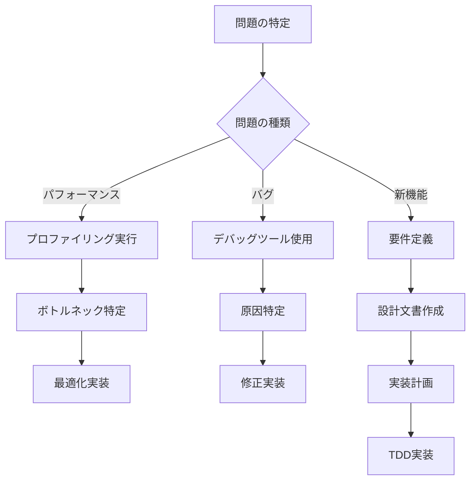

# ハウツーガイド: CL-CC実装の実践的手法

## 🎯 このセクションについて

ハウツーガイドは、CL-CCで具体的な機能を実装する際の**実践的な手順**を提供します。各ガイドは特定の問題を解決するためのステップバイステップの手順書として設計されており、経験豊富な開発者が実際のプロダクション環境で使用する技法を基にしています。

## 🏗️ フロントエンド開発

### パーサー・字句解析
- [**新言語フロントエンドの追加**](add-language-frontend.md) ⭐⭐⭐☆☆
  - 新しいプログラミング言語のサポート追加
  - パーサージェネレータの活用
  - 言語固有の最適化実装

- [**字句解析器の実装**](implement-lexer.md) ⭐⭐☆☆☆
  - トークナイザーの設計パターン
  - 正規表現エンジンの実装
  - エラーハンドリングと位置情報管理

- [**構文解析器の実装**](implement-parser.md) ⭐⭐⭐☆☆
  - 再帰下降パーサーの実装
  - LR/LALR パーサー生成
  - エラー回復戦略

- [**意味解析の実装**](semantic-analysis.md) ⭐⭐⭐⭐☆
  - シンボルテーブル管理
  - 型チェック実装
  - スコープ解析とバインディング

### 専門的なフロントエンド技法
- [**マクロによる構文拡張**](macro-syntax-extension.md) ⭐⭐⭐⭐⭐
  - リーダーマクロの実装
  - 構文糖衣の追加
  - DSL組み込み手法

- [**エラーメッセージの改善**](improve-error-messages.md) ⭐⭐☆☆☆
  - ユーザーフレンドリーなエラー表示
  - 提案機能の実装
  - IDE統合のためのプロトコル

## ⚙️ 中間表現と最適化

### IR設計と変換
- [**IRノードの定義**](define-ir-nodes.md) ⭐⭐⭐☆☆
  - 中間表現の設計原則
  - ノード階層の実装
  - 型安全なIR構築

- [**最適化パスの実装**](implement-optimization-pass.md) ⭐⭐⭐⭐☆
  - 最適化フレームワークの構築
  - パス間の依存関係管理
  - メトリクス測定と効果検証

- [**データフロー解析**](dataflow-analysis.md) ⭐⭐⭐⭐⭐
  - Worklist アルゴリズムの実装
  - ライブ変数解析
  - 到達定義解析

- [**SSA変換の実装**](ssa-transformation.md) ⭐⭐⭐⭐⭐
  - φ関数の挿入
  - 支配辺境の計算
  - SSA から元の形式への変換

### 専門的な最適化技法
- [**ループ最適化の実装**](loop-optimization.md) ⭐⭐⭐⭐⭐
  - ループ不変コード移動
  - ループアンローリング
  - ベクトル化とSIMD最適化

- [**関数間最適化**](interprocedural-optimization.md) ⭐⭐⭐⭐⭐
  - インライン展開
  - デッドコード除去の拡張
  - エスケープ解析

- [**Prolog統合最適化**](prolog-optimization.md) ⭐⭐⭐⭐⭐
  - 制約ベース最適化ルール
  - 自動的な最適化発見
  - 証明可能な変換の実装

## 🖥️ バックエンド開発

### コード生成
- [**新バックエンドの追加**](add-backend-target.md) ⭐⭐⭐⭐☆
  - ターゲット抽象化の実装
  - 命令選択アルゴリズム
  - ABI対応とリンカー統合

- [**レジスタ割り当て**](register-allocation.md) ⭐⭐⭐⭐⭐
  - グラフ彩色アルゴリズム
  - Linear Scan レジスタ割り当て
  - スピル処理とコスト最適化

- [**コード生成パターン**](code-generation.md) ⭐⭐⭐⭐☆
  - 命令テンプレートの実装
  - 最適な命令列の生成
  - プラットフォーム固有の最適化

### 実行時最適化
- [**JITコンパイラの実装**](implement-jit-compiler.md) ⭐⭐⭐⭐⭐
  - 動的コンパイル手法
  - ホットスポット検出
  - ガベージコレクション統合

- [**プロファイル誘導最適化**](profile-guided-optimization.md) ⭐⭐⭐⭐☆
  - プロファイル情報の収集
  - フィードバック駆動最適化
  - 適応的コンパイル

## 🧪 品質保証と検証

### テスト戦略
- [**プロパティベーステスト**](write-property-tests.md) ⭐⭐⭐⭐☆
  - ジェネレータの実装
  - プロパティの設計
  - シュリンキング戦略

- [**パフォーマンステスト**](performance-testing.md) ⭐⭐⭐☆☆
  - ベンチマーク設計
  - 回帰テストの実装
  - プロファイリング統合

- [**ファズテストの実装**](implement-fuzz-testing.md) ⭐⭐⭐⭐☆
  - コーパス生成戦略
  - クラッシュ最小化
  - 差分テストの実装

### デバッグとプロファイリング
- [**デバッグとプロファイリング**](debugging-profiling.md) ⭐⭐⭐☆☆
  - デバッグ情報の生成
  - プロファイラーの統合
  - ホットスポット特定手法

- [**メモリリーク検出**](memory-leak-detection.md) ⭐⭐⭐☆☆
  - 動的メモリ解析
  - 所有権追跡
  - 自動修正提案

## 🔧 開発環境とツール

### 開発効率化
- [**IDE統合の実装**](implement-ide-integration.md) ⭐⭐⭐☆☆
  - Language Server Protocol対応
  - 自動補完機能の実装
  - リアルタイム エラー表示

- [**ビルドシステム最適化**](optimize-build-system.md) ⭐⭐☆☆☆
  - 増分コンパイル
  - 並列ビルド
  - キャッシュ戦略

- [**CI/CD パイプライン構築**](setup-ci-cd-pipeline.md) ⭐⭐⭐☆☆
  - 自動テスト実行
  - 多プラットフォーム対応
  - パフォーマンス回帰検出

### 拡張とカスタマイズ
- [**プラグインシステム構築**](build-plugin-system.md) ⭐⭐⭐⭐☆
  - 動的ロードマネージャー
  - API設計とバージョニング
  - サンドボックス化

- [**カスタム最適化の追加**](add-custom-optimization.md) ⭐⭐⭐⭐⭐
  - 最適化フレームワーク拡張
  - ドメイン固有最適化
  - 検証とテスト

## 📊 モニタリングと分析

### パフォーマンス解析
- [**コンパイル時間最適化**](optimize-compile-time.md) ⭐⭐⭐☆☆
  - ボトルネック特定
  - 並列化戦略
  - メモリ使用量削減

- [**実行時性能解析**](runtime-performance-analysis.md) ⭐⭐⭐⭐☆
  - プロファイリング統合
  - ホットパス特定
  - 最適化効果測定

### 品質メトリクス
- [**コード品質測定**](measure-code-quality.md) ⭐⭐☆☆☆
  - 静的解析ツール統合
  - 複雑度測定
  - 技術的負債追跡

- [**テストカバレッジ向上**](improve-test-coverage.md) ⭐⭐⭐☆☆
  - カバレッジ測定
  - 未テスト領域の特定
  - 自動テスト生成

## 🚀 専門的な技法

### 効率的技術の統合
- [**機械学習統合**](integrate-machine-learning.md) ⭐⭐⭐⭐⭐
  - 最適化予測モデル
  - ホットスポット予測
  - 自動チューニング

- [**形式的検証の統合**](integrate-formal-verification.md) ⭐⭐⭐⭐⭐
  - 定理証明器連携
  - 仕様記述と検証
  - 自動証明生成

### スケーラビリティ
- [**分散コンパイル**](distributed-compilation.md) ⭐⭐⭐⭐⭐
  - 分散ビルドシステム
  - 依存関係管理
  - 負荷分散戦略

- [**クラウド統合**](cloud-integration.md) ⭐⭐⭐⭐☆
  - コンテナ化戦略
  - サーバーレス実行
  - スケーラブルなCI/CD

## 🗺️ 使用方法ガイド

### 難易度別の学習パス

**初級者向け** (⭐⭐☆☆☆):
1. 字句解析器の実装
2. エラーメッセージの改善
3. ビルドシステム最適化
4. コード品質測定

**中級者向け** (⭐⭐⭐☆☆):
1. 構文解析器の実装
2. IRノードの定義
3. 新バックエンドの追加
4. パフォーマンステスト

**上級者向け** (⭐⭐⭐⭐☆以上):
1. データフロー解析
2. SSA変換の実装
3. レジスタ割り当て
4. 機械学習統合

### 問題解決のフローチャート

## 📚 関連リソース

### 内部リンク
- [チュートリアル](../tutorials/README.md) - 基礎から段階的に学習
- [リファレンス](../reference/README.md) - API詳細仕様
- [説明](../explanation/README.md) - 設計思想と理論背景

### 外部リソース
- [LLVM Documentation](https://llvm.org/docs/) - バックエンド実装の参考
- [Common Lisp HyperSpec](http://www.lispworks.com/documentation/HyperSpec/) - 言語仕様
- [Crafting Interpreters](https://craftinginterpreters.com/) - コンパイラ実装理論

---

*各ハウツーガイドは独立しており、必要に応じて参照できます。実装中に問題が発生した場合は、該当するガイドを参照して解決策を見つけてください。*