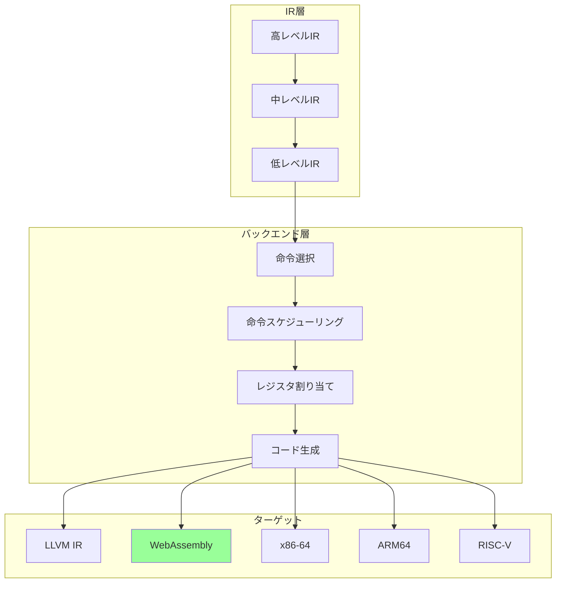
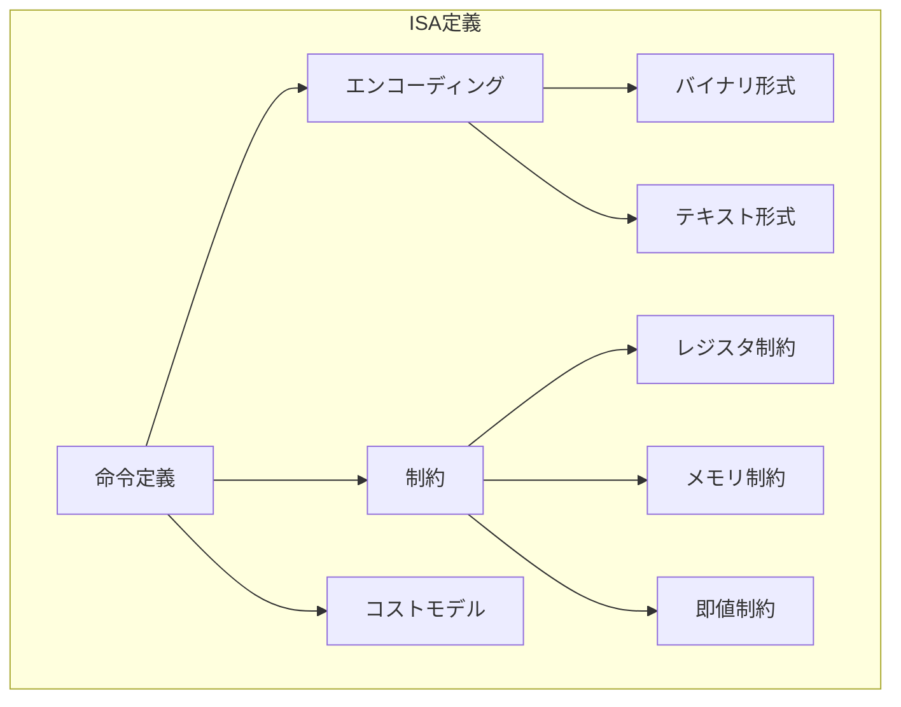
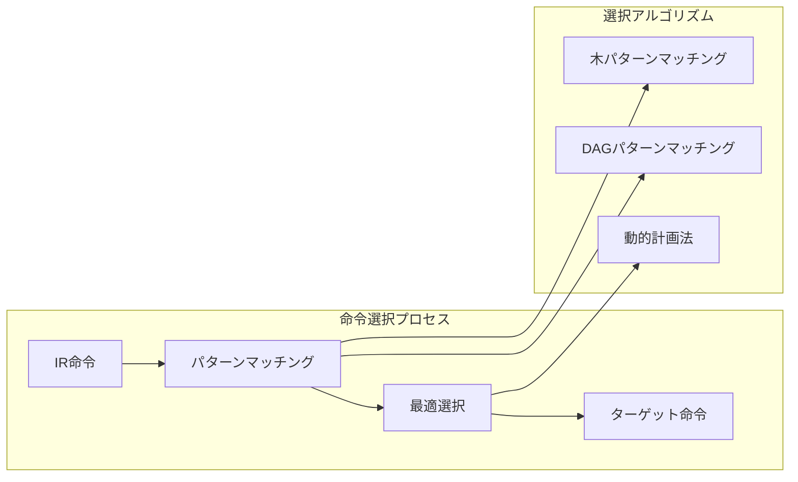
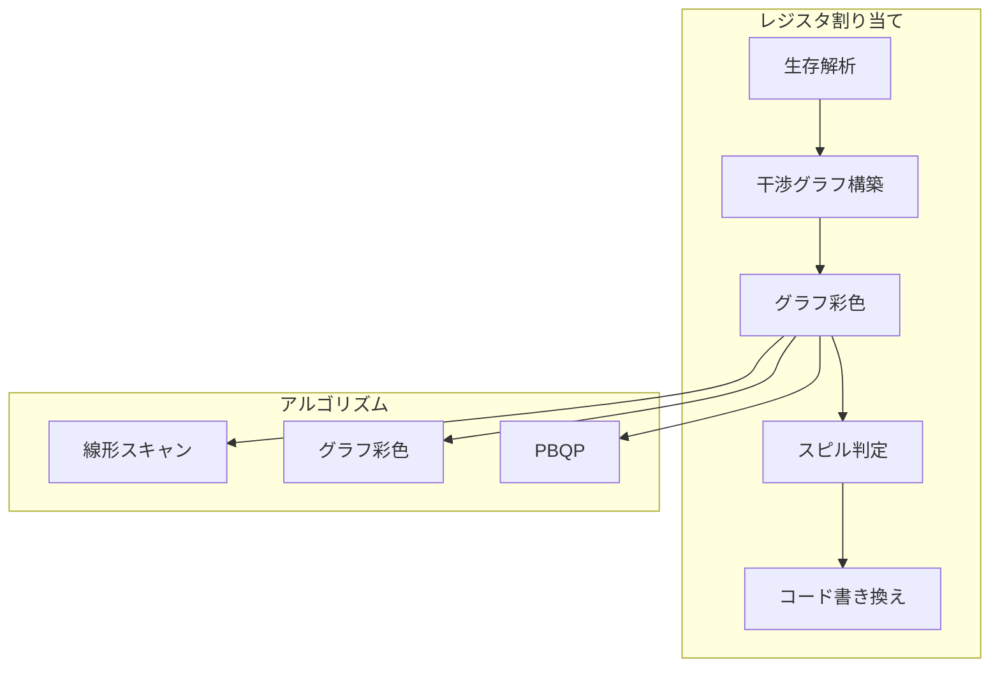
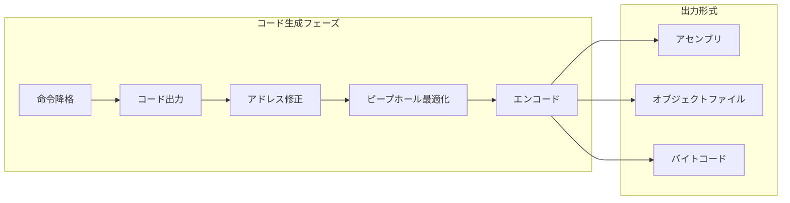
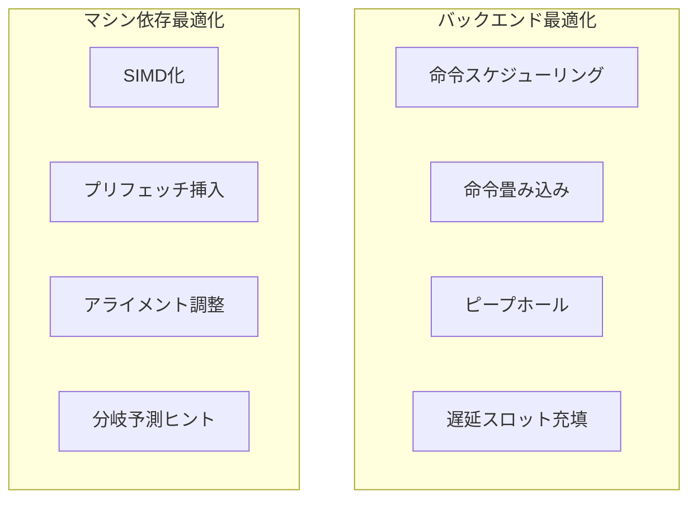
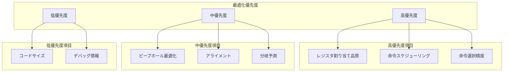

# バックエンドターゲットの追加方法

## 🎯 目的

CL-CCコンパイラコレクションに新しいバックエンドターゲット（LLVM、WebAssembly、x86-64など）を追加する手順を説明します。

## 📊 バックエンドアーキテクチャ



## 🔧 実装手順

### ステップ1: ターゲット仕様の定義

```lisp
;;;; backends/your-target/spec.lisp
(in-package :cl-cc.backend)

(defclass target-specification ()
  ((name :initarg :name
         :reader target-name
         :documentation "ターゲットの名前")
   (triple :initarg :triple
           :reader target-triple
           :documentation "ターゲットトリプル (例: x86_64-unknown-linux-gnu)")
   (features :initform nil
             :accessor target-features
             :documentation "ターゲット機能フラグ")
   (constraints :initform nil
                :accessor target-constraints
                :documentation "アーキテクチャ制約"))
  (:documentation "ターゲット仕様の基底クラス"))

;; WebAssemblyターゲットの例
(defclass wasm-target (target-specification)
  ((memory-model :initform :linear
                 :reader memory-model)
   (pointer-size :initform 32
                 :reader pointer-size)
   (endianness :initform :little
               :reader endianness)
   (stack-grows-down :initform t
                     :reader stack-grows-down))
  (:default-initargs
   :name "wasm32"
   :triple "wasm32-unknown-unknown"))

;; ターゲット機能の定義
(defmethod initialize-features ((target wasm-target))
  "WebAssemblyの機能フラグを初期化"
  (setf (target-features target)
        '(:simd128          ; SIMD命令
          :bulk-memory      ; バルクメモリ操作
          :tail-call        ; 末尾呼び出し
          :multi-value      ; 複数返り値
          :reference-types  ; 参照型
          :gc)))           ; ガベージコレクション
```

### ステップ2: 命令セットアーキテクチャ (ISA) の定義



```lisp
;;;; backends/your-target/isa.lisp
(in-package :cl-cc.backend.your-target)

;; 命令クラスの定義
(defclass target-instruction ()
  ((opcode :initarg :opcode
           :reader inst-opcode
           :documentation "オペコード")
   (operands :initarg :operands
             :accessor inst-operands
             :documentation "オペランドリスト")
   (encoding :initform nil
             :accessor inst-encoding
             :documentation "エンコーディング情報")
   (latency :initform 1
            :reader inst-latency
            :documentation "レイテンシ")
   (throughput :initform 1
               :reader inst-throughput
               :documentation "スループット"))
  (:documentation "ターゲット命令の基底クラス"))

;; WebAssembly命令の定義
(defmacro define-wasm-instruction (name &body specs)
  "WebAssembly命令を定義するマクロ"
  (destructuring-bind (&key opcode operands encoding cost constraints) specs
    `(progn
       (defclass ,name (target-instruction)
         ((constraints :initform ',constraints))
         (:default-initargs
          :opcode ',opcode
          :latency ,(or (getf cost :latency) 1)
          :throughput ,(or (getf cost :throughput) 1)))

       (defmethod encode-instruction ((inst ,name) &optional stream)
         ,encoding))))

;; 命令定義の例
(define-wasm-instruction i32.add
  :opcode #x6a
  :operands ((lhs :type i32) (rhs :type i32))
  :encoding (write-byte #x6a stream)
  :cost (:latency 1 :throughput 1)
  :constraints (:commutative t))

(define-wasm-instruction i32.load
  :opcode #x28
  :operands ((addr :type i32))
  :encoding (progn
              (write-byte #x28 stream)
              (write-leb128 (alignment inst) stream)
              (write-leb128 (offset inst) stream))
  :cost (:latency 3 :throughput 1)
  :constraints (:memory-access t))

(define-wasm-instruction call
  :opcode #x10
  :operands ((func-idx :type u32))
  :encoding (progn
              (write-byte #x10 stream)
              (write-leb128 func-idx stream))
  :cost (:latency 10 :throughput 1)
  :constraints (:control-flow t))

;; 命令パターンマッチング
(defclass instruction-pattern ()
  ((pattern :initarg :pattern
            :reader pattern-template)
   (cost :initarg :cost
         :reader pattern-cost)
   (predicate :initarg :predicate
              :reader pattern-predicate))
  (:documentation "命令パターン"))

(defmacro define-pattern (name pattern &key instruction cost when)
  "命令パターンを定義"
  `(defparameter ,name
     (make-instance 'instruction-pattern
                    :pattern ',pattern
                    :cost ,cost
                    :predicate (lambda (node) ,when))))

;; パターン定義例
(define-pattern add-immediate-pattern
  (add ?reg (const ?imm))
  :instruction (make-add-immediate ?reg ?imm)
  :cost 1
  :when (and (register-p ?reg)
             (fits-in-immediate-p ?imm)))
```

### ステップ3: 命令選択の実装



```lisp
;;;; backends/your-target/instruction-selection.lisp
(in-package :cl-cc.backend.your-target)

(defclass instruction-selector ()
  ((patterns :initform (make-hash-table :test #'equal)
             :accessor selector-patterns)
   (cost-model :initform (make-instance 'cost-model)
               :accessor selector-cost-model)
   (target :initarg :target
           :reader selector-target))
  (:documentation "命令選択器"))

(defmethod select-instructions ((selector instruction-selector) ir-node)
  "IR命令からターゲット命令を選択"
  (let ((matches (find-matching-patterns selector ir-node)))
    (if matches
        (select-best-match selector matches)
        (default-instruction-for selector ir-node))))

(defmethod find-matching-patterns ((selector instruction-selector) node)
  "マッチするパターンを検索"
  (let ((matches nil))
    (maphash (lambda (pattern inst-template)
               (when (match-pattern pattern node)
                 (push (cons pattern inst-template) matches)))
             (selector-patterns selector))
    matches))

(defmethod select-best-match ((selector instruction-selector) matches)
  "最適なマッチを選択（コストベース）"
  (let ((best nil)
        (best-cost most-positive-fixnum))
    (dolist (match matches)
      (let ((cost (compute-pattern-cost selector (car match))))
        (when (< cost best-cost)
          (setf best match
                best-cost cost))))
    (instantiate-instruction (cdr best))))

;; DAGベースの命令選択
(defclass dag-selector (instruction-selector)
  ((dag :initform nil
        :accessor selector-dag)
   (memo-table :initform (make-hash-table :test #'equal)
               :accessor selector-memo))
  (:documentation "DAGベースの命令選択器"))

(defmethod build-dag ((selector dag-selector) basic-block)
  "基本ブロックからDAGを構築"
  (let ((dag (make-instance 'dag-graph)))
    (dolist (inst (block-instructions basic-block))
      (add-node-to-dag dag inst))
    (setf (selector-dag selector) dag)))

(defmethod select-for-dag ((selector dag-selector))
  "DAG全体に対して最適な命令選択"
  (dynamic-programming-selection selector (selector-dag selector)))

(defmethod dynamic-programming-selection ((selector dag-selector) dag)
  "動的計画法による最適選択"
  (let ((costs (make-hash-table :test #'eq))
        (selections (make-hash-table :test #'eq)))

    ;; ボトムアップで最適解を計算
    (dolist (node (topological-sort dag))
      (let ((min-cost most-positive-fixnum)
            (best-selection nil))

        ;; 各パターンを試す
        (dolist (pattern (applicable-patterns selector node))
          (let ((cost (compute-total-cost selector node pattern costs)))
            (when (< cost min-cost)
              (setf min-cost cost
                    best-selection pattern))))

        (setf (gethash node costs) min-cost
              (gethash node selections) best-selection)))

    ;; 選択結果から命令列を生成
    (generate-instructions-from-selections selections)))

;; タイリングアルゴリズム
(defmethod tile-tree ((selector instruction-selector) tree)
  "木構造に対するタイリング"
  (let ((tiles nil))
    (labels ((tile-recursive (node)
               (let ((pattern (find-largest-matching-pattern selector node)))
                 (if pattern
                     (progn
                       (push pattern tiles)
                       ;; カバーされていない子ノードを処理
                       (dolist (child (uncovered-children node pattern))
                         (tile-recursive child)))
                     ;; パターンが見つからない場合のフォールバック
                     (progn
                       (push (default-pattern node) tiles)
                       (dolist (child (node-children node))
                         (tile-recursive child)))))))
      (tile-recursive tree))
    (reverse tiles)))
```

### ステップ4: レジスタ割り当て



```lisp
;;;; backends/your-target/register-allocation.lisp
(in-package :cl-cc.backend.your-target)

(defclass register-allocator ()
  ((register-file :initarg :registers
                  :reader allocator-registers
                  :documentation "利用可能なレジスタ")
   (interference-graph :initform nil
                       :accessor allocator-interference
                       :documentation "干渉グラフ")
   (allocation :initform (make-hash-table :test #'eq)
               :accessor allocator-allocation
               :documentation "割り当て結果"))
  (:documentation "レジスタ割り当て器"))

;; レジスタファイルの定義
(defclass register-file ()
  ((general-purpose :initarg :gpr
                    :reader gp-registers)
   (floating-point :initarg :fpr
                   :reader fp-registers)
   (vector :initarg :vr
           :reader vector-registers)
   (special :initarg :special
            :reader special-registers))
  (:documentation "レジスタファイル"))

;; WebAssemblyの場合（無限レジスタ）
(defclass wasm-register-allocator (register-allocator)
  ()
  (:documentation "WebAssembly用レジスタ割り当て"))

(defmethod allocate-registers ((allocator wasm-register-allocator) func)
  "WebAssemblyのローカル変数割り当て"
  ;; WebAssemblyは柔軟なローカル変数を持つ
  (let ((local-count 0)
        (allocation (make-hash-table :test #'eq)))

    (dolist (value (function-values func))
      (when (needs-storage-p value)
        (setf (gethash value allocation)
              (make-wasm-local (incf local-count)
                               (value-type value)))))

    allocation))

;; x86-64の場合（有限レジスタ）
(defclass x86-register-allocator (register-allocator)
  ()
  (:default-initargs
   :registers (make-x86-register-file)))

(defmethod allocate-registers ((allocator x86-register-allocator) func)
  "グラフ彩色によるレジスタ割り当て"
  ;; 1. 生存解析
  (let ((liveness (analyze-liveness func)))

    ;; 2. 干渉グラフの構築
    (build-interference-graph allocator liveness)

    ;; 3. グラフ彩色
    (let ((coloring (color-graph allocator)))

      ;; 4. スピル処理
      (handle-spills allocator coloring)

      ;; 5. 最終的な割り当て
      (finalize-allocation allocator coloring))))

(defmethod build-interference-graph ((allocator register-allocator) liveness)
  "干渉グラフを構築"
  (let ((graph (make-instance 'interference-graph)))

    (dolist (block (function-blocks (allocator-function allocator)))
      (let ((live (gethash block liveness)))
        ;; 同時に生存している変数間にエッジを追加
        (dolist (v1 live)
          (dolist (v2 live)
            (unless (eq v1 v2)
              (add-interference graph v1 v2))))))

    (setf (allocator-interference allocator) graph)))

(defmethod color-graph ((allocator register-allocator))
  "Chaitinのグラフ彩色アルゴリズム"
  (let ((graph (copy-graph (allocator-interference allocator)))
        (stack nil)
        (spilled nil)
        (k (length (allocator-registers allocator))))

    ;; 単純化フェーズ
    (loop while (has-nodes-p graph)
          do (let ((node (find-node-with-degree-less-than graph k)))
               (if node
                   ;; スタックにプッシュして削除
                   (progn
                     (push node stack)
                     (remove-node graph node))
                   ;; スピル候補を選択
                   (let ((spill-node (select-spill-candidate graph)))
                     (push spill-node spilled)
                     (remove-node graph spill-node)))))

    ;; 彩色フェーズ
    (let ((coloring (make-hash-table :test #'eq)))
      (dolist (node (reverse stack))
        (let ((available (available-colors allocator node coloring)))
          (if available
              (setf (gethash node coloring) (first available))
              (push node spilled))))

      (values coloring spilled))))

;; 線形スキャンアルゴリズム
(defclass linear-scan-allocator (register-allocator)
  ()
  (:documentation "線形スキャンによる高速レジスタ割り当て"))

(defmethod allocate-registers ((allocator linear-scan-allocator) func)
  "線形スキャンアルゴリズム"
  (let ((intervals (compute-live-intervals func))
        (active nil)
        (allocation (make-hash-table :test #'eq)))

    ;; 開始位置でソート
    (setf intervals (sort intervals #'< :key #'interval-start))

    (dolist (interval intervals)
      ;; 期限切れの区間を削除
      (expire-old-intervals allocator active (interval-start interval))

      ;; 利用可能なレジスタがあるか
      (let ((reg (find-free-register allocator active)))
        (if reg
            ;; レジスタを割り当て
            (progn
              (setf (gethash (interval-var interval) allocation) reg)
              (push interval active))
            ;; スピル
            (spill-at-interval allocator interval active allocation))))

    allocation))
```

### ステップ5: コード生成



```lisp
;;;; backends/your-target/code-generation.lisp
(in-package :cl-cc.backend.your-target)

(defclass code-generator ()
  ((target :initarg :target
           :reader generator-target)
   (output-stream :initarg :output
                  :accessor generator-output)
   (symbol-table :initform (make-hash-table :test #'equal)
                 :accessor generator-symbols)
   (relocation-table :initform nil
                     :accessor generator-relocations))
  (:documentation "コードジェネレータ"))

;; WebAssemblyコード生成
(defclass wasm-code-generator (code-generator)
  ((module :initform (make-instance 'wasm-module)
           :accessor wasm-module))
  (:documentation "WebAssemblyコードジェネレータ"))

(defmethod generate-code ((generator wasm-code-generator) ir-module)
  "WebAssemblyモジュールを生成"
  ;; モジュール構造の生成
  (generate-module-structure generator ir-module)

  ;; 各関数のコード生成
  (dolist (func (module-functions ir-module))
    (generate-function generator func))

  ;; モジュールのシリアライズ
  (serialize-wasm-module (wasm-module generator)
                         (generator-output generator)))

(defmethod generate-function ((generator wasm-code-generator) func)
  "WebAssembly関数を生成"
  (let ((wasm-func (make-instance 'wasm-function
                                   :name (function-name func)
                                   :type (function-signature func))))

    ;; ローカル変数の宣言
    (generate-locals generator wasm-func func)

    ;; 命令の生成
    (dolist (block (function-blocks func))
      (generate-block generator wasm-func block))

    ;; 関数をモジュールに追加
    (add-function (wasm-module generator) wasm-func)))

(defmethod generate-block ((generator wasm-code-generator) wasm-func block)
  "基本ブロックのコード生成"
  (with-output-to-sequence (stream)
    ;; ブロックラベル
    (when (block-label block)
      (emit-label generator stream (block-label block)))

    ;; 各命令を生成
    (dolist (inst (block-instructions block))
      (emit-instruction generator stream inst))

    ;; 制御フローの生成
    (generate-control-flow generator stream block)))

(defmethod emit-instruction ((generator wasm-code-generator) stream inst)
  "WebAssembly命令を出力"
  (case (instruction-type inst)
    (:i32.const
     (write-byte #x41 stream)
     (write-sleb128 (instruction-value inst) stream))

    (:i32.add
     (write-byte #x6a stream))

    (:local.get
     (write-byte #x20 stream)
     (write-leb128 (instruction-index inst) stream))

    (:call
     (write-byte #x10 stream)
     (write-leb128 (resolve-function-index generator
                                           (instruction-target inst))
                   stream))))

;; x86-64コード生成
(defclass x86-code-generator (code-generator)
  ()
  (:documentation "x86-64コードジェネレータ"))

(defmethod emit-instruction ((generator x86-code-generator) stream inst)
  "x86-64命令を出力"
  (let ((encoding (encode-x86-instruction inst)))
    ;; REXプレフィックス
    (when (needs-rex-p inst)
      (write-byte (compute-rex-prefix inst) stream))

    ;; オペコード
    (dolist (byte (instruction-opcode-bytes inst))
      (write-byte byte stream))

    ;; ModR/M
    (when (needs-modrm-p inst)
      (write-byte (compute-modrm inst) stream))

    ;; SIB
    (when (needs-sib-p inst)
      (write-byte (compute-sib inst) stream))

    ;; ディスプレースメント
    (when (instruction-displacement inst)
      (write-displacement stream (instruction-displacement inst)))

    ;; 即値
    (when (instruction-immediate inst)
      (write-immediate stream (instruction-immediate inst)))))

;; ピープホール最適化
(defclass peephole-optimizer ()
  ((patterns :initform nil
             :accessor peephole-patterns))
  (:documentation "ピープホール最適化器"))

(defmethod optimize-peephole ((optimizer peephole-optimizer) instructions)
  "命令列に対してピープホール最適化を適用"
  (let ((optimized nil)
        (i 0))
    (loop while (< i (length instructions))
          do (let ((match (find-peephole-match optimizer instructions i)))
               (if match
                   ;; パターンマッチ成功
                   (progn
                     (dolist (new-inst (apply-peephole-pattern match))
                       (push new-inst optimized))
                     (incf i (pattern-length match)))
                   ;; マッチしない場合はそのまま
                   (progn
                     (push (nth i instructions) optimized)
                     (incf i)))))
    (nreverse optimized)))

;; アセンブリ出力
(defmethod generate-assembly ((generator code-generator) ir-module stream)
  "人間が読めるアセンブリを生成"
  (format stream "; Generated by CL-CC~%")
  (format stream "; Target: ~A~%" (target-name (generator-target generator)))
  (format stream "~%")

  ;; データセクション
  (format stream ".data~%")
  (generate-data-section generator ir-module stream)

  ;; テキストセクション
  (format stream "~%.text~%")
  (dolist (func (module-functions ir-module))
    (generate-function-assembly generator func stream)))
```

### ステップ6: 最適化とチューニング



```lisp
;;;; backends/your-target/machine-optimization.lisp
(in-package :cl-cc.backend.your-target)

(defclass machine-optimizer ()
  ((target :initarg :target
           :reader optimizer-target)
   (cpu-model :initarg :cpu-model
              :reader optimizer-cpu))
  (:documentation "マシン固有最適化"))

;; 命令スケジューリング
(defclass instruction-scheduler ()
  ((latency-model :initarg :latency-model
                  :reader scheduler-latency)
   (resource-model :initarg :resource-model
                   :reader scheduler-resources))
  (:documentation "命令スケジューラ"))

(defmethod schedule-instructions ((scheduler instruction-scheduler) block)
  "命令をスケジューリング"
  (let ((dag (build-dependency-dag block))
        (ready-queue (make-priority-queue))
        (scheduled nil)
        (cycle 0))

    ;; リストスケジューリングアルゴリズム
    (loop while (or (not (empty-p ready-queue))
                    (has-unscheduled-p dag))
          do (progn
               ;; 準備完了の命令を追加
               (dolist (inst (ready-instructions dag cycle))
                 (enqueue ready-queue inst (priority inst)))

               ;; リソースが利用可能な命令をスケジュール
               (loop while (and (not (empty-p ready-queue))
                                (available-resources-p scheduler cycle))
                     do (let ((inst (dequeue ready-queue)))
                          (schedule-at scheduler inst cycle)
                          (push inst scheduled)
                          (mark-scheduled dag inst)))

               (incf cycle)))

    (nreverse scheduled)))

;; SIMD最適化
(defclass simd-optimizer (machine-optimizer)
  ()
  (:documentation "SIMD命令への変換"))

(defmethod vectorize-loop ((optimizer simd-optimizer) loop)
  "ループのベクトル化"
  (when (vectorizable-p loop)
    (let ((vector-width (target-vector-width (optimizer-target optimizer))))
      ;; ループを展開してSIMD命令に変換
      (transform-to-simd loop vector-width))))

(defmethod transform-to-simd ((loop loop-info) width)
  "SIMD命令への変換"
  (let ((vectorized nil))
    (dolist (inst (loop-body loop))
      (case (instruction-type inst)
        (:scalar-add
         (push (make-simd-add inst width) vectorized))
        (:scalar-mul
         (push (make-simd-mul inst width) vectorized))
        (otherwise
         (push inst vectorized))))
    (nreverse vectorized)))

;; プロファイルガイド最適化
(defclass profile-guided-optimizer (machine-optimizer)
  ((profile-data :initarg :profile
                 :reader optimizer-profile))
  (:documentation "プロファイルガイド最適化"))

(defmethod optimize-with-profile ((optimizer profile-guided-optimizer) func)
  "プロファイル情報を使用した最適化"
  ;; ホットパスの特定
  (let ((hot-paths (identify-hot-paths (optimizer-profile optimizer) func)))

    ;; ホットパスの積極的な最適化
    (dolist (path hot-paths)
      (aggressive-optimize-path optimizer path))

    ;; コールドパスのサイズ最適化
    (optimize-cold-paths optimizer func)))
```

### ステップ7: デバッグ情報の生成

```lisp
;;;; backends/your-target/debug-info.lisp
(in-package :cl-cc.backend.your-target)

(defclass debug-info-generator ()
  ((format :initarg :format
           :reader debug-format
           :documentation "デバッグ情報形式 (DWARF, PDB, etc.)")
   (source-map :initform (make-hash-table :test #'equal)
               :accessor debug-source-map))
  (:documentation "デバッグ情報ジェネレータ"))

;; DWARF形式
(defclass dwarf-generator (debug-info-generator)
  ()
  (:default-initargs :format :dwarf))

(defmethod generate-debug-info ((generator dwarf-generator) module)
  "DWARF形式のデバッグ情報を生成"
  ;; .debug_infoセクション
  (generate-debug-info-section generator module)

  ;; .debug_lineセクション
  (generate-line-number-info generator module)

  ;; .debug_frameセクション
  (generate-frame-info generator module))

;; ソースマップ (WebAssembly用)
(defclass source-map-generator (debug-info-generator)
  ()
  (:default-initargs :format :source-map))

(defmethod generate-source-map ((generator source-map-generator) module)
  "ソースマップを生成"
  (let ((mappings nil))
    (dolist (func (module-functions module))
      (dolist (inst (function-instructions func))
        (when (instruction-location inst)
          (push (make-mapping inst) mappings))))
    (encode-source-map (reverse mappings))))
```

### ステップ8: テストとベンチマーク

```lisp
;;;; backends/your-target/tests.lisp
(in-package :cl-cc.backend.your-target.tests)

(define-test-suite backend-tests
  (:documentation "バックエンドのテストスイート"))

;; 命令選択のテスト
(define-test instruction-selection-test
  "命令選択のテスト"
  (let* ((ir (make-ir-add (make-ir-const 1) (make-ir-const 2)))
         (selector (make-instance 'instruction-selector))
         (selected (select-instructions selector ir)))
    (assert-equal 'i32.add (instruction-type selected))))

;; レジスタ割り当てのテスト
(define-test register-allocation-test
  "レジスタ割り当てのテスト"
  (let* ((func (make-test-function))
         (allocator (make-instance 'register-allocator))
         (allocation (allocate-registers allocator func)))
    ;; 干渉する変数が異なるレジスタに割り当てられているか
    (assert-not-equal (gethash 'x allocation)
                      (gethash 'y allocation))))

;; コード生成のテスト
(define-test code-generation-test
  "コード生成のテスト"
  (let* ((module (make-test-module))
         (generator (make-instance 'wasm-code-generator))
         (output (with-output-to-sequence (s)
                   (generate-code generator module s))))
    ;; WebAssemblyマジックナンバーの確認
    (assert-equal #(#x00 #x61 #x73 #x6d) (subseq output 0 4))))

;; ベンチマーク
(define-benchmark backend-benchmark
  "バックエンドのベンチマーク"
  (let ((test-programs (generate-benchmark-programs)))
    (dolist (program test-programs)
      (time-operation 'instruction-selection program)
      (time-operation 'register-allocation program)
      (time-operation 'code-generation program))))

;; 統合テスト
(define-test end-to-end-test
  "エンドツーエンドテスト"
  (let* ((source "func factorial(n) { if n <= 1 then 1 else n * factorial(n-1) }")
         (ir (compile-to-ir source))
         (wasm (compile-to-wasm ir)))
    ;; 実行して結果を確認
    (assert-equal 120 (execute-wasm wasm 'factorial 5))))
```

## 📊 パフォーマンス考慮事項



## 📋 チェックリスト

- [ ] ターゲット仕様の定義
- [ ] ISAの定義と命令パターン
- [ ] 命令選択の実装
- [ ] レジスタ割り当ての実装
- [ ] コード生成の実装
- [ ] マシン固有最適化
- [ ] デバッグ情報の生成
- [ ] アセンブラ/リンカとの統合
- [ ] テストケースの作成
- [ ] ベンチマークの実施
- [ ] ドキュメントの作成

## 🎯 ベストプラクティス

1. **段階的実装**: 最小限の命令セットから始める
2. **テスト駆動**: 各フェーズを独立してテスト
3. **プロファイリング**: 実際のコードでの性能測定
4. **ドキュメント**: ISAとABIの詳細な文書化
5. **互換性**: 既存のツールチェーンとの統合

## 🔗 関連リンク

- [新しい言語フロントエンドの追加](add-language-frontend.md)
- [最適化パスの実装](implement-optimization-pass.md)
- [中間表現(IR)仕様](../reference/ir-specification.md)

---

*新しいターゲットの追加は、コンパイラの真の力を解き放つ鍵である。*