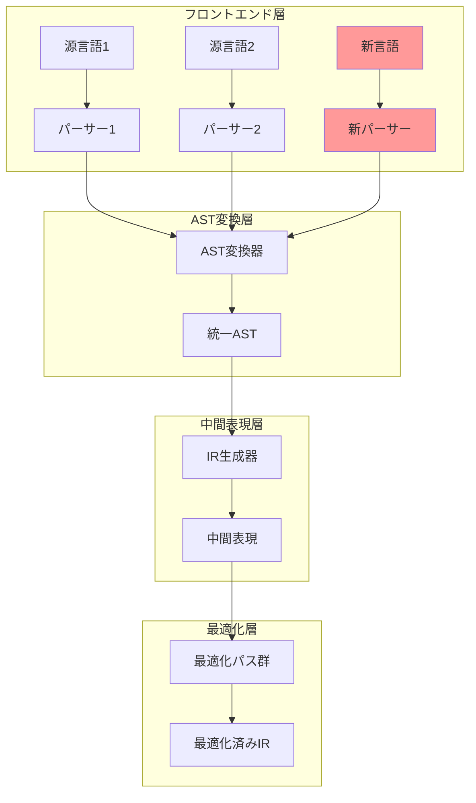
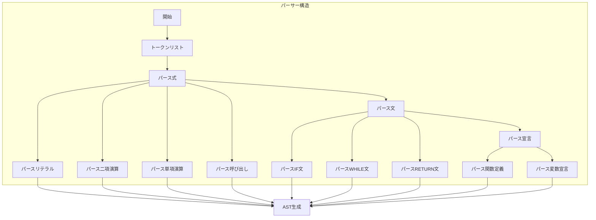
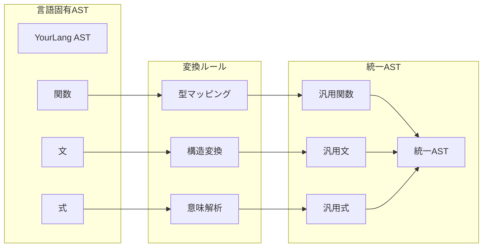
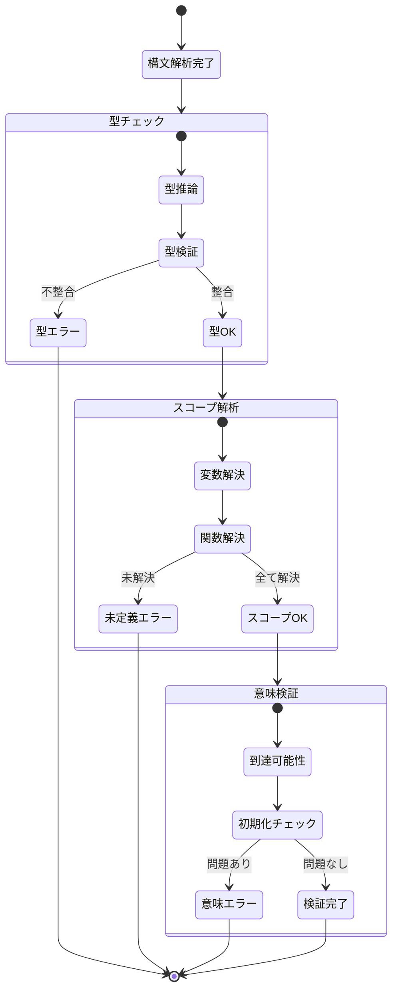
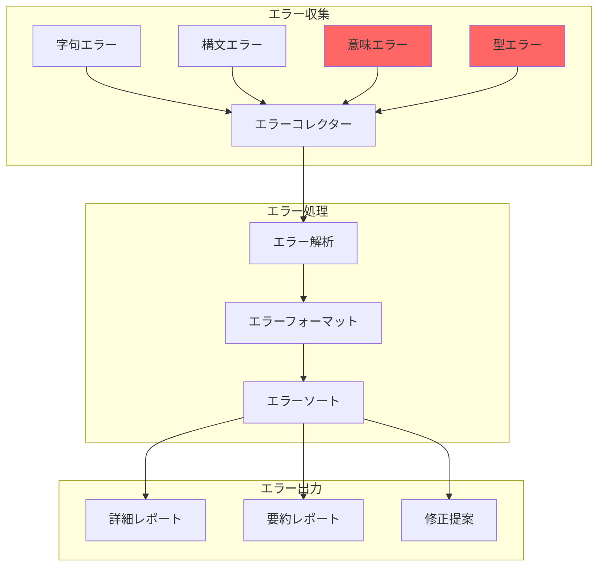
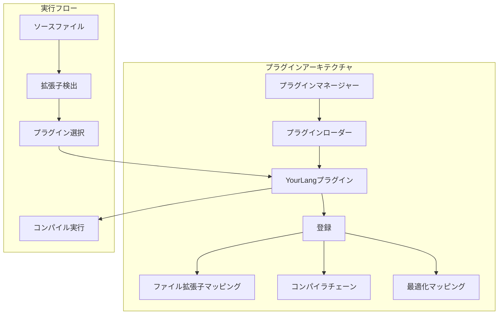

# 新しい言語フロントエンドの追加方法

## 🎯 目的

CL-CCコンパイラコレクションに新しいプログラミング言語のフロントエンドを追加する手順を説明します。

## 📊 アーキテクチャ概要



## 🔧 実装手順

### ステップ1: 言語仕様の定義

```lisp
;;;; languages/your-language/spec.lisp
(in-package :cl-cc.frontend)

(defclass your-language-spec (language-specification)
  ((name :initform "YourLanguage"
         :reader language-name)
   (version :initform "1.0.0"
           :reader language-version)
   (file-extensions :initform '("yl" "yourlang")
                    :reader language-extensions)))

;; トークン定義
(define-token-types your-language
  ;; キーワード
  (:if "if")
  (:then "then")
  (:else "else")
  (:while "while")
  (:function "func")
  (:return "return")

  ;; 演算子
  (:plus "+")
  (:minus "-")
  (:multiply "*")
  (:divide "/")
  (:assign "=")
  (:equal "==")

  ;; リテラル
  (:number "[0-9]+")
  (:string "\"[^\"]*\"")
  (:identifier "[a-zA-Z_][a-zA-Z0-9_]*"))
```

### ステップ2: レクサーの実装

```lisp
;;;; languages/your-language/lexer.lisp
(in-package :cl-cc.frontend.your-language)

(defclass your-language-lexer (lexer-base)
  ((current-position :initform 0)
   (tokens :initform nil)
   (source :initarg :source)))

(defmethod tokenize ((lexer your-language-lexer))
  "ソースコードをトークン列に変換"
  (with-slots (source current-position tokens) lexer
    (loop while (< current-position (length source))
          do (skip-whitespace lexer)
          when (< current-position (length source))
          do (push (next-token lexer) tokens))
    (nreverse tokens)))

(defmethod next-token ((lexer your-language-lexer))
  "次のトークンを読み取る"
  (let ((char (peek-char lexer)))
    (cond
      ;; 数値リテラル
      ((digit-char-p char)
       (read-number lexer))

      ;; 文字列リテラル
      ((char= char #\")
       (read-string lexer))

      ;; 識別子またはキーワード
      ((alpha-char-p char)
       (read-identifier-or-keyword lexer))

      ;; 演算子
      ((member char '(#\+ #\- #\* #\/ #\=))
       (read-operator lexer))

      ;; エラー
      (t (error "予期しない文字: ~C at position ~D"
                char (slot-value lexer 'current-position))))))
```

### ステップ3: パーサーの実装



```lisp
;;;; languages/your-language/parser.lisp
(in-package :cl-cc.frontend.your-language)

(defclass your-language-parser (parser-base)
  ((tokens :initarg :tokens)
   (current :initform 0)))

(defmethod parse ((parser your-language-parser))
  "トークン列をASTに変換"
  (parse-program parser))

(defmethod parse-program ((parser your-language-parser))
  "プログラム全体をパース"
  (make-instance 'program-node
                 :declarations (loop while (not (at-end-p parser))
                                    collect (parse-declaration parser))))

(defmethod parse-declaration ((parser your-language-parser))
  "宣言をパース"
  (case (token-type (current-token parser))
    (:function (parse-function parser))
    (otherwise (parse-statement parser))))

(defmethod parse-function ((parser your-language-parser))
  "関数定義をパース"
  (consume parser :function)
  (let ((name (consume parser :identifier))
        (params (parse-parameter-list parser))
        (body (parse-block parser)))
    (make-instance 'function-node
                   :name name
                   :params params
                   :body body)))

(defmethod parse-statement ((parser your-language-parser))
  "文をパース"
  (case (token-type (current-token parser))
    (:if (parse-if-statement parser))
    (:while (parse-while-statement parser))
    (:return (parse-return-statement parser))
    (otherwise (parse-expression-statement parser))))

;; 演算子優先順位パーサー
(defmethod parse-expression ((parser your-language-parser) &optional (precedence 0))
  "式を演算子優先順位でパース"
  (let ((left (parse-primary parser)))
    (loop while (and (not (at-end-p parser))
                     (>= (operator-precedence (current-token parser))
                         precedence))
          do (let* ((op (current-token parser))
                    (op-precedence (operator-precedence op)))
               (advance parser)
               (setf left (make-instance 'binary-op-node
                                          :operator (token-type op)
                                          :left left
                                          :right (parse-expression parser
                                                                   (1+ op-precedence))))))
    left))
```

### ステップ4: AST変換器の実装



```lisp
;;;; languages/your-language/ast-transformer.lisp
(in-package :cl-cc.frontend.your-language)

(defclass your-language-transformer (ast-transformer)
  ((type-map :initform (make-hash-table :test #'equal))
   (symbol-table :initform (make-instance 'symbol-table))))

(defgeneric transform-to-unified-ast (node transformer)
  (:documentation "言語固有のASTを統一ASTに変換"))

;; 関数ノードの変換
(defmethod transform-to-unified-ast ((node function-node)
                                     (transformer your-language-transformer))
  (make-instance 'unified-function-node
                 :name (function-name node)
                 :parameters (mapcar (lambda (param)
                                       (transform-parameter param transformer))
                                     (function-params node))
                 :return-type (infer-return-type node transformer)
                 :body (transform-to-unified-ast (function-body node)
                                                 transformer)))

;; 型推論
(defmethod infer-type ((node ast-node) (transformer your-language-transformer))
  "ノードの型を推論"
  (typecase node
    (literal-node
     (type-of (literal-value node)))
    (binary-op-node
     (unify-types (infer-type (binary-left node) transformer)
                  (infer-type (binary-right node) transformer)))
    (variable-node
     (lookup-type (variable-name node) transformer))
    (otherwise :unknown)))

;; シンボルテーブル管理
(defmethod enter-scope ((transformer your-language-transformer))
  "新しいスコープに入る"
  (push-scope (slot-value transformer 'symbol-table)))

(defmethod exit-scope ((transformer your-language-transformer))
  "スコープから出る"
  (pop-scope (slot-value transformer 'symbol-table)))

(defmethod register-symbol ((transformer your-language-transformer)
                           name type &optional value)
  "シンボルを登録"
  (add-symbol (slot-value transformer 'symbol-table)
              name type value))
```

### ステップ5: セマンティック解析



```lisp
;;;; languages/your-language/semantic-analyzer.lisp
(in-package :cl-cc.frontend.your-language)

(defclass semantic-analyzer ()
  ((errors :initform nil)
   (warnings :initform nil)
   (type-environment :initform (make-instance 'type-environment))
   (scope-manager :initform (make-instance 'scope-manager))))

(defmethod analyze ((analyzer semantic-analyzer) ast)
  "セマンティック解析を実行"
  (handler-case
      (progn
        (check-types analyzer ast)
        (resolve-symbols analyzer ast)
        (check-control-flow analyzer ast)
        (check-initialization analyzer ast)
        (when (errors analyzer)
          (signal 'semantic-error :errors (errors analyzer)))
        ast)
    (error (e)
      (push e (errors analyzer))
      nil)))

(defmethod check-types ((analyzer semantic-analyzer) node)
  "型チェックを実行"
  (typecase node
    (binary-op-node
     (let ((left-type (get-type (binary-left node) analyzer))
           (right-type (get-type (binary-right node) analyzer)))
       (unless (compatible-types-p left-type right-type)
         (add-error analyzer
                    (format nil "型の不一致: ~A と ~A"
                            left-type right-type)))))
    (function-call-node
     (check-argument-types analyzer node))
    (return-node
     (check-return-type analyzer node))))
```

### ステップ6: エラーレポーティング



```lisp
;;;; languages/your-language/error-reporting.lisp
(in-package :cl-cc.frontend.your-language)

(defclass compilation-error ()
  ((type :initarg :type)
   (message :initarg :message)
   (location :initarg :location)
   (severity :initarg :severity :initform :error)
   (suggestion :initarg :suggestion :initform nil)))

(defmethod report-error ((error compilation-error) &optional (stream *error-output*))
  "エラーを報告"
  (with-slots (type message location severity suggestion) error
    (format stream "~&~A: ~A~%"
            (severity-string severity)
            message)
    (when location
      (format stream "  位置: ~A~%"
              (format-location location)))
    (when suggestion
      (format stream "  提案: ~A~%"
              suggestion))))

(defmethod generate-diagnostic ((analyzer semantic-analyzer) node error-type)
  "診断メッセージを生成"
  (case error-type
    (:undefined-variable
     (make-instance 'compilation-error
                    :type :semantic
                    :message (format nil "未定義の変数: ~A"
                                     (variable-name node))
                    :location (node-location node)
                    :suggestion "変数を宣言するか、スペルを確認してください"))

    (:type-mismatch
     (make-instance 'compilation-error
                    :type :type-error
                    :message "型が一致しません"
                    :location (node-location node)
                    :severity :error))

    (:unreachable-code
     (make-instance 'compilation-error
                    :type :warning
                    :message "到達不可能なコード"
                    :location (node-location node)
                    :severity :warning))))
```

### ステップ7: テストとバリデーション

```lisp
;;;; languages/your-language/tests.lisp
(in-package :cl-cc.frontend.your-language.tests)

(define-test-suite your-language-frontend-tests
  (:documentation "フロントエンドのテストスイート"))

(define-test lexer-test
  "レクサーのテスト"
  (let ((lexer (make-instance 'your-language-lexer
                              :source "func main() { return 42; }")))
    (let ((tokens (tokenize lexer)))
      (assert-equal 8 (length tokens))
      (assert-equal :function (token-type (first tokens)))
      (assert-equal "main" (token-value (second tokens))))))

(define-test parser-test
  "パーサーのテスト"
  (let* ((source "if (x > 0) then x else -x")
         (lexer (make-instance 'your-language-lexer :source source))
         (tokens (tokenize lexer))
         (parser (make-instance 'your-language-parser :tokens tokens))
         (ast (parse parser)))
    (assert-true (typep ast 'if-expr-node))
    (assert-true (typep (if-condition ast) 'binary-op-node))))

(define-test semantic-test
  "セマンティック解析のテスト"
  (let* ((ast (parse-program "func foo(x) { return x + y; }"))
         (analyzer (make-instance 'semantic-analyzer)))
    (analyze analyzer ast)
    (assert-true (find-if (lambda (e)
                             (search "未定義の変数: y"
                                     (slot-value e 'message)))
                          (errors analyzer)))))

;; プロパティベーステスト
(define-property-test roundtrip-test
  "パース→生成のラウンドトリップ"
  (for-all ((source (gen-valid-source)))
    (let* ((ast1 (parse-source source))
           (generated (generate-source ast1))
           (ast2 (parse-source generated)))
      (ast-equivalent-p ast1 ast2))))
```

### ステップ8: 統合とプラグイン化



```lisp
;;;; languages/your-language/plugin.lisp
(in-package :cl-cc.plugins)

(defclass your-language-plugin (language-plugin)
  ((name :initform "YourLanguage")
   (version :initform "1.0.0")
   (extensions :initform '("yl" "yourlang"))))

(defmethod initialize-plugin ((plugin your-language-plugin))
  "プラグインを初期化"
  (register-lexer plugin 'your-language-lexer)
  (register-parser plugin 'your-language-parser)
  (register-transformer plugin 'your-language-transformer)
  (register-analyzer plugin 'semantic-analyzer)

  ;; 最適化パスを登録
  (register-optimization-pass plugin 'your-language-specific-optimization))

(defmethod can-handle-p ((plugin your-language-plugin) file)
  "このプラグインがファイルを処理できるか判定"
  (member (pathname-type file)
          (slot-value plugin 'extensions)
          :test #'string=))

;; プラグインの自動登録
(register-plugin (make-instance 'your-language-plugin))
```

## 📋 チェックリスト

- [ ] 言語仕様の文書化
- [ ] レクサーの実装とテスト
- [ ] パーサーの実装とテスト
- [ ] AST変換器の実装
- [ ] セマンティック解析の実装
- [ ] エラーレポーティングの実装
- [ ] 統合テストの作成
- [ ] パフォーマンステストの実施
- [ ] ドキュメントの作成
- [ ] サンプルプログラムの作成

## 🎯 ベストプラクティス

1. **段階的な実装**
   - 最小限の機能から始める
   - 徐々に機能を追加

2. **テストファースト**
   - 各コンポーネントを独立してテスト
   - 統合テストで全体を検証

3. **エラー処理**
   - わかりやすいエラーメッセージ
   - 可能な限り修正提案を提供

4. **パフォーマンス**
   - 大規模ファイルでのテスト
   - メモリ使用量の監視

## 🔗 関連リンク

- [最適化パスの実装](implement-optimization-pass.md)
- [バックエンドターゲットの追加](add-backend-target.md)
- [コアAPIリファレンス](../reference/core-api.md)

---

*新しい言語の追加は、CL-CCの力を証明する良い機会である。*