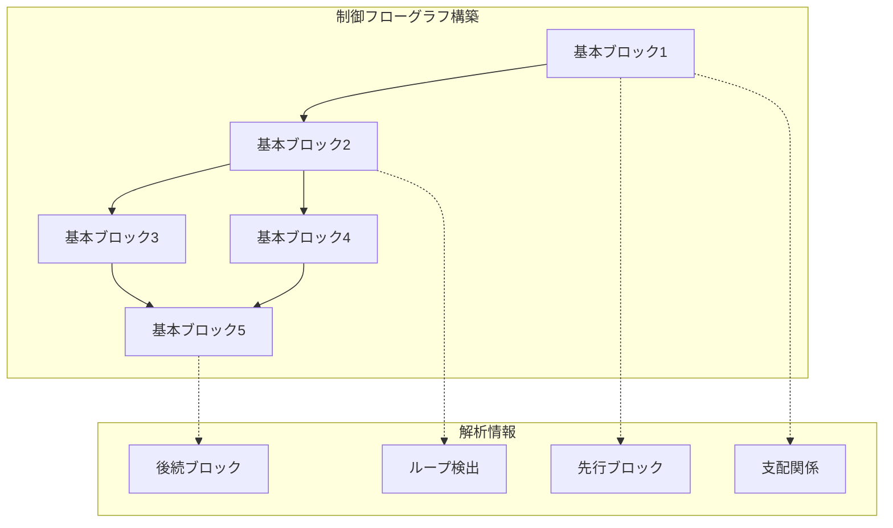
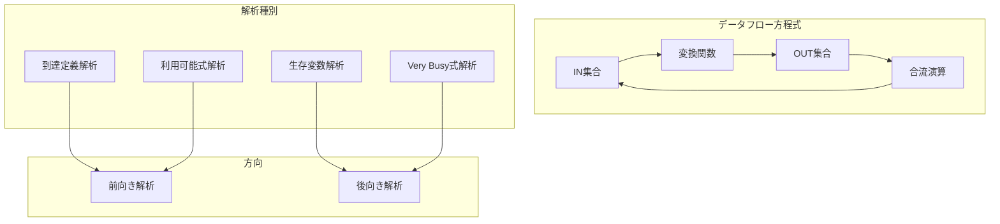
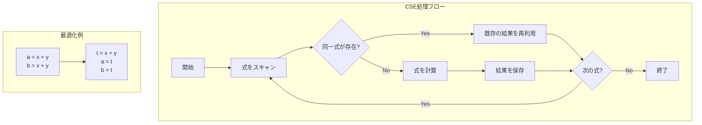
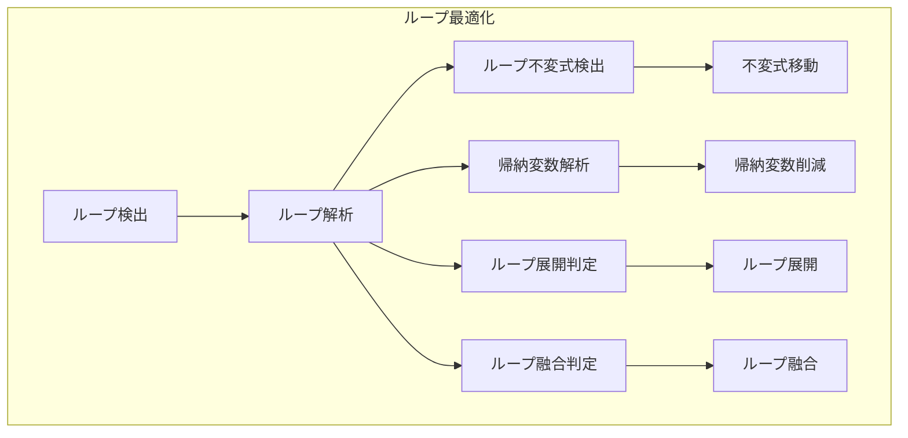
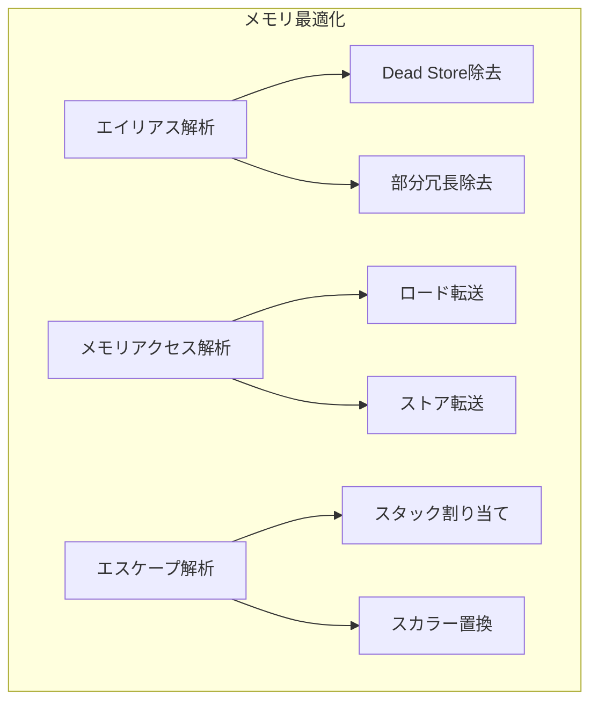
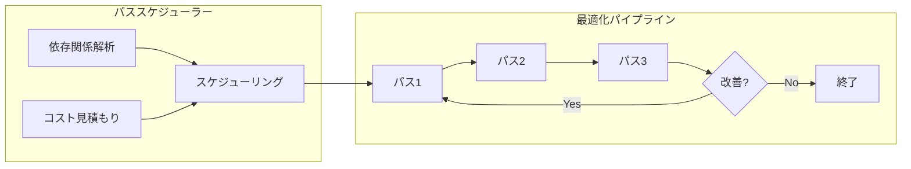

# 最適化パスの実装方法

## 🎯 目的

CL-CCの中間表現（IR）に対する高性能な最適化パスを実装する手順を説明します。

## 📊 最適化パイプライン全体像

```mermaid
graph LR
    subgraph "入力"
        IR1[初期IR]
    end

    subgraph "解析フェーズ"
        CFG[制御フロー解析]
        DFA[データフロー解析]
        DOM[支配木構築]
        SSA[SSA形式変換]
    end

    subgraph "最適化フェーズ"
        DCE[デッドコード除去]
        CSE[共通部分式除去]
        CF[定数畳み込み]
        CP[定数伝播]
        LICM[ループ不変式移動]
        IV[帰納変数最適化]
        PRE[部分冗長除去]
    end

    subgraph "出力"
        IR2[最適化済みIR]
    end

    IR1 --> CFG --> DFA
    DFA --> DOM --> SSA
    SSA --> DCE --> CSE
    CSE --> CF --> CP
    CP --> LICM --> IV
    IV --> PRE --> IR2

    style CF fill:#99ff99
    style CP fill:#99ff99
```



## 🔧 実装手順

### ステップ1: 最適化パスの基本構造

```lisp
;;;; optimizations/optimization-pass-base.lisp
(in-package :cl-cc.optimizer)

(defclass optimization-pass ()
  ((name :initarg :name
         :reader pass-name
         :documentation "パスの名前")
   (description :initarg :description
                :reader pass-description
                :documentation "パスの説明")
   (requires :initarg :requires
             :initform nil
             :reader pass-requirements
             :documentation "前提となる解析")
   (preserves :initarg :preserves
              :initform nil
              :reader pass-preserves
              :documentation "保持する性質")
   (statistics :initform (make-hash-table :test #'equal)
               :accessor pass-statistics
               :documentation "統計情報"))
  (:documentation "最適化パスの基底クラス"))

(defgeneric run-pass (pass ir-module)
  (:documentation "最適化パスを実行"))

(defgeneric should-run-p (pass ir-module)
  (:documentation "パスを実行すべきか判定")
  (:method ((pass optimization-pass) ir-module)
    t))

(defmethod run-pass :around ((pass optimization-pass) ir-module)
  "パス実行の前後処理"
  (when (should-run-p pass ir-module)
    (let ((start-time (get-internal-real-time)))
      (prog1 (call-next-method)
        (record-statistics pass
                          :time (- (get-internal-real-time) start-time)
                          :module ir-module)))))
```

### ステップ2: 制御フロー解析



```lisp
;;;; optimizations/control-flow-analysis.lisp
(in-package :cl-cc.optimizer)

(defclass control-flow-graph ()
  ((entry-block :initarg :entry
                :accessor cfg-entry
                :documentation "エントリーブロック")
   (exit-block :initarg :exit
               :accessor cfg-exit
               :documentation "出口ブロック")
   (blocks :initform (make-hash-table :test #'eq)
           :accessor cfg-blocks
           :documentation "基本ブロックの集合")
   (edges :initform (make-hash-table :test #'equal)
          :accessor cfg-edges
          :documentation "エッジ情報"))
  (:documentation "制御フローグラフ"))

(defclass basic-block ()
  ((id :initarg :id
       :reader block-id)
   (instructions :initform nil
                 :accessor block-instructions)
   (predecessors :initform nil
                 :accessor block-predecessors)
   (successors :initform nil
               :accessor block-successors)
   (dominators :initform nil
               :accessor block-dominators)
   (loop-header :initform nil
                :accessor block-loop-header))
  (:documentation "基本ブロック"))

(defmethod build-cfg ((module ir-module))
  "IRモジュールから制御フローグラフを構築"
  (let ((cfg (make-instance 'control-flow-graph))
        (current-block nil)
        (block-map (make-hash-table :test #'equal)))

    ;; 基本ブロックの識別
    (dolist (inst (module-instructions module))
      (cond
        ;; 新しいブロックの開始
        ((or (null current-block)
             (is-label-p inst)
             (is-target-p inst))
         (setf current-block (make-instance 'basic-block
                                            :id (generate-block-id)))
         (setf (gethash (block-id current-block) (cfg-blocks cfg))
               current-block))

        ;; 現在のブロックに命令を追加
        (t
         (push inst (block-instructions current-block))))

      ;; ブロックの終了判定
      (when (is-terminator-p inst)
        (setf current-block nil)))

    ;; エッジの構築
    (build-edges cfg)

    ;; 支配木の構築
    (build-dominator-tree cfg)

    ;; ループの検出
    (detect-loops cfg)

    cfg))

(defmethod build-dominator-tree ((cfg control-flow-graph))
  "支配木を構築"
  (let ((dominators (make-hash-table :test #'eq)))
    ;; Lengauer-Tarjanアルゴリズムの実装
    (labels ((dfs (block visited)
               ;; 深さ優先探索で番号付け
               (pushnew block visited)
               (dolist (succ (block-successors block))
                 (unless (member succ visited)
                   (dfs succ visited)))))

      ;; エントリーブロックから開始
      (dfs (cfg-entry cfg) nil)

      ;; 各ブロックの直接支配ノードを計算
      (iterate-until-fixpoint
       (lambda ()
         (maphash (lambda (id block)
                    (update-dominators block dominators))
                  (cfg-blocks cfg)))))

    dominators))

(defmethod detect-loops ((cfg control-flow-graph))
  "自然ループを検出"
  (let ((loops nil))
    (maphash (lambda (id block)
               (dolist (succ (block-successors block))
                 ;; バックエッジの検出
                 (when (dominates-p succ block)
                   (push (make-instance 'natural-loop
                                        :header succ
                                        :back-edge (cons block succ))
                         loops))))
             (cfg-blocks cfg))
    loops))
```

### ステップ3: データフロー解析



```lisp
;;;; optimizations/dataflow-analysis.lisp
(in-package :cl-cc.optimizer)

(defclass dataflow-analysis ()
  ((direction :initarg :direction
              :reader analysis-direction
              :documentation ":forward or :backward")
   (initial-value :initarg :initial
                  :reader analysis-initial
                  :documentation "初期値")
   (transfer-function :initarg :transfer
                      :reader analysis-transfer
                      :documentation "変換関数")
   (meet-operation :initarg :meet
                   :reader analysis-meet
                   :documentation "合流演算"))
  (:documentation "データフロー解析の基底クラス"))

;; 到達定義解析
(defclass reaching-definitions (dataflow-analysis)
  ()
  (:default-initargs
   :direction :forward
   :initial (make-empty-set)
   :meet #'set-union))

(defmethod transfer-function ((analysis reaching-definitions) block)
  "到達定義の変換関数"
  (lambda (in-set)
    (let ((gen-set (compute-gen-set block))
          (kill-set (compute-kill-set block)))
      (set-union gen-set
                 (set-difference in-set kill-set)))))

;; 生存変数解析
(defclass live-variables (dataflow-analysis)
  ()
  (:default-initargs
   :direction :backward
   :initial (make-empty-set)
   :meet #'set-union))

(defmethod transfer-function ((analysis live-variables) block)
  "生存変数の変換関数"
  (lambda (out-set)
    (let ((use-set (compute-use-set block))
          (def-set (compute-def-set block)))
      (set-union use-set
                 (set-difference out-set def-set)))))

;; 利用可能式解析
(defclass available-expressions (dataflow-analysis)
  ()
  (:default-initargs
   :direction :forward
   :initial (make-universal-set)
   :meet #'set-intersection))

;; データフロー解析の実行
(defmethod run-dataflow-analysis ((analysis dataflow-analysis)
                                  (cfg control-flow-graph))
  "不動点反復法でデータフロー解析を実行"
  (let ((in-sets (make-hash-table :test #'eq))
        (out-sets (make-hash-table :test #'eq))
        (worklist (all-blocks cfg))
        (changed t))

    ;; 初期化
    (initialize-sets in-sets out-sets cfg analysis)

    ;; 不動点に到達するまで反復
    (loop while changed
          do (setf changed nil)
          do (dolist (block worklist)
               (let ((old-out (gethash block out-sets)))
                 (update-block-sets block in-sets out-sets analysis cfg)
                 (unless (set-equal (gethash block out-sets) old-out)
                   (setf changed t)))))

    (values in-sets out-sets)))

;; SSA形式への変換
(defclass ssa-builder ()
  ((cfg :initarg :cfg
        :reader ssa-cfg)
   (dominance-frontier :initform (make-hash-table :test #'eq)
                      :accessor ssa-df)
   (phi-nodes :initform (make-hash-table :test #'eq)
              :accessor ssa-phi-nodes))
  (:documentation "SSA形式変換器"))

(defmethod build-ssa ((builder ssa-builder))
  "SSA形式を構築"
  ;; 1. 支配辺境を計算
  (compute-dominance-frontier builder)

  ;; 2. Φ関数の配置
  (place-phi-functions builder)

  ;; 3. 変数のリネーミング
  (rename-variables builder))
```

### ステップ4: 最適化の実装例 - 定数畳み込み

```lisp
;;;; optimizations/constant-folding.lisp
(in-package :cl-cc.optimizer)

(defclass constant-folding-pass (optimization-pass)
  ((folded-count :initform 0
                 :accessor folded-count))
  (:default-initargs
   :name "Constant Folding"
   :description "コンパイル時に定数式を評価"))

(defmethod run-pass ((pass constant-folding-pass) ir-module)
  "定数畳み込みを実行"
  (let ((changed nil))
    (do-instructions (inst ir-module)
      (when (foldable-instruction-p inst)
        (let ((result (fold-instruction inst)))
          (when result
            (replace-instruction inst result)
            (incf (folded-count pass))
            (setf changed t)))))
    changed))

(defmethod foldable-instruction-p ((inst ir-instruction))
  "命令が畳み込み可能か判定"
  (and (arithmetic-instruction-p inst)
       (every #'constant-operand-p (instruction-operands inst))))

(defmethod fold-instruction ((inst ir-instruction))
  "定数命令を評価"
  (case (instruction-opcode inst)
    (:add (apply #'+ (get-constant-values inst)))
    (:sub (apply #'- (get-constant-values inst)))
    (:mul (apply #'* (get-constant-values inst)))
    (:div (apply #'/ (get-constant-values inst)))
    (:and (apply #'logand (get-constant-values inst)))
    (:or  (apply #'logior (get-constant-values inst)))
    (:xor (apply #'logxor (get-constant-values inst)))
    (otherwise nil)))

;; 代数的簡約
(defmethod algebraic-simplification ((inst ir-instruction))
  "代数的な簡約規則を適用"
  (case (instruction-opcode inst)
    ;; x + 0 = x
    (:add
     (when (and (constant-operand-p (second-operand inst))
                (zerop (constant-value (second-operand inst))))
       (first-operand inst)))

    ;; x * 1 = x
    (:mul
     (when (and (constant-operand-p (second-operand inst))
                (= 1 (constant-value (second-operand inst))))
       (first-operand inst)))

    ;; x * 0 = 0
    (:mul
     (when (and (constant-operand-p (second-operand inst))
                (zerop (constant-value (second-operand inst))))
       (make-constant 0)))

    ;; x - x = 0
    (:sub
     (when (same-operand-p (first-operand inst)
                          (second-operand inst))
       (make-constant 0)))))
```

### ステップ5: 共通部分式除去（CSE）



```lisp
;;;; optimizations/common-subexpression-elimination.lisp
(in-package :cl-cc.optimizer)

(defclass cse-pass (optimization-pass)
  ((expression-table :initform (make-hash-table :test #'equal)
                     :accessor cse-table)
   (available-expressions :initform nil
                         :accessor cse-available))
  (:default-initargs
   :name "Common Subexpression Elimination"
   :description "共通部分式を除去"
   :requires '(:available-expressions)))

(defmethod run-pass ((pass cse-pass) ir-module)
  "共通部分式除去を実行"
  (let ((cfg (build-cfg ir-module))
        (ae-analysis (make-instance 'available-expressions)))

    ;; 利用可能式解析を実行
    (multiple-value-bind (in-sets out-sets)
        (run-dataflow-analysis ae-analysis cfg)

      ;; 各基本ブロックで共通部分式を除去
      (maphash (lambda (id block)
                 (eliminate-common-subexpressions
                  pass block
                  (gethash block in-sets)))
               (cfg-blocks cfg)))))

(defmethod eliminate-common-subexpressions ((pass cse-pass)
                                           block
                                           available)
  "ブロック内の共通部分式を除去"
  (let ((local-table (make-hash-table :test #'equal)))

    (dolist (inst (block-instructions block))
      (when (pure-instruction-p inst)
        (let ((expr-key (compute-expression-key inst)))

          ;; 既に計算済みの式か確認
          (multiple-value-bind (existing exists-p)
              (gethash expr-key local-table)

            (if exists-p
                ;; 既存の結果を再利用
                (replace-with-copy inst existing)

                ;; 新しい式として登録
                (setf (gethash expr-key local-table)
                      (instruction-destination inst)))))))))

(defmethod compute-expression-key ((inst ir-instruction))
  "式の正規化されたキーを生成"
  (let ((opcode (instruction-opcode inst))
        (operands (instruction-operands inst)))

    ;; 可換演算子の場合はオペランドをソート
    (when (commutative-operator-p opcode)
      (setf operands (sort-operands operands)))

    ;; ハッシュキーを生成
    (list opcode operands)))

(defmethod pure-instruction-p ((inst ir-instruction))
  "副作用のない純粋な命令か判定"
  (and (not (memory-instruction-p inst))
       (not (call-instruction-p inst))
       (not (volatile-instruction-p inst))))
```

### ステップ6: ループ最適化



```lisp
;;;; optimizations/loop-optimization.lisp
(in-package :cl-cc.optimizer)

(defclass loop-optimization-pass (optimization-pass)
  ((loop-info :initform nil
              :accessor loop-info))
  (:default-initargs
   :name "Loop Optimization"
   :description "ループの最適化"))

;; ループ不変式移動（LICM）
(defclass licm-pass (loop-optimization-pass)
  ()
  (:default-initargs
   :name "Loop Invariant Code Motion"
   :description "ループ不変式を外に移動"))

(defmethod run-pass ((pass licm-pass) ir-module)
  "ループ不変式移動を実行"
  (let ((cfg (build-cfg ir-module))
        (loops (detect-loops cfg)))

    (dolist (loop loops)
      (hoist-loop-invariants pass loop cfg))))

(defmethod hoist-loop-invariants ((pass licm-pass) loop cfg)
  "ループ不変式を巻き上げ"
  (let ((invariants (find-loop-invariants loop))
        (preheader (get-or-create-preheader loop)))

    (dolist (inst invariants)
      (when (safe-to-hoist-p inst loop)
        (move-instruction inst preheader)
        (record-hoisted pass inst)))))

(defmethod find-loop-invariants ((loop natural-loop))
  "ループ不変式を検出"
  (let ((invariants nil)
        (loop-blocks (loop-blocks loop))
        (changed t))

    ;; 不動点まで反復
    (loop while changed
          do (setf changed nil)
          do (dolist (block loop-blocks)
               (dolist (inst (block-instructions block))
                 (when (and (not (member inst invariants))
                           (loop-invariant-p inst loop invariants))
                   (push inst invariants)
                   (setf changed t)))))

    invariants))

(defmethod loop-invariant-p ((inst ir-instruction) loop known-invariants)
  "命令がループ不変か判定"
  (and
   ;; 副作用がない
   (pure-instruction-p inst)

   ;; すべてのオペランドがループ不変
   (every (lambda (operand)
            (or
             ;; 定数
             (constant-p operand)

             ;; ループ外で定義
             (defined-outside-loop-p operand loop)

             ;; 既知の不変式
             (member (defining-instruction operand) known-invariants)))
          (instruction-operands inst))))

;; ループ展開
(defclass loop-unrolling-pass (loop-optimization-pass)
  ((unroll-factor :initform 4
                  :accessor unroll-factor))
  (:default-initargs
   :name "Loop Unrolling"
   :description "ループを展開"))

(defmethod should-unroll-p ((pass loop-unrolling-pass) loop)
  "ループを展開すべきか判定"
  (and
   ;; トリップカウントが既知
   (known-trip-count-p loop)

   ;; 小さなループ
   (< (loop-size loop) 100)

   ;; 展開してもコードサイズが爆発しない
   (< (* (loop-size loop) (unroll-factor pass)) 1000)))

(defmethod unroll-loop ((pass loop-unrolling-pass) loop)
  "ループを展開"
  (let ((factor (unroll-factor pass))
        (body (loop-body loop)))

    ;; ループ本体を複製
    (dotimes (i (1- factor))
      (let ((cloned (clone-instructions body)))
        ;; 帰納変数を調整
        (adjust-induction-variables cloned (* i (loop-step loop)))
        ;; 複製した本体を挿入
        (insert-instructions-after body cloned)))))

;; 帰納変数最適化
(defclass induction-variable-optimization (loop-optimization-pass)
  ()
  (:default-initargs
   :name "Induction Variable Optimization"
   :description "帰納変数を最適化"))

(defmethod optimize-induction-variables ((pass induction-variable-optimization)
                                        loop)
  "帰納変数を最適化"
  (let ((ivs (detect-induction-variables loop)))

    ;; 強度削減
    (dolist (iv ivs)
      (when (reducible-p iv)
        (strength-reduce iv)))

    ;; 不要な帰納変数を除去
    (eliminate-redundant-ivs ivs)))

(defmethod strength-reduce ((iv induction-variable))
  "強度削減を適用"
  ;; 乗算を加算に変換
  ;; i * c → t (t += c at each iteration)
  (when (eq (iv-operation iv) :mul)
    (let ((add-inst (make-add-instruction
                     (iv-base iv)
                     (iv-step iv))))
      (replace-instruction (iv-update iv) add-inst))))
```

### ステップ7: メモリ最適化



```lisp
;;;; optimizations/memory-optimization.lisp
(in-package :cl-cc.optimizer)

(defclass alias-analysis ()
  ((alias-sets :initform (make-hash-table :test #'eq)
               :accessor alias-sets)
   (points-to :initform (make-hash-table :test #'eq)
              :accessor points-to-info))
  (:documentation "エイリアス解析"))

(defmethod may-alias-p ((ptr1 pointer) (ptr2 pointer) analysis)
  "2つのポインタがエイリアスする可能性があるか"
  (or
   ;; 同じポインタ
   (eq ptr1 ptr2)

   ;; 同じエイリアス集合
   (eq (gethash ptr1 (alias-sets analysis))
       (gethash ptr2 (alias-sets analysis)))

   ;; 保守的な判定
   (unknown-alias-p ptr1 ptr2)))

;; Dead Store除去
(defclass dead-store-elimination (optimization-pass)
  ()
  (:default-initargs
   :name "Dead Store Elimination"
   :description "不要なストアを除去"
   :requires '(:alias-analysis :live-variables)))

(defmethod run-pass ((pass dead-store-elimination) ir-module)
  "Dead Storeを除去"
  (let ((alias-info (run-alias-analysis ir-module))
        (live-info (run-live-analysis ir-module)))

    (do-instructions (inst ir-module)
      (when (and (store-instruction-p inst)
                 (dead-store-p inst alias-info live-info))
        (remove-instruction inst)))))

(defmethod dead-store-p ((store store-instruction) alias-info live-info)
  "ストアが不要か判定"
  (let ((ptr (store-pointer store))
        (next-access (find-next-memory-access store)))

    (and
     ;; 次のアクセスが存在
     next-access

     ;; 次のアクセスもストア
     (store-instruction-p next-access)

     ;; 同じ位置へのストア
     (must-alias-p ptr (store-pointer next-access) alias-info)

     ;; 間に読み込みがない
     (no-loads-between-p store next-access alias-info))))

;; エスケープ解析
(defclass escape-analysis (dataflow-analysis)
  ((escape-info :initform (make-hash-table :test #'eq)
                :accessor escape-info))
  (:documentation "エスケープ解析"))

(defmethod analyze-escape ((analysis escape-analysis) allocation)
  "割り当てのエスケープを解析"
  (let ((users (find-users allocation)))

    (cond
      ;; 関数から返される
      ((some #'return-instruction-p users)
       :global-escape)

      ;; ストアされる
      ((some (lambda (u)
               (and (store-instruction-p u)
                    (not (local-store-p u))))
             users)
       :heap-escape)

      ;; 関数呼び出しに渡される
      ((some (lambda (u)
               (and (call-instruction-p u)
                    (not (noescape-call-p u))))
             users)
       :arg-escape)

      ;; エスケープしない
      (t :no-escape))))

(defmethod optimize-allocation ((allocation allocation-instruction)
                               escape-info)
  "エスケープ情報に基づいて割り当てを最適化"
  (case (gethash allocation escape-info)
    (:no-escape
     ;; スタック割り当てに変換
     (convert-to-stack-allocation allocation))

    (:arg-escape
     ;; 部分的な最適化が可能
     (optimize-partial-escape allocation))))
```

### ステップ8: 最適化パスの組み合わせとスケジューリング



```lisp
;;;; optimizations/pass-manager.lisp
(in-package :cl-cc.optimizer)

(defclass pass-manager ()
  ((passes :initform nil
           :accessor manager-passes)
   (pass-order :initform nil
               :accessor pass-order)
   (max-iterations :initform 10
                   :accessor max-iterations)
   (statistics :initform (make-hash-table :test #'equal)
               :accessor manager-stats))
  (:documentation "最適化パスマネージャー"))

(defmethod add-pass ((manager pass-manager) pass &key priority)
  "パスを追加"
  (push (cons pass priority) (manager-passes manager))
  (recompute-pass-order manager))

(defmethod recompute-pass-order ((manager pass-manager))
  "パスの実行順序を計算"
  (let ((deps (compute-pass-dependencies manager))
        (costs (estimate-pass-costs manager)))

    (setf (pass-order manager)
          (topological-sort (manager-passes manager) deps costs))))

(defmethod run-optimization-pipeline ((manager pass-manager) ir-module)
  "最適化パイプラインを実行"
  (let ((iteration 0)
        (changed t)
        (total-benefit 0))

    ;; 収束するまで反復
    (loop while (and changed
                     (< iteration (max-iterations manager)))
          do (progn
               (setf changed nil)
               (incf iteration)

               ;; 各パスを順番に実行
               (dolist (pass (pass-order manager))
                 (when (should-run-pass-p pass ir-module)
                   (let ((benefit (run-pass-with-profiling pass ir-module)))
                     (when (> benefit 0)
                       (setf changed t)
                       (incf total-benefit benefit))

                     ;; 統計を記録
                     (record-pass-statistics manager pass benefit))))))

    ;; 最終的な統計を返す
    (values ir-module total-benefit)))

(defmethod run-pass-with-profiling ((pass optimization-pass) ir-module)
  "パスをプロファイリング付きで実行"
  (let ((start-time (get-internal-real-time))
        (start-size (module-size ir-module))
        (start-cost (estimate-cost ir-module)))

    (run-pass pass ir-module)

    (let ((end-time (get-internal-real-time))
          (end-size (module-size ir-module))
          (end-cost (estimate-cost ir-module)))

      ;; 改善度を計算
      (compute-benefit start-cost end-cost
                      start-size end-size
                      (- end-time start-time)))))

;; 適応的最適化
(defclass adaptive-optimizer (pass-manager)
  ((learning-rate :initform 0.1
                  :accessor learning-rate)
   (pass-weights :initform (make-hash-table :test #'eq)
                 :accessor pass-weights))
  (:documentation "学習機能付き最適化器"))

(defmethod adapt-pass-order ((optimizer adaptive-optimizer) feedback)
  "フィードバックに基づいてパス順序を適応"
  (dolist (pass-result feedback)
    (let ((pass (car pass-result))
          (benefit (cdr pass-result)))

      ;; 重みを更新
      (update-pass-weight optimizer pass benefit)

      ;; 順序を再計算
      (when (significant-change-p optimizer)
        (recompute-pass-order optimizer)))))
```

## 📊 パフォーマンス測定とプロファイリング

```lisp
;;;; optimizations/profiling.lisp
(in-package :cl-cc.optimizer)

(defclass optimization-profiler ()
  ((metrics :initform (make-hash-table :test #'equal)
            :accessor profiler-metrics))
  (:documentation "最適化プロファイラー"))

(defmethod profile-optimization ((profiler optimization-profiler)
                                 pass
                                 ir-module)
  "最適化の効果を測定"
  (let ((metrics (make-instance 'optimization-metrics)))

    ;; 実行時間
    (setf (metric-time metrics)
          (measure-execution-time
           (lambda () (run-pass pass ir-module))))

    ;; コードサイズ
    (setf (metric-code-size metrics)
          (measure-code-size ir-module))

    ;; 推定実行コスト
    (setf (metric-estimated-cost metrics)
          (estimate-execution-cost ir-module))

    ;; メモリ使用量
    (setf (metric-memory-usage metrics)
          (measure-memory-usage))

    metrics))

(defmethod generate-optimization-report ((profiler optimization-profiler))
  "最適化レポートを生成"
  (format nil "~{~A~%~}"
          (loop for pass being the hash-keys of (profiler-metrics profiler)
                using (hash-value metrics)
                collect (format-pass-report pass metrics))))
```

## 🧪 テストとベンチマーク

```lisp
;;;; optimizations/tests/optimization-tests.lisp
(in-package :cl-cc.optimizer.tests)

(define-test-suite optimization-tests
  (:documentation "最適化パスのテストスイート"))

(define-test constant-folding-test
  "定数畳み込みのテスト"
  (let* ((ir (parse-ir "
          %1 = add i32 2, 3
          %2 = mul i32 %1, 4
          %3 = add i32 %2, 5
          "))
         (pass (make-instance 'constant-folding-pass))
         (optimized (run-pass pass ir)))

    (assert-equal 25 (get-constant-value optimized '%3))))

(define-test cse-test
  "共通部分式除去のテスト"
  (let* ((ir (parse-ir "
          %1 = add i32 %x, %y
          %2 = mul i32 %1, 2
          %3 = add i32 %x, %y  ; 共通部分式
          %4 = div i32 %3, 2
          "))
         (pass (make-instance 'cse-pass))
         (optimized (run-pass pass ir)))

    ;; %3が%1を参照するように最適化される
    (assert-true (refers-to-p optimized '%3 '%1))))

(define-benchmark optimization-benchmark
  "最適化パスのベンチマーク"
  (let ((test-cases (generate-test-programs)))

    (dolist (program test-cases)
      (benchmark-pass 'constant-folding-pass program)
      (benchmark-pass 'cse-pass program)
      (benchmark-pass 'licm-pass program)
      (benchmark-pass 'dead-code-elimination program))))
```

## 📋 チェックリスト

- [ ] 最適化パスの設計
- [ ] 制御フロー解析の実装
- [ ] データフロー解析の実装
- [ ] 最適化アルゴリズムの実装
- [ ] 正当性のテスト
- [ ] パフォーマンステスト
- [ ] 他の最適化との相互作用テスト
- [ ] ドキュメントの作成

## 🎯 ベストプラクティス

1. **正当性優先**: 最適化の正しさを最優先
2. **段階的実装**: シンプルなケースから始める
3. **十分なテスト**: エッジケースも含めて網羅的にテスト
4. **プロファイリング**: 実際の効果を測定
5. **保守性**: コードの可読性を維持

## 🔗 関連リンク

- [中間表現(IR)仕様](../reference/ir-specification.md)
- [最適化パスカタログ](../reference/optimization-passes.md)
- [パフォーマンス最適化戦略](../explanation/performance-strategy.md)

---

*最適化は芸術である。正しさを保ちながら、最大の効果を追求せよ。*