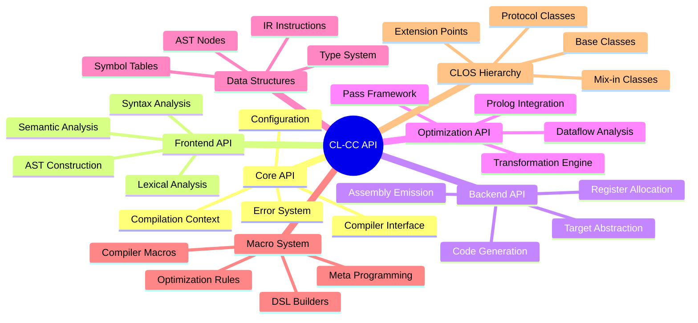

# CL-CC 完全APIリファレンス

## 🎯 概要

このドキュメントは、CL-CCの全APIを網羅した完全なリファレンスです。すべての公開インターフェース、クラス、関数、マクロの詳細仕様を提供します。

## 📋 目次



---

## コンパイラコアAPI

### メインコンパイラクラス

#### `COMPILER` クラス

```lisp
(defclass compiler ()
  ((name :initarg :name
         :accessor compiler-name
         :type symbol
         :documentation "コンパイラの名前")
   (frontend :initarg :frontend
             :accessor compiler-frontend
             :type frontend
             :documentation "フロントエンド実装")
   (backend :initarg :backend
            :accessor compiler-backend
            :type backend
            :documentation "バックエンド実装")
   (optimization-level :initarg :optimization-level
                       :accessor optimization-level
                       :type (integer 0 3)
                       :initform 1
                       :documentation "最適化レベル (0-3)")
   (target-architecture :initarg :target
                        :accessor target-architecture
                        :type keyword
                        :initform :x86-64
                        :documentation "ターゲットアーキテクチャ")
   (debug-info :initarg :debug-info
               :accessor debug-info-p
               :type boolean
               :initform nil
               :documentation "デバッグ情報生成フラグ")
   (compilation-context :accessor compilation-context
                        :initform nil
                        :documentation "現在のコンパイルコンテキスト")))
```

**説明**: CL-CCのメインコンパイラクラス。すべてのコンパイル操作の中心となる。

**使用例**:
```lisp
(defparameter *my-compiler*
  (make-instance 'compiler
                 :name 'my-lisp-compiler
                 :frontend (make-instance 'lisp-frontend)
                 :backend (make-instance 'llvm-backend)
                 :optimization-level 2
                 :target :x86-64
                 :debug-info t))
```

### メインコンパイル関数

#### `COMPILE-PROGRAM` 関数

```lisp
(defgeneric compile-program (compiler source &key output-file options)
  (:documentation "プログラム全体をコンパイルする"))

(defmethod compile-program ((compiler compiler) (source pathname)
                           &key output-file options)
  "ファイルからプログラムをコンパイル")

(defmethod compile-program ((compiler compiler) (source string)
                           &key output-file options)
  "文字列からプログラムをコンパイル")

(defmethod compile-program ((compiler compiler) (source stream)
                           &key output-file options)
  "ストリームからプログラムをコンパイル")
```

**パラメータ**:
- `compiler`: コンパイラインスタンス
- `source`: ソースコード（ファイルパス、文字列、またはストリーム）
- `output-file`: 出力ファイルパス（省略時は自動生成）
- `options`: 追加オプション（プロパティリスト）

**戻り値**: `COMPILATION-RESULT` オブジェクト

**使用例**:
```lisp
(compile-program *my-compiler* "factorial.lisp"
                 :output-file "factorial.o"
                 :options '(:optimize-loops t :inline-functions t))
```

#### `COMPILE-EXPRESSION` 関数

```lisp
(defgeneric compile-expression (compiler expression &key context)
  (:documentation "単一の式をコンパイルする"))
```

**説明**: 単一の式を即座にコンパイルし、実行可能コードまたは中間表現を生成。

**使用例**:
```lisp
(compile-expression *my-compiler* '(+ 1 2 3))
;; => #<COMPILED-EXPRESSION {10051E2F43}>
```

### コンパイル設定

#### `COMPILER-OPTIONS` クラス

```lisp
(defclass compiler-options ()
  ((optimization-passes :initarg :optimization-passes
                        :accessor optimization-passes
                        :type list
                        :initform '()
                        :documentation "有効な最適化パス")
   (warning-level :initarg :warning-level
                  :accessor warning-level
                  :type (integer 0 3)
                  :initform 1
                  :documentation "警告レベル")
   (error-on-warning :initarg :error-on-warning
                     :accessor error-on-warning-p
                     :type boolean
                     :initform nil
                     :documentation "警告をエラーとして扱う")
   (parallel-compilation :initarg :parallel
                         :accessor parallel-compilation-p
                         :type boolean
                         :initform t
                         :documentation "並列コンパイル有効化")
   (cache-enabled :initarg :cache
                  :accessor cache-enabled-p
                  :type boolean
                  :initform t
                  :documentation "コンパイルキャッシュ"))
```

### エラーハンドリング

#### `COMPILATION-ERROR` 条件

```lisp
(define-condition compilation-error (error)
  ((phase :initarg :phase
          :reader error-phase
          :type keyword
          :documentation "エラーが発生したコンパイルフェーズ")
   (location :initarg :location
             :reader error-location
             :type (or null source-location)
             :documentation "エラー発生位置")
   (source-form :initarg :source-form
                :reader error-source-form
                :initform nil
                :documentation "エラーを引き起こしたソース")
   (suggestion :initarg :suggestion
               :reader error-suggestion
               :initform nil
               :documentation "修正提案"))
  (:report (lambda (condition stream)
             (format stream "Compilation error in ~A: ~A"
                     (error-phase condition)
                     (call-next-method))))
  (:documentation "コンパイル時エラーの基底クラス"))
```

**サブタイプ**:
- `SYNTAX-ERROR`: 構文エラー
- `TYPE-ERROR`: 型エラー
- `SEMANTIC-ERROR`: 意味解析エラー
- `OPTIMIZATION-ERROR`: 最適化エラー
- `CODEGEN-ERROR`: コード生成エラー

---

## フロントエンドAPI

### フロントエンドインターフェース

#### `FRONTEND` 抽象クラス

```lisp
(defclass frontend ()
  ((language :initarg :language
             :accessor frontend-language
             :type keyword
             :documentation "対象言語")
   (parser :accessor frontend-parser
           :documentation "パーサーインスタンス")
   (lexer :accessor frontend-lexer
          :documentation "字句解析器インスタンス")
   (semantic-analyzer :accessor frontend-semantic-analyzer
                      :documentation "意味解析器"))
  (:documentation "フロントエンドの抽象基底クラス"))
```

#### `PARSE` ジェネリック関数

```lisp
(defgeneric parse (frontend source)
  (:documentation "ソースコードをASTに変換"))

(defmethod parse ((frontend lisp-frontend) (source string))
  "Lispソースのパース")

(defmethod parse ((frontend lisp-frontend) (source stream))
  "Lispストリームのパース")
```

### 字句解析API

#### `TOKEN` クラス

```lisp
(defclass token ()
  ((type :initarg :type
         :accessor token-type
         :type keyword
         :documentation "トークンの種類")
   (value :initarg :value
          :accessor token-value
          :documentation "トークンの値")
   (location :initarg :location
             :accessor token-location
             :type source-location
             :documentation "ソース内位置")
   (metadata :initform (make-hash-table)
             :accessor token-metadata
             :documentation "追加メタデータ"))
  (:documentation "字句解析によって生成されるトークン"))
```

#### `TOKENIZE` 関数

```lisp
(defgeneric tokenize (lexer input)
  (:documentation "入力を字句解析してトークン列を生成"))

(defmethod tokenize ((lexer standard-lexer) (input string))
  "文字列の字句解析")

(defmethod tokenize ((lexer standard-lexer) (input stream))
  "ストリームの字句解析")
```

### ASTノード階層

#### `AST-NODE` 基底クラス

```lisp
(defclass ast-node ()
  ((location :initarg :location
             :accessor node-location
             :type (or null source-location)
             :initform nil
             :documentation "ソースコード内の位置")
   (type-info :accessor node-type-info
              :initform nil
              :documentation "型情報")
   (annotations :initform (make-hash-table)
                :accessor node-annotations
                :documentation "ノード注釈"))
  (:documentation "すべてのASTノードの基底クラス"))
```

#### `EXPRESSION-NODE` クラス

```lisp
(defclass expression-node (ast-node)
  ((result-type :accessor expression-result-type
                :initform nil
                :documentation "式の結果型")
   (side-effects :accessor expression-side-effects
                 :initform nil
                 :type list
                 :documentation "副作用のリスト"))
  (:documentation "式を表現するノード"))
```

#### `LITERAL-NODE` クラス

```lisp
(defclass literal-node (expression-node)
  ((value :initarg :value
          :accessor literal-value
          :documentation "リテラル値")
   (literal-type :initarg :literal-type
                 :accessor literal-type
                 :type keyword
                 :documentation "リテラルの型"))
  (:documentation "リテラル値のノード"))
```

---

## 中間表現API

### IR階層

#### `IR-NODE` 基底クラス

```lisp
(defclass ir-node ()
  ((id :initform (generate-unique-id)
       :accessor ir-node-id
       :type fixnum
       :documentation "ノードの一意ID")
   (predecessors :initform '()
                 :accessor ir-predecessors
                 :type list
                 :documentation "先行ノード")
   (successors :initform '()
               :accessor ir-successors
               :type list
               :documentation "後続ノード")
   (metadata :initform (make-hash-table)
             :accessor ir-metadata
             :documentation "メタデータ"))
  (:documentation "IRノードの基底クラス"))
```

#### `BASIC-BLOCK` クラス

```lisp
(defclass basic-block (ir-node)
  ((instructions :initform '()
                 :accessor block-instructions
                 :type list
                 :documentation "命令のリスト")
   (label :initarg :label
          :accessor block-label
          :type (or symbol null)
          :documentation "ブロックラベル")
   (dominators :accessor block-dominators
               :initform '()
               :documentation "支配ノード")
   (dominated :accessor block-dominated
              :initform '()
              :documentation "被支配ノード"))
  (:documentation "基本ブロック"))
```

### SSA形式

#### `SSA-VALUE` クラス

```lisp
(defclass ssa-value ()
  ((name :initarg :name
         :accessor ssa-value-name
         :type symbol
         :documentation "SSA値の名前")
   (definition :initarg :definition
               :accessor ssa-value-definition
               :type ir-instruction
               :documentation "定義する命令")
   (uses :initform '()
         :accessor ssa-value-uses
         :type list
         :documentation "使用箇所のリスト")
   (type :accessor ssa-value-type
         :initform nil
         :documentation "値の型"))
  (:documentation "SSA形式の値"))
```

#### `PHI-INSTRUCTION` クラス

```lisp
(defclass phi-instruction (ir-instruction)
  ((operands :initarg :operands
             :accessor phi-operands
             :type list
             :documentation "φ関数のオペランド")
   (block-mapping :initform (make-hash-table)
                  :accessor phi-block-mapping
                  :documentation "ブロックから値へのマッピング"))
  (:documentation "φ関数命令"))
```

---

## 最適化API

### 最適化フレームワーク

#### `OPTIMIZATION-PASS` 基底クラス

```lisp
(defclass optimization-pass ()
  ((name :initarg :name
         :accessor pass-name
         :type symbol
         :documentation "パスの名前")
   (description :initarg :description
                :accessor pass-description
                :type string
                :documentation "パスの説明")
   (prerequisites :initarg :prerequisites
                  :accessor pass-prerequisites
                  :type list
                  :initform '()
                  :documentation "前提条件となるパス")
   (invalidates :initarg :invalidates
                :accessor pass-invalidates
                :type list
                :initform '()
                :documentation "無効化する解析結果")
   (preserves :initarg :preserves
              :accessor pass-preserves
              :type list
              :initform '()
              :documentation "保持する解析結果"))
  (:documentation "最適化パスの基底クラス"))
```

#### `RUN-PASS` ジェネリック関数

```lisp
(defgeneric run-pass (pass ir-unit &key options)
  (:documentation "最適化パスを実行"))

(defmethod run-pass ((pass optimization-pass) (unit ir-function)
                    &key options)
  "関数レベルでの最適化パス実行")

(defmethod run-pass ((pass optimization-pass) (unit ir-module)
                    &key options)
  "モジュールレベルでの最適化パス実行")
```

### データフロー解析

#### `DATAFLOW-ANALYSIS` クラス

```lisp
(defclass dataflow-analysis ()
  ((direction :initarg :direction
              :accessor analysis-direction
              :type (member :forward :backward)
              :documentation "解析方向")
   (lattice :initarg :lattice
            :accessor analysis-lattice
            :type lattice
            :documentation "格子構造")
   (transfer-function :initarg :transfer-function
                      :accessor analysis-transfer-function
                      :type function
                      :documentation "転送関数")
   (meet-function :initarg :meet-function
                  :accessor analysis-meet-function
                  :type function
                  :documentation "合流関数"))
  (:documentation "データフロー解析の抽象クラス"))
```

#### `LIVE-VARIABLE-ANALYSIS` クラス

```lisp
(defclass live-variable-analysis (dataflow-analysis)
  ()
  (:default-initargs
   :direction :backward
   :lattice (make-instance 'powerset-lattice)
   :transfer-function #'live-variable-transfer
   :meet-function #'set-union)
  (:documentation "ライブ変数解析"))
```

---

## バックエンドAPI

### バックエンドインターフェース

#### `BACKEND` 抽象クラス

```lisp
(defclass backend ()
  ((target-architecture :initarg :target
                        :accessor backend-target-architecture
                        :type keyword
                        :documentation "ターゲットアーキテクチャ")
   (calling-convention :accessor backend-calling-convention
                       :documentation "呼び出し規約")
   (register-file :accessor backend-register-file
                  :documentation "レジスタファイル記述")
   (instruction-set :accessor backend-instruction-set
                    :documentation "命令セット記述"))
  (:documentation "バックエンドの抽象基底クラス"))
```

#### `GENERATE-CODE` ジェネリック関数

```lisp
(defgeneric generate-code (backend ir-unit &key options)
  (:documentation "IRからターゲットコードを生成"))

(defmethod generate-code ((backend x86-64-backend) (unit ir-function)
                         &key options)
  "x86-64アセンブリコード生成")

(defmethod generate-code ((backend llvm-backend) (unit ir-module)
                         &key options)
  "LLVM IRコード生成")
```

### レジスタ割り当て

#### `REGISTER-ALLOCATOR` クラス

```lisp
(defclass register-allocator ()
  ((algorithm :initarg :algorithm
              :accessor allocator-algorithm
              :type keyword
              :documentation "割り当てアルゴリズム")
   (register-classes :accessor allocator-register-classes
                     :documentation "レジスタクラス")
   (spill-strategy :initarg :spill-strategy
                   :accessor allocator-spill-strategy
                   :type keyword
                   :initform :cost-based
                   :documentation "スピル戦略"))
  (:documentation "レジスタ割り当て器"))
```

#### `ALLOCATE-REGISTERS` 関数

```lisp
(defgeneric allocate-registers (allocator function &key constraints)
  (:documentation "関数内でレジスタ割り当てを実行"))
```

---

## S式PrologAPI

### Prolog統合

#### `PROLOG-ENGINE` クラス

```lisp
(defclass prolog-engine ()
  ((knowledge-base :initform (make-hash-table :test 'equal)
                   :accessor prolog-knowledge-base
                   :documentation "知識ベース")
   (builtin-predicates :initform (make-hash-table :test 'equal)
                       :accessor prolog-builtin-predicates
                       :documentation "組み込み述語")
   (unification-algorithm :initarg :unification
                          :accessor prolog-unification-algorithm
                          :type function
                          :initform #'robinson-unification
                          :documentation "単一化アルゴリズム"))
  (:documentation "S式Prologエンジン"))
```

#### `ASSERT-FACT` 関数

```lisp
(defgeneric assert-fact (engine fact)
  (:documentation "事実を知識ベースに追加"))

(defmethod assert-fact ((engine prolog-engine) (fact list))
  "リスト形式の事実を追加")

(defmethod assert-fact ((engine prolog-engine) (fact prolog-term))
  "Prolog項として事実を追加")
```

#### `QUERY` 関数

```lisp
(defgeneric query (engine goal &key limit all-solutions)
  (:documentation "Prologクエリを実行"))

(defmethod query ((engine prolog-engine) (goal list)
                 &key (limit 1) all-solutions)
  "リスト形式のゴールでクエリ実行")
```

### 単一化

#### `UNIFY` 関数

```lisp
(defgeneric unify (term1 term2 &optional substitution)
  (:documentation "二つの項を単一化"))

(defmethod unify ((term1 prolog-term) (term2 prolog-term)
                 &optional (substitution (make-substitution)))
  "Prolog項の単一化")

(defmethod unify ((term1 symbol) (term2 t)
                 &optional (substitution (make-substitution)))
  "変数と任意の項の単一化")
```

---

## プロパティテストAPI

### プロパティ定義

#### `DEFPROPERTY` マクロ

```lisp
(defmacro defproperty (name generators property-body &key description)
  "プロパティテストを定義"
  `(defun ,name ()
     ,@(when description `(,description))
     (property-test
       :generators ,generators
       :property (lambda ,(extract-generator-variables generators)
                   ,@property-body))))
```

**使用例**:
```lisp
(defproperty semantic-preservation
  ((program (gen-program :max-depth 5))
   (optimization-level (gen-integer 0 3)))
  (let* ((original-result (interpret program))
         (compiled (compile-program *compiler* program
                                   :optimization-level optimization-level))
         (compiled-result (execute compiled)))
    (semantically-equal original-result compiled-result))
  :description "コンパイル後も意味が保持される")
```

### ジェネレータ

#### `DEFGENERATOR` マクロ

```lisp
(defmacro defgenerator (name parameters &body body)
  "カスタムジェネレータを定義"
  `(defun ,name ,parameters
     (make-generator
       :generate-fn (lambda (size) ,@body)
       :shrink-fn ,(extract-shrink-function body))))
```

#### 組み込みジェネレータ

```lisp
(defun gen-integer (&optional (min 0) (max 100))
  "整数ジェネレータ")

(defun gen-symbol (&key (package *package*) (length 5))
  "シンボルジェネレータ")

(defun gen-list (element-gen &key (min-length 0) (max-length 10))
  "リストジェネレータ")

(defun gen-ast-node (&key (max-depth 3) (node-types '(:literal :binary-op :variable)))
  "ASTノードジェネレータ")
```

---

## マクロシステムAPI

### コンパイラマクロ

#### `DEFINE-COMPILER-MACRO` マクロ

```lisp
(defmacro define-compiler-macro (name lambda-list &body body)
  "コンパイラマクロを定義"
  `(setf (compiler-macro-function ',name)
         (lambda ,lambda-list ,@body)))
```

### DSL構築マクロ

#### `DEFLANGUAGE` マクロ

```lisp
(defmacro deflanguage (name &key syntax semantics optimization)
  "新しいDSLを定義"
  `(progn
     (define-syntax ,name ,syntax)
     (define-semantics ,name ,semantics)
     (define-optimization ,name ,optimization)
     (register-language ',name)))
```

**使用例**:
```lisp
(deflanguage arithmetic-dsl
  :syntax ((expression := literal | binary-op | variable)
           (binary-op := "(" operator expression expression ")")
           (operator := "+" | "-" | "*" | "/"))
  :semantics ((eval-expression expr env))
  :optimization ((constant-folding arithmetic-constant-fold)
                 (algebraic-simplification arithmetic-simplify)))
```

### 構文拡張

#### `DEFINE-SYNTAX-EXTENSION` マクロ

```lisp
(defmacro define-syntax-extension (name pattern expansion &key priority)
  "構文拡張を定義"
  `(register-syntax-extension
     ',name
     (make-syntax-rule :pattern ',pattern
                       :expansion ',expansion
                       :priority ,(or priority 0))))
```

---

## 型システムAPI

### 型定義

#### `TYPE-ENVIRONMENT` クラス

```lisp
(defclass type-environment ()
  ((bindings :initform (make-hash-table :test 'eq)
             :accessor type-bindings
             :documentation "変数から型へのバインディング")
   (parent :initarg :parent
           :accessor type-parent
           :initform nil
           :documentation "親環境")
   (constraints :initform '()
                :accessor type-constraints
                :documentation "型制約"))
  (:documentation "型環境"))
```

#### `INFER-TYPE` ジェネリック関数

```lisp
(defgeneric infer-type (expression type-env)
  (:documentation "式の型を推論"))

(defmethod infer-type ((expr literal-node) (env type-environment))
  "リテラルの型推論")

(defmethod infer-type ((expr binary-operation-node) (env type-environment))
  "二項演算の型推論")
```

### 型制約

#### `TYPE-CONSTRAINT` クラス

```lisp
(defclass type-constraint ()
  ((kind :initarg :kind
         :accessor constraint-kind
         :type keyword
         :documentation "制約の種類")
   (types :initarg :types
          :accessor constraint-types
          :type list
          :documentation "制約に関わる型")
   (location :initarg :location
             :accessor constraint-location
             :documentation "制約の発生場所"))
  (:documentation "型制約"))
```

---

## パフォーマンスAPI

### プロファイリング

#### `PROFILE-COMPILATION` マクロ

```lisp
(defmacro profile-compilation (&body body)
  "コンパイルプロセスをプロファイル"
  `(with-profiling (:phases '(:parsing :optimization :codegen))
     ,@body))
```

#### `BENCHMARK-COMPILER` 関数

```lisp
(defun benchmark-compiler (compiler test-programs &key iterations)
  "コンパイラのベンチマーク"
  ...)
```

### メトリクス

#### `COMPILATION-METRICS` クラス

```lisp
(defclass compilation-metrics ()
  ((compile-time :accessor metrics-compile-time
                 :type real
                 :documentation "コンパイル時間")
   (memory-usage :accessor metrics-memory-usage
                 :type fixnum
                 :documentation "メモリ使用量")
   (optimization-count :accessor metrics-optimization-count
                       :type fixnum
                       :documentation "適用された最適化数")
   (code-size :accessor metrics-code-size
              :type fixnum
              :documentation "生成コードサイズ"))
  (:documentation "コンパイルメトリクス"))
```

---

## デバッグAPI

### デバッグ情報

#### `DEBUG-INFO` クラス

```lisp
(defclass debug-info ()
  ((source-mapping :initform (make-hash-table)
                   :accessor debug-source-mapping
                   :documentation "ソースマッピング")
   (variable-info :initform (make-hash-table)
                  :accessor debug-variable-info
                  :documentation "変数情報")
   (call-stack-info :accessor debug-call-stack-info
                    :documentation "コールスタック情報"))
  (:documentation "デバッグ情報"))
```

### エラー報告

#### `ENHANCED-ERROR-REPORTING` クラス

```lisp
(defclass enhanced-error-reporting ()
  ((context-lines :initarg :context-lines
                  :accessor error-context-lines
                  :type fixnum
                  :initform 3
                  :documentation "エラー周辺のコンテキスト行数")
   (suggestions-enabled :initarg :suggestions
                        :accessor suggestions-enabled-p
                        :type boolean
                        :initform t
                        :documentation "修正提案の有効化")
   (color-output :initarg :color
                 :accessor color-output-p
                 :type boolean
                 :initform t
                 :documentation "カラー出力"))
  (:documentation "拡張エラー報告"))
```

---

## 設定とカスタマイゼーション

### グローバル設定

#### `*DEFAULT-OPTIMIZATION-LEVEL*` 変数

```lisp
(defparameter *default-optimization-level* 1
  "デフォルトの最適化レベル")
```

#### `*ENABLE-PARALLEL-COMPILATION*` 変数

```lisp
(defparameter *enable-parallel-compilation* t
  "並列コンパイルの有効化")
```

### カスタマイゼーションフック

#### `*COMPILATION-HOOKS*` 変数

```lisp
(defparameter *compilation-hooks*
  (list :before-parsing '()
        :after-parsing '()
        :before-optimization '()
        :after-optimization '()
        :before-codegen '()
        :after-codegen '())
  "コンパイルフック")
```

#### `ADD-COMPILATION-HOOK` 関数

```lisp
(defun add-compilation-hook (phase function)
  "コンパイルフックを追加"
  (push function (getf *compilation-hooks* phase)))
```

---

## ユーティリティAPI

### ファイル操作

#### `LOAD-COMPILER-CONFIG` 関数

```lisp
(defun load-compiler-config (config-file)
  "コンパイラ設定ファイルをロード"
  ...)
```

#### `SAVE-COMPILATION-RESULT` 関数

```lisp
(defun save-compilation-result (result output-path &key format)
  "コンパイル結果を保存"
  ...)
```

### コード生成ユーティリティ

#### `WITH-CODE-GENERATION` マクロ

```lisp
(defmacro with-code-generation (backend &body body)
  "コード生成コンテキストマクロ"
  ...)
```

---

## サンプル実装

### 完全なコンパイル例

```lisp
;; 1. コンパイラの設定
(defparameter *my-compiler*
  (make-instance 'compiler
                 :name 'advanced-lisp-compiler
                 :frontend (make-instance 'enhanced-lisp-frontend
                                          :macro-expansion t
                                          :type-inference t)
                 :backend (make-instance 'optimizing-llvm-backend
                                         :target :x86-64
                                         :optimization-level 2)
                 :debug-info t))

;; 2. 最適化パスの設定
(setf (optimization-passes *my-compiler*)
      (list (make-instance 'constant-folding-pass)
            (make-instance 'dead-code-elimination-pass)
            (make-instance 'loop-optimization-pass)
            (make-instance 'function-inlining-pass)))

;; 3. コンパイル実行
(let ((result (compile-program *my-compiler* "my-program.lisp"
                               :output-file "my-program.o"
                               :options '(:parallel t
                                         :cache t
                                         :profile t))))
  (format t "Compilation completed in ~A seconds~%"
          (metrics-compile-time (compilation-metrics result)))
  (format t "Generated code size: ~A bytes~%"
          (metrics-code-size (compilation-metrics result))))
```

---

## 拡張ポイント

CL-CCは以下のポイントで拡張可能です：

1. **新しいフロントエンド**: `FRONTEND`クラスを継承
2. **新しいバックエンド**: `BACKEND`クラスを継承
3. **最適化パス**: `OPTIMIZATION-PASS`クラスを継承
4. **型システム**: 型推論・チェックアルゴリズムの追加
5. **DSL統合**: マクロシステムを使った言語拡張
6. **プロファイリング**: カスタムメトリクス収集
7. **デバッグ**: 拡張デバッグ情報の生成

## 📈 Performance and Profiling API

### Profiling Interface
```lisp
(defclass profiler ()
  ((enabled-p :initarg :enabled-p
              :accessor profiler-enabled-p
              :initform t)
   (granularity :initarg :granularity
                :accessor profiler-granularity
                :type (member :instruction :basic-block :function :module))
   (metrics :accessor profiler-metrics
            :initform (make-hash-table :test #'equal)))
  (:documentation "プロファイラー"))

(defgeneric start-profiling (profiler &key targets)
  (:documentation "プロファイリング開始"))

(defgeneric stop-profiling (profiler)
  (:documentation "プロファイリング終了"))

(defgeneric get-profile-data (profiler &key format)
  (:documentation "プロファイルデータ取得"))
```

### Benchmark Framework
```lisp
(defmacro define-benchmark (name &key
                                setup
                                teardown
                                iterations
                                warmup)
  "ベンチマークを定義"
  ...)

(defun run-benchmark (benchmark-name &key
                                    compare-with
                                    output-format)
  "ベンチマークを実行")

;; 使用例
(define-benchmark constant-folding-bench
  :setup (setf *test-ir* (generate-test-ir))
  :teardown (cleanup-test-data)
  :iterations 1000
  :warmup 100
  (run-constant-folding *test-ir*))
```

## 🔧 Extension and Plugin API

### Plugin System
```lisp
(defclass plugin ()
  ((name :initarg :name
         :reader plugin-name)
   (version :initarg :version
            :reader plugin-version)
   (dependencies :initarg :dependencies
                 :reader plugin-dependencies
                 :initform nil)
   (hooks :initform (make-hash-table :test #'equal)
          :accessor plugin-hooks))
  (:documentation "プラグインの基底クラス"))

(defgeneric plugin-load (plugin)
  (:documentation "プラグインをロード"))

(defgeneric plugin-unload (plugin)
  (:documentation "プラグインをアンロード"))

(defgeneric plugin-configure (plugin configuration)
  (:documentation "プラグインを設定"))
```

## 📊 Index

### Functions (A-Z)
- `accept-visitor`
- `add-hook`
- `allocate-registers`
- `analyze-semantics`
- `assert-fact`
- `benchmark-compiler`
- `compile-expression`
- `compile-program`
- `generate-code`
- `infer-type`
- `parse`
- `plugin-configure`
- `plugin-load`
- `plugin-unload`
- `query`
- `run-pass`
- `start-profiling`
- `stop-profiling`
- `tokenize`
- `unify`

### Classes (A-Z)
- `ast-node`
- `backend`
- `basic-block`
- `compilation-error`
- `compilation-metrics`
- `compiler`
- `compiler-options`
- `dataflow-analysis`
- `debug-info`
- `enhanced-error-reporting`
- `expression-node`
- `frontend`
- `ir-node`
- `literal-node`
- `live-variable-analysis`
- `optimization-pass`
- `phi-instruction`
- `plugin`
- `profiler`
- `prolog-engine`
- `register-allocator`
- `ssa-value`
- `token`
- `type-constraint`
- `type-environment`

### Macros (A-Z)
- `define-benchmark`
- `define-compiler-macro`
- `define-syntax-extension`
- `defgenerator`
- `deflanguage`
- `defproperty`
- `profile-compilation`
- `with-code-generation`

---

*このAPIリファレンスは、CL-CCの完全な公開インターフェースを文書化しています。各関数、クラス、マクロの詳細な使用方法については、対応するセクションを参照してください。*