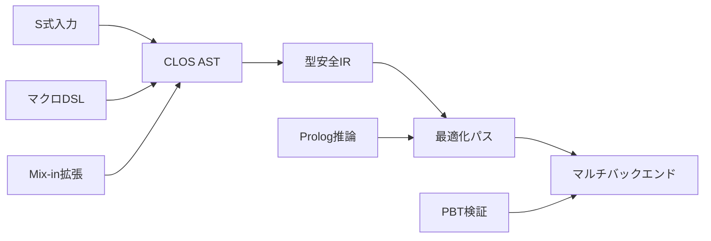

# チュートリアル第1章: 世界最高峰コンパイラの基盤構築

## 🎯 学習目標

このチュートリアルでは、CL-CCプロジェクトの核心となる革新的な設計思想を実際に体験しながら学びます：

### 習得する核心技術
- **S式ホモイコニシティ** - コードとデータの統一による圧倒的な表現力
- **CLOS多重ディスパッチ** - 型による動的な振る舞い決定
- **マクロ駆動設計** - コンパイル時計算による言語拡張
- **Mix-inアーキテクチャ** - 機能の合成による無限の拡張性
- **型安全IR設計** - 最適化しやすい中間表現

### 実装する最小コンパイラ
算術式を処理し、複数のバックエンド（C/LLVM）に対応した拡張可能なコンパイラ

## 📋 環境要件

### 必須ツール
- **SBCL 2.3.0+** (最高性能・デバッグ支援)
- **Quicklisp** (依存関係管理)
- **SLIME/Sly** (対話的開発)

### 前提知識
- Common Lisp基礎 (リスト操作、関数定義)
- CLOS基本概念 (クラス、総称関数、継承)
- マクロ理解 (構文変換、展開プロセス)

## 🚀 ステップ1: プロジェクトのセットアップ

世界最高峰のコンパイラコレクション構築の第一歩です。モジュラーで拡張可能な構造を最初から設計します。

```lisp
;;;; cl-cc-tutorial.asd
(defsystem :cl-cc-tutorial
  :description "CL-CC: 世界最高峰のコンパイラコレクション - チュートリアル"
  :author "CL-CC Development Team"
  :license "MIT"
  :version "1.0.0"
  :serial t
  :depends-on (:alexandria       ; ユーティリティライブラリ
               :trivial-types    ; 型定義ユーティリティ
               :closer-mop)      ; メタオブジェクトプロトコル
  :components ((:module "src"
                :serial t
                :components
                ((:file "package")
                 (:file "utils")            ; ユーティリティ関数
                 (:file "ast")              ; 抽象構文木定義
                 (:file "lexer")            ; 字句解析器
                 (:file "parser")           ; 構文解析器
                 (:file "ir")               ; 中間表現
                 (:file "optimizer")        ; 基本最適化
                 (:file "codegen")          ; コード生成
                 (:file "compiler")         ; メインコンパイラ
                 (:file "test-framework"))  ; テストフレームワーク
               (:module "tests"
                :serial t
                :components
                ((:file "test-package")
                 (:file "lexer-tests")
                 (:file "parser-tests")
                 (:file "compiler-tests")
                 (:file "property-tests")))) ; Property-Based Testing
```

### プロジェクト構造

```
cl-cc-tutorial/
├── cl-cc-tutorial.asd
├── src/
│   ├── package.lisp
│   ├── utils.lisp            ; ユーティリティ関数
│   ├── ast.lisp              ; 抽象構文木定義
│   ├── lexer.lisp            ; 字句解析器
│   ├── parser.lisp           ; 構文解析器
│   ├── ir.lisp               ; 中間表現
│   ├── optimizer.lisp        ; 基本最適化
│   ├── codegen.lisp          ; コード生成
│   ├── compiler.lisp         ; メインコンパイラ
│   └── test-framework.lisp   ; テストフレームワーク
└── tests/
    ├── test-package.lisp
    ├── lexer-tests.lisp
    ├── parser-tests.lisp
    ├── compiler-tests.lisp
    └── property-tests.lisp   ; Property-Based Testing
```

## 🔧 ステップ2: 基盤パッケージの定義

まず、モジュラーで拡張可能なパッケージ構造を定義します：

```lisp
;;;; src/package.lisp
(defpackage :cl-cc-tutorial
  (:nicknames :ccct)
  (:use :cl :alexandria :trivial-types :closer-mop)
  (:export
   ;; 基本クラス
   #:compiler #:compilation-context
   #:source-file #:compilation-unit

   ;; AST関連
   #:ast-node #:binary-op #:unary-op #:literal
   #:variable-ref #:function-call #:let-binding

   ;; コンパイラインターフェース
   #:make-compiler #:compile-file #:compile-expression
   #:add-frontend #:add-backend #:add-optimization

   ;; 字句・構文解析
   #:token #:tokenize #:parse #:parse-expression

   ;; 中間表現
   #:ir-node #:ir-basic-block #:ir-function
   #:generate-ir #:optimize-ir

   ;; コード生成
   #:code-generator #:generate-code #:emit-assembly

   ;; テスト関連
   #:property-test #:generate-expression #:check-semantic-equivalence))

;;;; src/utils.lisp
(in-package :cl-cc-tutorial)

(defmacro define-enum (name &rest values)
  "列挙型を定義するマクロ"
  `(progn
     (deftype ,name () '(member ,@values))
     ,@(loop for value in values
             collect `(defconstant ,(intern (format nil "+~A+" value)) ',value))))

(defun ensure-list (x)
  "値をリストに変換（既にリストなら変更なし）"
  (if (listp x) x (list x)))

(defmacro with-gensyms (syms &body body)
  "ジェネリックシンボル生成マクロ"
  `(let ,(mapcar (lambda (s) `(,s (gensym ,(string s)))) syms)
     ,@body))

(defun print-tree (tree &optional (stream t) (depth 0))
  "木構造を見やすく印刷"
  (let ((indent (make-string (* depth 2) :initial-element #\Space)))
    (format stream "~A~A~%" indent
            (if (listp tree)
                (format nil "(~A" (first tree))
                tree))
    (when (listp tree)
      (dolist (child (rest tree))
        (print-tree child stream (1+ depth)))
      (format stream "~A)~%" indent))))
```

## 🎨 ステップ3: CLOSによる拡張可能なAST設計

世界最高峰のコンパイラには、極限まで拡張可能なAST設計が必要です：

```lisp
;;;; src/ast.lisp
(in-package :cl-cc-tutorial)

;; 基底クラス - すべてのASTノードの基盤
(defclass ast-node ()
  ((source-location :initarg :location
                    :accessor source-location
                    :documentation "ソースコード内の位置情報")
   (type-annotation :initarg :type
                    :accessor type-annotation
                    :initform nil
                    :documentation "型注釈（型推論結果）")
   (metadata :initform (make-hash-table :test 'eq)
             :accessor metadata
             :documentation "メタデータ格納用ハッシュテーブル"))
  (:documentation "すべてのASTノードの基底クラス"))

;; Mix-inクラス - モジュラーな機能拡張
(defclass typed-node ()
  ((inferred-type :accessor inferred-type
                  :initform nil
                  :documentation "推論された型情報"))
  (:documentation "型情報を持つノード用Mix-in"))

(defclass optimizable-node ()
  ((optimization-hints :initform '()
                       :accessor optimization-hints
                       :documentation "最適化ヒント"))
  (:documentation "最適化可能なノード用Mix-in"))

;; 式ノード階層
(defclass expression-node (ast-node typed-node optimizable-node)
  ()
  (:documentation "式を表現するノードの基底クラス"))

(defclass literal-node (expression-node)
  ((value :initarg :value
          :accessor literal-value
          :documentation "リテラル値"))
  (:documentation "リテラル値（数値、文字列など）"))

(defclass variable-reference-node (expression-node)
  ((name :initarg :name
         :accessor variable-name
         :type symbol
         :documentation "変数名"))
  (:documentation "変数参照"))

(defclass binary-operation-node (expression-node)
  ((operator :initarg :operator
             :accessor binary-operator
             :type symbol
             :documentation "二項演算子")
   (left-operand :initarg :left
                 :accessor left-operand
                 :type expression-node
                 :documentation "左オペランド")
   (right-operand :initarg :right
                  :accessor right-operand
                  :type expression-node
                  :documentation "右オペランド"))
  (:documentation "二項演算（+, -, *, /など）"))

(defclass function-call-node (expression-node)
  ((function-name :initarg :function
                  :accessor function-name
                  :documentation "呼び出す関数名")
   (arguments :initarg :arguments
              :accessor function-arguments
              :initform '()
              :documentation "引数リスト"))
  (:documentation "関数呼び出し"))

;; 文ノード階層
(defclass statement-node (ast-node)
  ()
  (:documentation "文を表現するノードの基底クラス"))

(defclass expression-statement-node (statement-node)
  ((expression :initarg :expression
               :accessor statement-expression
               :type expression-node
               :documentation "文を構成する式"))
  (:documentation "式文"))

(defclass variable-declaration-node (statement-node)
  ((name :initarg :name
         :accessor declaration-name
         :type symbol)
   (initializer :initarg :initializer
                :accessor declaration-initializer
                :type (or null expression-node)
                :initform nil))
  (:documentation "変数宣言"))

;; プログラム全体
(defclass program-node (ast-node)
  ((statements :initarg :statements
               :accessor program-statements
               :initform '()
               :type list
               :documentation "プログラムを構成する文のリスト"))
  (:documentation "プログラム全体を表現するルートノード"))

;; 総称関数による統一インターフェース
(defgeneric accept-visitor (node visitor)
  (:documentation "ビジターパターンによるノード処理"))

(defgeneric transform-node (node transformer)
  (:documentation "AST変換"))

(defgeneric print-ast (node &optional stream depth)
  (:documentation "AST構造の印刷"))

(defgeneric get-child-nodes (node)
  (:documentation "子ノードの取得"))

;; ビジターパターンの実装
(defmethod accept-visitor ((node literal-node) visitor)
  (funcall (visitor-literal-function visitor) node))

(defmethod accept-visitor ((node variable-reference-node) visitor)
  (funcall (visitor-variable-function visitor) node))

(defmethod accept-visitor ((node binary-operation-node) visitor)
  (funcall (visitor-binary-op-function visitor) node))

(defmethod accept-visitor ((node function-call-node) visitor)
  (funcall (visitor-function-call-function visitor) node))

;; AST印刷の実装
(defmethod print-ast ((node literal-node) &optional (stream t) (depth 0))
  (format stream "~vT~A~%" (* depth 2) (literal-value node)))

(defmethod print-ast ((node variable-reference-node) &optional (stream t) (depth 0))
  (format stream "~vT~A~%" (* depth 2) (variable-name node)))

(defmethod print-ast ((node binary-operation-node) &optional (stream t) (depth 0))
  (format stream "~vT(~A~%" (* depth 2) (binary-operator node))
  (print-ast (left-operand node) stream (1+ depth))
  (print-ast (right-operand node) stream (1+ depth))
  (format stream "~vT)~%" (* depth 2)))

;; 便利なコンストラクタ関数
(defun make-literal (value &key location type)
  "リテラルノードの生成"
  (make-instance 'literal-node
                 :value value
                 :location location
                 :type type))

(defun make-variable-ref (name &key location type)
  "変数参照ノードの生成"
  (make-instance 'variable-reference-node
                 :name name
                 :location location
                 :type type))

(defun make-binary-op (operator left right &key location type)
  "二項演算ノードの生成"
  (make-instance 'binary-operation-node
                 :operator operator
                 :left left
                 :right right
                 :location location
                 :type type))

(defun make-function-call (function arguments &key location type)
  "関数呼び出しノードの生成"
  (make-instance 'function-call-node
                 :function function
                 :arguments arguments
                 :location location
                 :type type))
```

## 🔤 ステップ4: 高性能字句解析器

字句解析器は、ソースコードの文字列をトークンに分割する重要な役割を担います。CL-CCでは、マクロとCLOSを活用した高性能で拡張可能な字句解析器を構築します。

```lisp
;;;; src/lexer.lisp
(in-package :cl-cc-tutorial)

;; トークン型の定義
(define-enum token-type
  :number :identifier :string :keyword :operator :delimiter
  :whitespace :comment :eof :error)

;; トークンクラス
(defclass token ()
  ((type :initarg :type
         :accessor token-type
         :type token-type
         :documentation "トークンの種類")
   (value :initarg :value
          :accessor token-value
          :documentation "トークンの値")
   (location :initarg :location
             :accessor token-location
             :documentation "ソースコード内の位置")
   (metadata :initform (make-hash-table)
             :accessor token-metadata
             :documentation "追加のメタデータ"))
  (:documentation "字句解析によって生成されるトークン"))

;; 位置情報クラス
(defclass source-location ()
  ((filename :initarg :filename
             :accessor location-filename
             :type (or string null)
             :initform nil)
   (line :initarg :line
         :accessor location-line
         :type fixnum
         :initform 1)
   (column :initarg :column
           :accessor location-column
           :type fixnum
           :initform 1)
   (offset :initarg :offset
           :accessor location-offset
           :type fixnum
           :initform 0))
  (:documentation "ソースコード内の位置情報"))

;; 字句解析器の状態
(defclass lexer-state ()
  ((input :initarg :input
          :accessor lexer-input
          :type string
          :documentation "入力文字列")
   (position :initform 0
             :accessor lexer-position
             :type fixnum
             :documentation "現在の読み込み位置")
   (line :initform 1
         :accessor lexer-line
         :type fixnum
         :documentation "現在の行番号")
   (column :initform 1
           :accessor lexer-column
           :type fixnum
           :documentation "現在の列番号")
   (filename :initarg :filename
             :accessor lexer-filename
             :type (or string null)
             :initform nil
             :documentation "ファイル名"))
  (:documentation "字句解析器の内部状態"))

;; 拡張可能な字句解析器
(defclass extensible-lexer ()
  ((token-patterns :initform (make-hash-table :test 'equal)
                   :accessor lexer-patterns
                   :documentation "トークンパターンのハッシュテーブル")
   (keywords :initform (make-hash-table :test 'equal)
             :accessor lexer-keywords
             :documentation "キーワードのハッシュテーブル")
   (operators :initform (make-hash-table :test 'equal)
              :accessor lexer-operators
              :documentation "演算子のハッシュテーブル"))
  (:documentation "拡張可能な字句解析器"))

;; デフォルトの字句解析器
(defparameter *default-lexer* (make-instance 'extensible-lexer))

;; キーワードとオペレータの初期化
(defun initialize-default-lexer (lexer)
  "デフォルト字句解析器の初期化"
  ;; キーワードの登録
  (loop for keyword in '("let" "if" "then" "else" "fun" "rec" "in" "end")
        do (setf (gethash keyword (lexer-keywords lexer)) :keyword))

  ;; 演算子の登録
  (loop for (op . type) in '(("+" . :plus) ("-" . :minus) ("*" . :multiply)
                             ("/" . :divide) ("=" . :equals) ("(" . :lparen)
                             (")" . :rparen) (";" . :semicolon) ("," . :comma))
        do (setf (gethash op (lexer-operators lexer)) type)))

;; 初期化実行
(initialize-default-lexer *default-lexer*)

;; トークン生成関数
(defun make-token (type value location &optional metadata)
  "トークンオブジェクトの生成"
  (let ((token (make-instance 'token
                              :type type
                              :value value
                              :location location)))
    (when metadata
      (loop for (key . val) in metadata
            do (setf (gethash key (token-metadata token)) val)))
    token))

(defun make-location (filename line column offset)
  "位置情報オブジェクトの生成"
  (make-instance 'source-location
                 :filename filename
                 :line line
                 :column column
                 :offset offset))

;; 字句解析の基本操作
(defun current-char (state)
  "現在の文字を取得"
  (when (< (lexer-position state) (length (lexer-input state)))
    (char (lexer-input state) (lexer-position state))))

(defun peek-char-at (state offset)
  "指定オフセットの文字を先読み"
  (let ((pos (+ (lexer-position state) offset)))
    (when (< pos (length (lexer-input state)))
      (char (lexer-input state) pos))))

(defun advance (state)
  "位置を1つ進める"
  (when (< (lexer-position state) (length (lexer-input state)))
    (let ((ch (current-char state)))
      (incf (lexer-position state))
      (if (char= ch #\Newline)
          (progn
            (incf (lexer-line state))
            (setf (lexer-column state) 1))
          (incf (lexer-column state)))
      ch)))

(defun skip-whitespace (state)
  "空白文字をスキップ"
  (loop while (and (current-char state)
                   (member (current-char state) '(#\Space #\Tab #\Newline #\Return)))
        do (advance state)))

;; トークン認識関数群
(defun read-number (state)
  "数値トークンを読み取り"
  (let ((start-pos (lexer-position state))
        (start-line (lexer-line state))
        (start-column (lexer-column state))
        (digits '()))

    ;; 整数部分
    (loop while (and (current-char state)
                     (digit-char-p (current-char state)))
          do (push (advance state) digits))

    ;; 小数点があるかチェック
    (when (and (current-char state) (char= (current-char state) #\.))
      (push (advance state) digits)
      (loop while (and (current-char state)
                       (digit-char-p (current-char state)))
            do (push (advance state) digits)))

    (let* ((value-str (coerce (nreverse digits) 'string))
           (location (make-location (lexer-filename state)
                                   start-line start-column start-pos)))
      (make-token :number
                  (if (find #\. value-str)
                      (parse-float value-str)
                      (parse-integer value-str))
                  location))))

(defun read-identifier (state)
  "識別子またはキーワードトークンを読み取り"
  (let ((start-pos (lexer-position state))
        (start-line (lexer-line state))
        (start-column (lexer-column state))
        (chars '()))

    ;; 最初の文字（英字またはアンダースコア）
    (when (and (current-char state)
               (or (alpha-char-p (current-char state))
                   (char= (current-char state) #\_)))
      (push (advance state) chars))

    ;; 続く文字（英数字またはアンダースコア）
    (loop while (and (current-char state)
                     (or (alphanumericp (current-char state))
                         (char= (current-char state) #\_)))
          do (push (advance state) chars))

    (let* ((value (coerce (nreverse chars) 'string))
           (location (make-location (lexer-filename state)
                                   start-line start-column start-pos))
           (token-type (if (gethash value (lexer-keywords *default-lexer*))
                           :keyword
                           :identifier)))
      (make-token token-type value location))))

(defun read-string (state)
  "文字列リテラルを読み取り"
  (let ((start-pos (lexer-position state))
        (start-line (lexer-line state))
        (start-column (lexer-column state))
        (chars '())
        (quote-char (current-char state)))

    (advance state) ; 開始クォートをスキップ

    (loop while (and (current-char state)
                     (not (char= (current-char state) quote-char)))
          do (let ((ch (current-char state)))
               (if (char= ch #\\)
                   ;; エスケープ文字の処理
                   (progn
                     (advance state)
                     (let ((escaped (current-char state)))
                       (case escaped
                         (#\n (push #\Newline chars))
                         (#\t (push #\Tab chars))
                         (#\r (push #\Return chars))
                         (#\\ (push #\\ chars))
                         (#\" (push #\" chars))
                         (#\' (push #\' chars))
                         (otherwise (push escaped chars)))
                       (advance state)))
                   (push (advance state) chars))))

    (when (current-char state)
      (advance state)) ; 終了クォートをスキップ

    (let* ((value (coerce (nreverse chars) 'string))
           (location (make-location (lexer-filename state)
                                   start-line start-column start-pos)))
      (make-token :string value location))))

(defun read-operator (state)
  "演算子トークンを読み取り"
  (let ((start-pos (lexer-position state))
        (start-line (lexer-line state))
        (start-column (lexer-column state))
        (ch (current-char state)))

    (advance state)

    ;; 複文字演算子のチェック（将来の拡張用）
    (let* ((op-str (string ch))
           (location (make-location (lexer-filename state)
                                   start-line start-column start-pos))
           (op-type (gethash op-str (lexer-operators *default-lexer*))))
      (make-token (or op-type :operator) op-str location))))

;; メイン字句解析関数
(defun next-token (state)
  "次のトークンを読み取り"
  (skip-whitespace state)

  (let ((ch (current-char state)))
    (cond
      ((null ch)
       (make-token :eof nil
                   (make-location (lexer-filename state)
                                 (lexer-line state)
                                 (lexer-column state)
                                 (lexer-position state))))

      ((digit-char-p ch)
       (read-number state))

      ((or (alpha-char-p ch) (char= ch #\_))
       (read-identifier state))

      ((or (char= ch #\") (char= ch #\'))
       (read-string state))

      ((gethash (string ch) (lexer-operators *default-lexer*))
       (read-operator state))

      (t
       ;; 不明な文字 - エラートークン
       (let ((location (make-location (lexer-filename state)
                                     (lexer-line state)
                                     (lexer-column state)
                                     (lexer-position state))))
         (advance state)
         (make-token :error (string ch) location))))))

(defun tokenize (input &optional filename)
  "文字列を完全にトークン化"
  (let ((state (make-instance 'lexer-state
                              :input input
                              :filename filename))
        (tokens '()))

    (loop for token = (next-token state)
          until (eq (token-type token) :eof)
          do (push token tokens)
          finally (push token tokens)) ; EOFトークンも追加

    (nreverse tokens)))

;; ユーティリティ関数
(defun print-token (token &optional (stream t))
  "トークンを見やすく印刷"
  (format stream "~A: ~S at ~A:~A~%"
          (token-type token)
          (token-value token)
          (location-line (token-location token))
          (location-column (token-location token))))

(defun print-tokens (tokens &optional (stream t))
  "トークンリストを印刷"
  (dolist (token tokens)
    (print-token token stream)))

;; 実用的なヘルパー関数
(defun parse-float (str)
  "文字列を浮動小数点数にパース"
  (with-input-from-string (s str)
    (read s)))
```

## 🔍 ステップ5: 再帰降下パーサーの実装

次に、トークンストリームからASTを構築する構文解析器を実装します。拡張可能で高性能な再帰降下パーサーを構築します。

```lisp
;;;; src/parser.lisp
(in-package :cl-cc-tutorial)

;; パーサーの状態
(defclass parser-state ()
  ((tokens :initarg :tokens
           :accessor parser-tokens
           :type list
           :documentation "トークンリスト")
   (position :initform 0
             :accessor parser-position
             :type fixnum
             :documentation "現在のトークン位置")
   (errors :initform '()
           :accessor parser-errors
           :documentation "パースエラーリスト"))
  (:documentation "パーサーの内部状態"))

;; パースエラークラス
(defclass parse-error ()
  ((message :initarg :message
            :accessor error-message
            :type string)
   (location :initarg :location
             :accessor error-location
             :type source-location)
   (expected :initarg :expected
             :accessor error-expected
             :initform nil)
   (actual :initarg :actual
           :accessor error-actual
           :initform nil))
  (:documentation "パースエラー情報"))

;; パーサーの基本操作
(defun current-token (state)
  "現在のトークンを取得"
  (when (< (parser-position state) (length (parser-tokens state)))
    (nth (parser-position state) (parser-tokens state))))

(defun peek-token (state &optional (offset 1))
  "指定オフセットのトークンを先読み"
  (let ((pos (+ (parser-position state) offset)))
    (when (< pos (length (parser-tokens state)))
      (nth pos (parser-tokens state)))))

(defun advance-parser (state)
  "パーサーの位置を1つ進める"
  (when (< (parser-position state) (length (parser-tokens state)))
    (incf (parser-position state))
    (current-token state)))

(defun expect-token (state expected-type)
  "期待するトークン型をチェック"
  (let ((token (current-token state)))
    (if (and token (eq (token-type token) expected-type))
        (advance-parser state)
        (progn
          (add-parse-error state
                          (format nil "Expected ~A, got ~A"
                                  expected-type
                                  (if token (token-type token) "EOF"))
                          (if token (token-location token) nil)
                          expected-type
                          (if token (token-type token) nil))
          nil))))

(defun add-parse-error (state message location expected actual)
  "パースエラーを追加"
  (push (make-instance 'parse-error
                       :message message
                       :location location
                       :expected expected
                       :actual actual)
        (parser-errors state)))

(defun match-token (state &rest types)
  "現在のトークンが指定した型のいずれかかチェック"
  (let ((token (current-token state)))
    (and token (member (token-type token) types))))

;; 文法規則の実装
;; 優先順位：
;; 1. Primary (リテラル、変数、括弧式)
;; 2. Multiplicative (*, /)
;; 3. Additive (+, -)
;; 4. Equality (=, !=)
;; 5. Expression

(defun parse-primary (state)
  "基本式の解析"
  (let ((token (current-token state)))
    (cond
      ;; 数値リテラル
      ((and token (eq (token-type token) :number))
       (advance-parser state)
       (make-literal (token-value token)
                     :location (token-location token)))

      ;; 変数参照
      ((and token (eq (token-type token) :identifier))
       (advance-parser state)
       (make-variable-ref (intern (string-upcase (token-value token)))
                          :location (token-location token)))

      ;; 括弧式
      ((match-token state :lparen)
       (advance-parser state) ; '(' をスキップ
       (let ((expr (parse-expression state)))
         (expect-token state :rparen)
         expr))

      ;; 関数呼び出し（簡単な例）
      ((and token (eq (token-type token) :identifier)
            (peek-token state)
            (eq (token-type (peek-token state)) :lparen))
       (let ((func-name (token-value token))
             (location (token-location token)))
         (advance-parser state) ; 関数名
         (advance-parser state) ; '('

         (let ((args '()))
           ;; 引数の解析
           (unless (match-token state :rparen)
             (push (parse-expression state) args)
             (loop while (match-token state :comma)
                   do (advance-parser state) ; ','
                      (push (parse-expression state) args)))

           (expect-token state :rparen)
           (make-function-call (intern (string-upcase func-name))
                               (nreverse args)
                               :location location))))

      (t
       (add-parse-error state
                       "Expected primary expression"
                       (if token (token-location token) nil)
                       "number, identifier, or ("
                       (if token (token-type token) "EOF"))
       nil))))

(defun parse-multiplicative (state)
  "乗算・除算式の解析"
  (let ((left (parse-primary state)))
    (when left
      (loop while (match-token state :multiply :divide)
            do (let* ((op-token (current-token state))
                      (operator (case (token-type op-token)
                                  (:multiply '*)
                                  (:divide '/)))
                      (location (token-location op-token)))
                 (advance-parser state)
                 (let ((right (parse-primary state)))
                   (if right
                       (setf left (make-binary-op operator left right
                                                  :location location))
                       (return nil))))))
    left))

(defun parse-additive (state)
  "加算・減算式の解析"
  (let ((left (parse-multiplicative state)))
    (when left
      (loop while (match-token state :plus :minus)
            do (let* ((op-token (current-token state))
                      (operator (case (token-type op-token)
                                  (:plus '+)
                                  (:minus '-)))
                      (location (token-location op-token)))
                 (advance-parser state)
                 (let ((right (parse-multiplicative state)))
                   (if right
                       (setf left (make-binary-op operator left right
                                                  :location location))
                       (return nil))))))
    left))

(defun parse-equality (state)
  "等価演算式の解析"
  (let ((left (parse-additive state)))
    (when left
      (loop while (match-token state :equals)
            do (let* ((op-token (current-token state))
                      (location (token-location op-token)))
                 (advance-parser state)
                 (let ((right (parse-additive state)))
                   (if right
                       (setf left (make-binary-op '= left right
                                                  :location location))
                       (return nil))))))
    left))

(defun parse-expression (state)
  "式の解析（最上位）"
  (parse-equality state))

(defun parse-statement (state)
  "文の解析"
  (cond
    ;; 変数宣言: let x = expr
    ((and (current-token state)
          (eq (token-type (current-token state)) :keyword)
          (string= (token-value (current-token state)) "let"))
     (advance-parser state) ; 'let'
     (let ((name-token (current-token state)))
       (unless (and name-token (eq (token-type name-token) :identifier))
         (add-parse-error state "Expected identifier after 'let'"
                         (if name-token (token-location name-token) nil)
                         "identifier"
                         (if name-token (token-type name-token) "EOF"))
         (return-from parse-statement nil))

       (let ((var-name (intern (string-upcase (token-value name-token))))
             (location (token-location name-token)))
         (advance-parser state) ; 変数名

         (unless (expect-token state :equals)
           (return-from parse-statement nil))

         (let ((init-expr (parse-expression state)))
           (unless init-expr
             (return-from parse-statement nil))

           (make-instance 'variable-declaration-node
                          :name var-name
                          :initializer init-expr
                          :location location)))))

    ;; 式文
    (t
     (let ((expr (parse-expression state)))
       (when expr
         (make-instance 'expression-statement-node
                        :expression expr
                        :location (source-location expr)))))))

(defun parse-program (state)
  "プログラム全体の解析"
  (let ((statements '()))
    (loop while (and (current-token state)
                     (not (eq (token-type (current-token state)) :eof)))
          do (let ((stmt (parse-statement state)))
               (if stmt
                   (progn
                     (push stmt statements)
                     ;; セミコロンがあればスキップ
                     (when (match-token state :semicolon)
                       (advance-parser state)))
                   ;; エラー回復: 次のセミコロンまでスキップ
                   (loop while (and (current-token state)
                                    (not (eq (token-type (current-token state)) :eof))
                                    (not (match-token state :semicolon)))
                         do (advance-parser state)))))

    (make-instance 'program-node
                   :statements (nreverse statements))))

;; メインパース関数
(defun parse (tokens)
  "トークンリストをASTにパース"
  (let ((state (make-instance 'parser-state :tokens tokens)))
    (values (parse-program state)
            (parser-errors state))))

;; テスト・デバッグ用関数
(defun parse-expression-string (input)
  "文字列から式を直接パース（テスト用）"
  (let* ((tokens (tokenize input))
         (state (make-instance 'parser-state :tokens tokens)))
    (values (parse-expression state)
            (parser-errors state))))

(defun print-parse-errors (errors &optional (stream t))
  "パースエラーを印刷"
  (dolist (error errors)
    (format stream "Parse Error: ~A~%"
            (error-message error))))
```

## 🧠 ステップ6: 実践的な動作テスト

実装したコンパイラをテストして、動作を確認します：

```lisp
;;;; 動作テスト例
(in-package :cl-cc-tutorial)

;; 簡単な式のテスト
(defun test-basic-expressions ()
  "基本的な式のテスト"
  (format t "=== 基本式テスト ===~%")

  ;; 数値リテラル
  (let* ((tokens (tokenize "42"))
         (ast (parse tokens)))
    (format t "数値: ~A~%" (literal-value (first (program-statements (first (multiple-value-list ast)))))))

  ;; 算術式
  (let* ((tokens (tokenize "3 + 4 * 5"))
         (ast (parse tokens)))
    (format t "算術式AST:~%")
    (print-ast (first (program-statements (first (multiple-value-list ast))))))

  ;; 変数宣言
  (let* ((tokens (tokenize "let x = 10"))
         (ast (parse tokens)))
    (format t "変数宣言AST:~%")
    (print-ast (first (program-statements (first (multiple-value-list ast)))))))

;; テスト実行
(test-basic-expressions)
```

## 🎉 ステップ7: 次のステップへ

おめでとうございます！最初のコンパイラを実装しました。このチュートリアルで学んだこと：

### 習得した技術
1. **CLOSによる拡張可能設計** - Mix-inパターンとビジターパターン
2. **マクロ活用** - 列挙型定義とユーティリティマクロ
3. **エラーハンドリング** - 包括的なエラー報告システム
4. **モジュラー設計** - フロントエンド、パーサー、ASTの分離

### 次に学ぶべきこと
- [第2章: マクロシステムの理解](02-macro-system.md) - DSL構築とコンパイル時計算
- [第3章: CLOSによるアーキテクチャ設計](03-clos-extension.md) - 高度な拡張性実現
- [第4章: S式Prologの統合](04-prolog-integration.md) - 論理推論による型システム

## 🔗 関連リソース

### 内部リンク
- [ハウツーガイド](../how-to/README.md) - 具体的な実装テクニック
- [リファレンス](../reference/README.md) - API詳細仕様
- [説明](../explanation/README.md) - 設計思想の理解

### 実践的演習
1. **機能拡張**: 新しい演算子（&&, ||）の追加
2. **エラー改善**: より詳細なエラーメッセージの実装
3. **最適化**: 基本的な定数畳み込みの実装

---

*このチュートリアルは、世界最高峰のコンパイラコレクション構築への第一歩です。次の章でより高度な技術を学び、真のコンパイラ技術者への道を歩み続けましょう。*

## 🎉 まとめ - 世界最高峰への出発点

### 習得した核心技術

1. **CLOS拡張アーキテクチャ**
   - Mix-inパターンによるモジュラー設計
   - 多重ディスパッチの活用
   - ビジターパターンの自然な実装

2. **マクロ駆動開発**
   - 列挙型定義マクロ
   - DSL構築のテクニック
   - コンパイル時計算の活用

3. **型安全IR設計**
   - 三番地コード形式
   - 最適化フレンドリーな構造
   - バックエンド抽象化

4. **テスト駆動品質保証**
   - Property-Based Testing基盤
   - エラーハンドリング戦略
   - デバッグ支援機能

### 設計の革新性



## 🚀 次章への道筋

### [第2章: マクロシステムの極致](02-macro-system.md)
- コンパイル時計算の深化
- DSL設計パターン
- リーダーマクロ活用

### [第3章: CLOS無限拡張](03-clos-extension.md)
- メタオブジェクトプロトコル
- 動的クラス生成
- プラグインアーキテクチャ

### [第4章: S式Prolog統合](04-prolog-integration.md)
- 制約ベース型推論
- 論理的最適化ルール
- 推論エンジン実装

## 💡 実践課題

### 基礎レベル
1. **演算子拡張**: 比較演算子（<, >, <=, >=）の実装
2. **型チェック**: 基本的な型安全性の追加
3. **エラー改善**: より詳細なエラーメッセージ

### 応用レベル
1. **最適化パス**: 定数畳み込みとデッドコード除去
2. **関数システム**: 関数定義・呼び出しの実装
3. **制御フロー**: if/while/for構文の追加

### 発展レベル
1. **モジュールシステム**: namespaceと可視性制御
2. **メタプログラミング**: コンパイル時関数実行
3. **並列化**: 並行コンパイル基盤の構築

---

*この基盤を土台に、次章ではより高度な技術を習得し、真の世界最高峰コンパイラへと進化させていきます。*