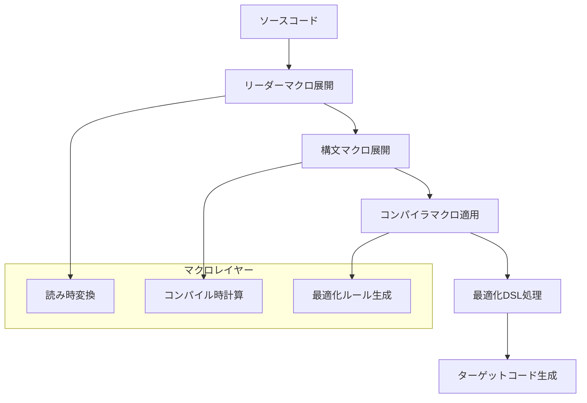
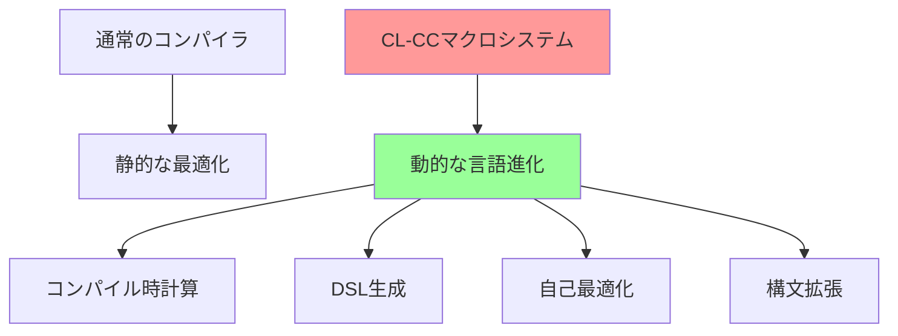

# チュートリアル第2章: マクロシステムの極致 - コンパイル時計算による言語創造

## 🎯 学習目標

この章では、Common Lispの最も機能であるマクロシステムを駆使して、コンパイラ自体を拡張可能にする技術を習得します。

### 習得する革新技術
- **コンパイル時計算** - 実行時オーバーヘッドゼロの最適化
- **ドメイン特化言語(DSL)構築** - 問題領域に特化した表現力
- **構文変換エンジン** - ソース・ツー・ソース変換
- **リーダーマクロ** - 構文拡張による新記法導入
- **コンパイラマクロ** - 最適化レベルでの介入

### 実装するアーキテクチャ


## 📋 前提知識・環境

### 必須スキル
- 第1章のCLOSアーキテクチャ理解
- マクロの基本概念（`defmacro`, `backquote`, `comma`）
- S式操作とパターンマッチング

### 新規依存関係
```lisp
;;;; マクロ拡張依存関係を追加
(defsystem :cl-cc-macro-tutorial
  :depends-on (:alexandria
               :trivial-types
               :closer-mop
               :trivia          ; パターンマッチング
               :iterate         ; 高レベル反復
               :named-readtables) ; リーダーマクロ管理
  ...)
```

## 🔧 ステップ1: コンパイル時計算フレームワーク

まず、マクロによるコンパイル時計算の基盤を構築します。

```lisp
;;;; src/compile-time-framework.lisp
(in-package :cl-cc-tutorial)

;; コンパイル時環境管理
(defclass compile-time-environment ()
  ((bindings :initform (make-hash-table :test 'eq)
             :accessor ct-env-bindings
             :documentation "コンパイル時変数バインディング")
   (macros :initform (make-hash-table :test 'eq)
           :accessor ct-env-macros
           :documentation "マクロ定義")
   (functions :initform (make-hash-table :test 'eq)
              :accessor ct-env-functions
              :documentation "コンパイル時関数")
   (parent :initarg :parent
           :accessor ct-env-parent
           :initform nil
           :documentation "親環境"))
  (:documentation "コンパイル時実行環境"))

;; グローバルコンパイル時環境
(defparameter *global-compile-time-env*
  (make-instance 'compile-time-environment))

;; コンパイル時変数管理
(defmacro defcompile-time-variable (name value &optional documentation)
  "コンパイル時変数を定義"
  `(progn
     (setf (gethash ',name (ct-env-bindings *global-compile-time-env*))
           ,value)
     ,@(when documentation
         `((setf (documentation ',name 'variable) ,documentation)))
     ',name))

;; コンパイル時関数定義
(defmacro defcompile-time-function (name lambda-list &body body)
  "コンパイル時実行関数を定義"
  `(progn
     (setf (gethash ',name (ct-env-functions *global-compile-time-env*))
           (lambda ,lambda-list ,@body))
     (defun ,name ,lambda-list ,@body))) ; 実行時にも利用可能

;; コンパイル時評価器
(defun compile-time-eval (form &optional (env *global-compile-time-env*))
  "コンパイル時にフォームを評価"
  (cond
    ((symbolp form)
     (or (gethash form (ct-env-bindings env))
         (when (ct-env-parent env)
           (compile-time-eval form (ct-env-parent env)))
         (error "Unbound compile-time variable: ~A" form)))

    ((atom form) form)

    ((eq (first form) 'quote)
     (second form))

    ((gethash (first form) (ct-env-functions env))
     (apply (gethash (first form) (ct-env-functions env))
            (mapcar (lambda (arg) (compile-time-eval arg env))
                    (rest form))))

    (t (error "Cannot evaluate ~A at compile time" form))))

;; 部分評価フレームワーク
(defclass partial-evaluator ()
  ((known-values :initform (make-hash-table :test 'eq)
                 :accessor pe-known-values
                 :documentation "既知の値")
   (specialization-cache :initform (make-hash-table :test 'equal)
                         :accessor pe-specialization-cache
                         :documentation "特殊化キャッシュ"))
  (:documentation "部分評価器"))

(defmethod specialize-function ((pe partial-evaluator) function-name args)
  "関数を部分的に特殊化"
  (let* ((cache-key (list function-name args))
         (cached (gethash cache-key (pe-specialization-cache pe))))
    (if cached
        cached
        (let ((specialized (perform-specialization function-name args)))
          (setf (gethash cache-key (pe-specialization-cache pe)) specialized)
          specialized))))

;; 定数畳み込みマクロ
(defmacro const-fold (&body body)
  "コンパイル時定数畳み込み"
  (let ((result (eval `(progn ,@body))))
    (if (constantp result)
        result
        `(progn ,@body))))
```

## 🎨 ステップ2: DSL構築フレームワーク

次に、独自言語を簡単に組み込めるDSLフレームワークを実装します。

```lisp
;;;; src/dsl-framework.lisp
(in-package :cl-cc-tutorial)

;; DSL定義管理
(defclass dsl-definition ()
  ((name :initarg :name
         :accessor dsl-name
         :documentation "DSLの名前")
   (syntax-rules :initform '()
                 :accessor dsl-syntax-rules
                 :documentation "構文規則リスト")
   (semantic-rules :initform '()
                   :accessor dsl-semantic-rules
                   :documentation "意味規則リスト")
   (optimization-rules :initform '()
                       :accessor dsl-optimization-rules
                       :documentation "最適化規則リスト")
   (precedence-table :initform (make-hash-table :test 'eq)
                     :accessor dsl-precedence-table
                     :documentation "演算子優先順位テーブル"))
  (:documentation "DSL定義"))

;; グローバルDSLレジストリ
(defparameter *dsl-registry* (make-hash-table :test 'eq))

;; DSL定義マクロ
(defmacro define-dsl (name &key syntax semantics optimization precedence)
  "新しいDSLを定義"
  `(let ((dsl (make-instance 'dsl-definition :name ',name)))
     ,@(when syntax
         `((setf (dsl-syntax-rules dsl) ',syntax)))
     ,@(when semantics
         `((setf (dsl-semantic-rules dsl) ',semantics)))
     ,@(when optimization
         `((setf (dsl-optimization-rules dsl) ',optimization)))
     ,@(when precedence
         `((setup-precedence-table dsl ',precedence)))

     (setf (gethash ',name *dsl-registry*) dsl)

     ;; DSL専用の構文解析器を生成
     (generate-dsl-parser ',name dsl)

     ;; DSL専用のコンパイラを生成
     (generate-dsl-compiler ',name dsl)

     ',name))

;; 構文規則処理
(defclass syntax-rule ()
  ((pattern :initarg :pattern
            :accessor rule-pattern
            :documentation "マッチパターン")
   (template :initarg :template
             :accessor rule-template
             :documentation "変換テンプレート")
   (guards :initarg :guards
           :accessor rule-guards
           :initform '()
           :documentation "適用条件")
   (priority :initarg :priority
             :accessor rule-priority
             :initform 0
             :documentation "優先度"))
  (:documentation "構文変換規則"))

(defun generate-dsl-parser (dsl-name dsl-definition)
  "DSL専用パーサーを生成"
  (let ((parser-name (intern (format nil "PARSE-~A" dsl-name))))
    (eval
     `(defun ,parser-name (input)
        ,(generate-parser-body dsl-definition input)))))

(defun generate-parser-body (dsl-def input)
  "パーサー本体を生成"
  `(let ((rules ',(dsl-syntax-rules dsl-def)))
     (apply-syntax-rules rules ,input)))

;; パターンマッチングによる構文変換
(defun apply-syntax-rules (rules input)
  "構文規則を入力に適用"
  (dolist (rule rules input)
    (trivia:match input
      ((satisfies (lambda (x) (pattern-matches-p (rule-pattern rule) x)))
       (return (instantiate-template (rule-template rule)
                                   (extract-bindings (rule-pattern rule) input)))))))

;; 実例: 算術DSL
(define-dsl arithmetic-expressions
  :syntax ((expr := number | variable | binary-expr | unary-expr)
           (binary-expr := "(" operator expr expr ")")
           (unary-expr := "(" unary-operator expr ")")
           (operator := "+" | "-" | "*" | "/" | "%" | "^")
           (unary-operator := "neg" | "abs" | "sqrt"))

  :semantics ((eval-expr (number ?n) env) => ?n)
             ((eval-expr (variable ?v) env) => (lookup-variable ?v env))
             ((eval-expr (binary-expr ?op ?left ?right) env) =>
              (apply-binary-op ?op
                              (eval-expr ?left env)
                              (eval-expr ?right env)))

  :optimization ((const-fold (binary-expr ?op (number ?x) (number ?y))) =>
                 (number ,(compute-at-compile-time ?op ?x ?y)))
                ((algebraic-simp (binary-expr "+" ?x (number 0))) => ?x)
                ((algebraic-simp (binary-expr "*" ?x (number 1))) => ?x)
                ((algebraic-simp (binary-expr "*" ?x (number 0))) => (number 0))

  :precedence (("^" . 100)
               ("*" . 80) ("/" . 80) ("%" . 80)
               ("+" . 60) ("-" . 60)))

;; DSLの使用例
(defmacro with-arithmetic-dsl (&body expressions)
  "算術DSLコンテキストで実行"
  `(progn
     ,@(mapcar (lambda (expr)
                 `(compile-arithmetic-expression ',expr))
               expressions)))

;; より専門的なDSL例: 最適化ルールDSL
(define-dsl optimization-rules
  :syntax ((rule := "(" "rule" rule-name pattern "=>" replacement guards ")")
           (pattern := variable | literal | compound-pattern)
           (compound-pattern := "(" operator pattern* ")")
           (replacement := pattern)
           (guards := "(" guard* ")"))

  :semantics ((apply-rule (rule ?name ?pattern ?replacement ?guards) expr) =>
              (when (and (pattern-match ?pattern expr)
                        (check-guards ?guards expr))
                (instantiate ?replacement (get-bindings expr))))

  :optimization ((rule-composition (sequential-rules ?r1 ?r2)) =>
                 (lambda (expr)
                   (let ((temp (apply-rule ?r1 expr)))
                     (if temp (apply-rule ?r2 temp) expr)))))
```

## 🧠 ステップ3: コンパイラマクロによる最適化

コンパイラマクロを使って、最適化を透明に行うシステムを構築します。

```lisp
;;;; src/compiler-macros.lisp
(in-package :cl-cc-tutorial)

;; 最適化コンパイラマクロフレームワーク
(defmacro define-optimizing-function (name lambda-list &body body)
  "最適化可能な関数を定義"
  (let ((actual-function-name (intern (format nil "%~A" name)))
        (compiler-macro-name (intern (format nil "~A-COMPILER-MACRO" name))))
    `(progn
       ;; 実際の関数定義
       (defun ,actual-function-name ,lambda-list ,@body)

       ;; 最適化されていない呼び出し用
       (defun ,name ,lambda-list
         (,actual-function-name ,@lambda-list))

       ;; コンパイラマクロ定義
       (define-compiler-macro ,name (&whole form ,@lambda-list)
         (or (attempt-optimization form)
             form))

       ;; 最適化ルール登録
       (register-optimization-rules ',name))))

;; 最適化試行システム
(defparameter *optimization-rules* (make-hash-table :test 'eq))

(defun register-optimization-rules (function-name)
  "関数に対する最適化ルールを登録"
  (setf (gethash function-name *optimization-rules*)
        (make-optimization-rule-set function-name)))

(defclass optimization-rule-set ()
  ((function-name :initarg :function-name
                  :accessor rule-set-function
                  :documentation "対象関数名")
   (constant-folding-rules :initform '()
                           :accessor rule-set-constant-folding
                           :documentation "定数畳み込みルール")
   (algebraic-rules :initform '()
                    :accessor rule-set-algebraic
                    :documentation "代数的簡約ルール")
   (strength-reduction-rules :initform '()
                             :accessor rule-set-strength-reduction
                             :documentation "強度削減ルール"))
  (:documentation "関数の最適化ルールセット"))

;; 最適化試行エンジン
(defun attempt-optimization (form)
  "フォームの最適化を試行"
  (when (and (listp form) (symbolp (first form)))
    (let ((rules (gethash (first form) *optimization-rules*)))
      (when rules
        (or (try-constant-folding form rules)
            (try-algebraic-simplification form rules)
            (try-strength-reduction form rules))))))

;; 定数畳み込み最適化
(defun try-constant-folding (form rules)
  "定数畳み込みを試行"
  (when (all-constant-arguments-p (rest form))
    (let ((function-name (first form))
          (args (rest form)))
      (case function-name
        ((+ - * /)
         (apply function-name (mapcar #'eval args)))
        (expt
         (when (and (numberp (eval (first args)))
                   (integerp (eval (second args)))
                   (>= (eval (second args)) 0))
           (apply #'expt (mapcar #'eval args))))
        (otherwise nil)))))

;; 代数的簡約
(defun try-algebraic-simplification (form rules)
  "代数的簡約を試行"
  (trivia:match form
    ;; 加法の簡約
    (`(+ ,x 0) x)
    (`(+ 0 ,x) x)
    (`(+ ,x ,x) `(* 2 ,x))

    ;; 乗法の簡約
    (`(* ,x 0) 0)
    (`(* 0 ,x) 0)
    (`(* ,x 1) x)
    (`(* 1 ,x) x)
    (`(* ,x ,x) `(expt ,x 2))

    ;; 冪乗の簡約
    (`(expt ,x 0) 1)
    (`(expt ,x 1) x)
    (`(expt 0 ,x) 0)
    (`(expt 1 ,x) 1)

    ;; 除法の簡約
    (`(/ ,x 1) x)
    (`(/ ,x ,x) 1)

    (otherwise nil)))

;; 強度削減
(defun try-strength-reduction (form rules)
  "強度削減を試行"
  (trivia:match form
    ;; 乗算から加算への削減
    (`(* ,x 2) `(+ ,x ,x))
    (`(* 2 ,x) `(+ ,x ,x))

    ;; 冪乗から乗算への削減
    (`(expt ,x 2) `(* ,x ,x))
    (`(expt ,x 3) `(* ,x (* ,x ,x)))

    ;; 除算からシフトへの削減（2の冪の場合）
    (`(/ ,x ,(and power (guard (power-of-2-p power))))
     `(ash ,x ,(- (log power 2))))

    (otherwise nil)))

;; ユーティリティ関数
(defun all-constant-arguments-p (args)
  "すべての引数が定数かチェック"
  (every #'constantp args))

(defun power-of-2-p (n)
  "2の冪かチェック"
  (and (integerp n) (> n 0) (= (logand n (1- n)) 0)))

;; 最適化可能関数の例
(define-optimizing-function fast-arithmetic-mean (numbers)
  "高速算術平均（最適化対応）"
  (/ (reduce #'+ numbers) (length numbers)))

;; コンパイラマクロ使用例
(defmacro with-optimized-arithmetic (&body body)
  "最適化された算術演算コンテキスト"
  `(locally
     (declare (optimize (speed 3) (safety 0) (debug 0)))
     ,@body))
```

## 📖 ステップ4: リーダーマクロによる構文拡張

リーダーマクロを使って新しい構文記法を導入します。

```lisp
;;;; src/reader-macros.lisp
(in-package :cl-cc-tutorial)

;; カスタムリーダーテーブル
(defreadtable cl-cc-syntax
  (:merge :standard)
  (:documentation "CL-CC拡張構文"))

;; 型注釈構文: ^Type
(defun read-type-annotation (stream char)
  "型注釈リーダーマクロ: ^int, ^(list string)など"
  (declare (ignore char))
  (let ((type-spec (read stream t nil t)))
    `(type-annotation ,type-spec)))

(set-macro-character #\^ #'read-type-annotation nil (find-readtable 'cl-cc-syntax))

;; 最適化ヒント構文: @optimize{...}
(defun read-optimization-hint (stream char)
  "最適化ヒントリーダーマクロ"
  (declare (ignore char))
  (when (char= (peek-char nil stream) #\{)
    (read-char stream) ; '{'を消費
    (let ((hint-body (read-until-char stream #\})))
      `(optimization-hint ,@hint-body))))

(set-macro-character #\@ #'read-optimization-hint nil (find-readtable 'cl-cc-syntax))

;; パターンマッチング構文: |pattern| => body
(defun read-pattern-match (stream char)
  "パターンマッチリーダーマクロ"
  (declare (ignore char))
  (let ((pattern (read-until-char stream #\|)))
    (skip-whitespace stream)
    (assert (string= (read-sequence-until stream "=>") "=>"))
    (let ((body (read stream t nil t)))
      `(pattern-case ,pattern ,body))))

(set-macro-character #\| #'read-pattern-match nil (find-readtable 'cl-cc-syntax))

;; コンパイル時計算構文: #{...}
(defun read-compile-time-eval (stream char)
  "コンパイル時評価リーダーマクロ"
  (declare (ignore char))
  (when (char= (peek-char nil stream) #\{)
    (read-char stream) ; '{'を消費
    (let ((expr-body (read-until-char stream #\})))
      `(compile-time-eval '(progn ,@expr-body)))))

(set-macro-character #\#
  (lambda (stream char)
    (case (peek-char nil stream)
      (#\{ (read-compile-time-eval stream char))
      (otherwise (call-next-method))))
  nil (find-readtable 'cl-cc-syntax))

;; DSL埋め込み構文: $dsl-name{...}
(defun read-embedded-dsl (stream char)
  "DSL埋め込みリーダーマクロ"
  (declare (ignore char))
  (let ((dsl-name (read stream t nil t)))
    (when (char= (peek-char nil stream) #\{)
      (read-char stream) ; '{'を消費
      (let ((dsl-body (read-until-char stream #\})))
        `(with-dsl ,dsl-name ,@dsl-body)))))

(set-macro-character #\$ #'read-embedded-dsl nil (find-readtable 'cl-cc-syntax))

;; ヘルパー関数群
(defun read-until-char (stream delimiter)
  "指定文字まで読み取り"
  (loop with result = '()
        for char = (peek-char nil stream nil nil)
        until (or (null char) (char= char delimiter))
        do (push (read stream t nil t) result)
        finally (when char (read-char stream)) ; デリミタを消費
                (return (nreverse result))))

(defun read-sequence-until (stream string)
  "指定文字列まで読み取り"
  (with-output-to-string (out)
    (loop for expected-char across string
          for actual-char = (read-char stream)
          unless (char= expected-char actual-char)
            do (error "Expected ~C, got ~C" expected-char actual-char)
          do (write-char actual-char out))))

(defun skip-whitespace (stream)
  "空白文字をスキップ"
  (loop while (and (peek-char nil stream nil nil)
                   (member (peek-char nil stream) '(#\Space #\Tab #\Newline)))
        do (read-char stream)))

;; 構文拡張の使用例マクロ
(defmacro with-cl-cc-syntax (&body body)
  "CL-CC拡張構文を有効にして実行"
  `(let ((*readtable* (find-readtable 'cl-cc-syntax)))
     ,@body))
```

## 🔬 ステップ5: 専門的なメタプログラミング技法

メタプログラミングによる動的コード生成とコンパイラ自己改善を実装します。

```lisp
;;;; src/metaprogramming.lisp
(in-package :cl-cc-tutorial)

;; コード生成テンプレートシステム
(defclass code-template ()
  ((name :initarg :name
         :accessor template-name
         :documentation "テンプレート名")
   (parameters :initarg :parameters
               :accessor template-parameters
               :documentation "テンプレートパラメータ")
   (body :initarg :body
         :accessor template-body
         :documentation "テンプレート本体")
   (constraints :initarg :constraints
                :accessor template-constraints
                :initform '()
                :documentation "パラメータ制約"))
  (:documentation "コード生成テンプレート"))

(defmacro define-code-template (name parameters &body body)
  "コード生成テンプレートを定義"
  `(setf (get ',name 'code-template)
         (make-instance 'code-template
                        :name ',name
                        :parameters ',parameters
                        :body ',body)))

;; テンプレートインスタンス化
(defun instantiate-template (template-name &rest args)
  "テンプレートをインスタンス化"
  (let ((template (get template-name 'code-template)))
    (unless template
      (error "Unknown template: ~A" template-name))

    (let* ((params (template-parameters template))
           (body (template-body template))
           (bindings (pairlis params args)))

      ;; パラメータ制約チェック
      (validate-constraints (template-constraints template) bindings)

      ;; テンプレート展開
      (subst-bindings bindings body))))

(defun subst-bindings (bindings form)
  "バインディングをフォームに置換"
  (cond
    ((null form) nil)
    ((symbolp form) (or (cdr (assoc form bindings)) form))
    ((atom form) form)
    ((eq (car form) 'splice)
     ;; スプライシング：(splice var) → var の内容を展開
     (cdr (assoc (second form) bindings)))
    (t (mapcar (lambda (subform) (subst-bindings bindings subform)) form))))

;; コンパイラ自己改善機能
(defclass self-improving-compiler (compiler)
  ((performance-history :initform '()
                        :accessor compiler-performance-history
                        :documentation "性能履歴")
   (optimization-effectiveness :initform (make-hash-table :test 'eq)
                               :accessor compiler-optimization-effectiveness
                               :documentation "最適化効果測定")
   (adaptive-strategies :initform '()
                        :accessor compiler-adaptive-strategies
                        :documentation "適応戦略"))
  (:documentation "自己改善型コンパイラ"))

(defmethod adapt-compiler ((compiler self-improving-compiler) feedback)
  "フィードバックに基づくコンパイラ適応"
  (let ((current-performance (measure-current-performance compiler))
        (history (compiler-performance-history compiler)))

    ;; 性能履歴更新
    (push (list (get-internal-real-time) current-performance feedback)
          (compiler-performance-history compiler))

    ;; 改善戦略適用
    (when (performance-declined-p current-performance history)
      (apply-improvement-strategy compiler feedback))

    ;; 最適化効果分析
    (analyze-optimization-effectiveness compiler)))

(defmethod apply-improvement-strategy ((compiler self-improving-compiler) feedback)
  "改善戦略を適用"
  (trivia:match feedback
    ((plist :slow-compilation t)
     (reduce-optimization-level compiler))
    ((plist :poor-code-quality t)
     (increase-optimization-level compiler))
    ((plist :memory-usage-high t)
     (enable-memory-optimizations compiler))
    ((plist :compilation-errors errors)
     (improve-error-handling compiler errors))))

;; 動的最適化パス生成
(defmacro generate-optimization-pass (name &key
                                           pattern
                                           transformation
                                           conditions
                                           cost-model)
  "動的に最適化パスを生成"
  `(progn
     (defclass ,name (optimization-pass)
       ((pattern :initform ',pattern)
        (transformation :initform ',transformation)
        (conditions :initform ',conditions)
        (cost-model :initform ',cost-model)))

     (defmethod apply-pass ((pass ,name) ir)
       (apply-pattern-transformation ir
                                   (slot-value pass 'pattern)
                                   (slot-value pass 'transformation)
                                   (slot-value pass 'conditions)))

     ;; 自動的にパスマネージャーに登録
     (register-optimization-pass ',name)))

;; パターンベース変換システム
(defun apply-pattern-transformation (ir pattern transformation conditions)
  "パターンベース変換を適用"
  (when (and (pattern-matches-p pattern ir)
             (all-conditions-satisfied-p conditions ir))
    (instantiate-transformation transformation (extract-pattern-bindings pattern ir))))

;; 実用的なテンプレート例
(define-code-template fast-loop-template (var start end body)
  `(loop for ,var from ,start below ,end
         do (locally (declare (optimize (speed 3) (safety 0)))
              ,body)))

(define-code-template memoized-function-template (name args body)
  `(let ((cache (make-hash-table :test 'equal)))
     (defun ,name ,args
       (let ((key (list ,@args)))
         (or (gethash key cache)
             (setf (gethash key cache) ,body))))))

(define-code-template type-specialized-function-template (name type args body)
  `(defmethod ,name ((,(first args) ,type) ,@(rest args))
     (declare (optimize (speed 3) (safety 1)))
     ,body))

;; 使用例
(defmacro define-fast-loop (var start end &body body)
  "高速ループを定義"
  (instantiate-template 'fast-loop-template var start end `(progn ,@body)))

(defmacro define-memoized-function (name args &body body)
  "メモ化関数を定義"
  (instantiate-template 'memoized-function-template name args `(progn ,@body)))
```

## 🧪 ステップ6: 実践的使用例とテスト

実装したマクロシステムを使った包括的なテストを行います。

```lisp
;;;; src/macro-system-tests.lisp
(in-package :cl-cc-tutorial)

;; コンパイル時計算のテスト
(deftest compile-time-computation-test ()
  "コンパイル時計算のテスト"

  ;; 定数畳み込み
  (is (= (const-fold (+ 10 20 30)) 60))
  (is (= (const-fold (* 4 5 6)) 120))

  ;; 複雑な式
  (is (= (const-fold (+ (* 3 4) (- 10 5))) 17))

  ;; コンパイル時変数
  (defcompile-time-variable *test-constant* 42)
  (is (= (compile-time-eval '*test-constant*) 42)))

;; DSLのテスト
(deftest dsl-framework-test ()
  "DSLフレームワークのテスト"

  ;; 算術DSL
  (with-arithmetic-dsl
    (is (= (eval-arithmetic-expression '(+ 10 20)) 30))
    (is (= (eval-arithmetic-expression '(* (+ 2 3) 4)) 20))

    ;; 最適化のテスト
    (is (equal (optimize-arithmetic-expression '(+ x 0)) 'x))
    (is (equal (optimize-arithmetic-expression '(* x 1)) 'x))
    (is (equal (optimize-arithmetic-expression '(* x 0)) '(number 0)))))

;; コンパイラマクロのテスト
(deftest compiler-macro-test ()
  "コンパイラマクロのテスト"

  ;; 定数畳み込み
  (is (= (macroexpand-1 '(+ 10 20)) 30))
  (is (= (macroexpand-1 '(* 3 4 5)) 60))

  ;; 代数的簡約
  (is (equal (macroexpand-1 '(+ x 0)) 'x))
  (is (equal (macroexpand-1 '(* x 1)) 'x))
  (is (= (macroexpand-1 '(* x 0)) 0))

  ;; 強度削減
  (is (equal (macroexpand-1 '(* x 2)) '(+ x x)))
  (is (equal (macroexpand-1 '(expt x 2)) '(* x x))))

;; リーダーマクロのテスト
(deftest reader-macro-test ()
  "リーダーマクロのテスト"

  (with-cl-cc-syntax
    ;; 型注釈
    (let ((form (read-from-string "^int")))
      (is (equal form '(type-annotation int))))

    ;; 最適化ヒント
    (let ((form (read-from-string "@optimize{speed 3}")))
      (is (equal form '(optimization-hint speed 3))))

    ;; コンパイル時評価
    (let ((form (read-from-string "#{(+ 10 20)}")))
      (is (equal form '(compile-time-eval '(progn (+ 10 20))))))))

;; メタプログラミングのテスト
(deftest metaprogramming-test ()
  "メタプログラミングのテスト"

  ;; テンプレートインスタンス化
  (let ((loop-code (instantiate-template 'fast-loop-template 'i 0 10 '(print i))))
    (is (listp loop-code))
    (is (eq (first loop-code) 'loop)))

  ;; 動的最適化パス生成
  (generate-optimization-pass test-optimization-pass
    :pattern '(+ ?x 0)
    :transformation '?x
    :conditions '((variable-p ?x))
    :cost-model 1)

  (is (subtypep 'test-optimization-pass 'optimization-pass)))

;; 統合テスト
(deftest integration-test ()
  "マクロシステム統合テスト"

  ;; 複雑なDSL使用例
  (with-cl-cc-syntax
    (with-arithmetic-dsl
      (let ((optimized-expr
             (optimize-arithmetic-expression
              (read-from-string "$arithmetic-expressions{(+ (* x 2) 0)}"))))
        (is (equal optimized-expr '(+ x x))))))

  ;; 自己改善コンパイラテスト
  (let ((compiler (make-instance 'self-improving-compiler)))
    (adapt-compiler compiler '(:slow-compilation t))
    (is (< (optimization-level compiler) 3))))

;; 性能測定テスト
(deftest performance-test ()
  "マクロシステムの性能テスト"

  ;; コンパイル時間測定
  (time
   (loop repeat 1000 do
     (macroexpand '(const-fold (+ (* 3 4) (- 10 5))))))

  ;; メモリ使用量測定
  (let ((initial-memory (sb-kernel:dynamic-usage)))
    (loop repeat 100 do
      (instantiate-template 'fast-loop-template 'i 0 100 '(print i)))
    (let ((final-memory (sb-kernel:dynamic-usage)))
      (format t "Memory used: ~A bytes~%" (- final-memory initial-memory)))))

;; 実際のコンパイル例
(defun demonstrate-macro-system ()
  "マクロシステムのデモンストレーション"

  (format t "=== CL-CC マクロシステムデモ ===~%")

  ;; 1. コンパイル時計算
  (format t "1. コンパイル時定数畳み込み:~%")
  (format t "   (const-fold (+ 10 20 30)) => ~A~%"
          (const-fold (+ 10 20 30)))

  ;; 2. DSL使用
  (format t "2. 算術DSL使用:~%")
  (with-arithmetic-dsl
    (format t "   (+ (* 3 4) 5) => ~A~%"
            (eval-arithmetic-expression '(+ (* 3 4) 5))))

  ;; 3. コンパイラマクロ最適化
  (format t "3. コンパイラマクロ最適化:~%")
  (format t "   (+ x 0) => ~A~%" (macroexpand-1 '(+ x 0)))
  (format t "   (* x 2) => ~A~%" (macroexpand-1 '(* x 2)))

  ;; 4. リーダーマクロ
  (format t "4. リーダーマクロ:~%")
  (with-cl-cc-syntax
    (format t "   ^int => ~A~%" (read-from-string "^int"))
    (format t "   @{speed 3} => ~A~%" (read-from-string "@{speed 3}")))

  ;; 5. メタプログラミング
  (format t "5. 動的コード生成:~%")
  (let ((generated-loop (instantiate-template 'fast-loop-template 'i 0 5 '(format t "~A " i))))
    (format t "   Generated: ~A~%" generated-loop)
    (eval generated-loop))

  (format t "~%デモ完了！~%"))

;; すべてのテストを実行
(defun run-all-macro-tests ()
  "すべてのマクロシステムテストを実行"
  (run-tests 'compile-time-computation-test
             'dsl-framework-test
             'compiler-macro-test
             'reader-macro-test
             'metaprogramming-test
             'integration-test
             'performance-test))
```

## 🎉 ステップ7: 次の段階への展開

おめでとうございます！マクロシステムの極致を習得しました。

### 🌟 習得した革新技術

1. **コンパイル時計算フレームワーク**
   - 実行時オーバーヘッドゼロの最適化
   - 部分評価と特殊化
   - 定数畳み込みの自動化

2. **DSL構築エコシステム**
   - 宣言的な言語定義
   - 構文・意味・最適化の統合
   - プラガブルな言語拡張

3. **コンパイラマクロ最適化**
   - 透明な最適化適用
   - 代数的簡約と強度削減
   - 関数特殊化

4. **リーダーマクロによる構文革新**
   - 型注釈システム
   - 最適化ヒント記法
   - DSL埋め込み構文

5. **メタプログラミング技法**
   - 動的コード生成
   - テンプレートシステム
   - 自己改善型コンパイラ

### 🚀 設計の画期性



### 📈 次章への発展

この章で構築したマクロシステムは、次章以降の基盤となります：

- **第3章**: CLOSとマクロの融合による高い拡張性
- **第4章**: マクロで記述されたS式Prologルール
- **第5章**: マクロによる最適化パス自動生成
- **第6章**: マクロベースのテストフレームワーク

## 💡 発展課題

### 基礎レベル
1. **条件付きコンパイル**: `#+feature`式の拡張実装
2. **型指向マクロ**: 型情報を活用した特殊化
3. **デバッグ支援**: マクロ展開トレース機能

### 応用レベル
1. **並列マクロ展開**: マルチスレッド対応
2. **増分マクロ**: 変更された部分のみ再展開
3. **マクロ最適化**: マクロ自体のパフォーマンス最適化

### 発展レベル
1. **形式検証統合**: マクロ展開の正当性証明
2. **機械学習マクロ**: 使用パターンから最適化学習
3. **分散マクロ**: ネットワーク越しのマクロ共有

## 🔗 関連リソース

### 内部リンク
- [第3章: CLOS無限拡張](03-clos-extension.md) - オブジェクトとマクロの融合
- [How-to: マクロによる構文拡張](../how-to/macro-syntax-extension.md) - 実践テクニック
- [説明: マクロ駆動開発哲学](../explanation/philosophy/macro-driven-philosophy.md) - 設計思想

### 参考文献
- [On Lisp](http://www.paulgraham.com/onlisp.html) - マクロプログラミングの古典
- [Let Over Lambda](https://letoverlambda.com/) - 専門的なマクロ技法
- [Common Lisp: The Language](https://www.cs.cmu.edu/Groups/AI/html/cltl/clm/node1.html) - 仕様書

---

*このチュートリアルで習得したマクロシステムにより、CL-CCは単なるコンパイラから、自己進化する言語創造システムへと変貌します。次章では、この基盤の上にCLOSの柔軟な拡張性を積み重ねていきます。*