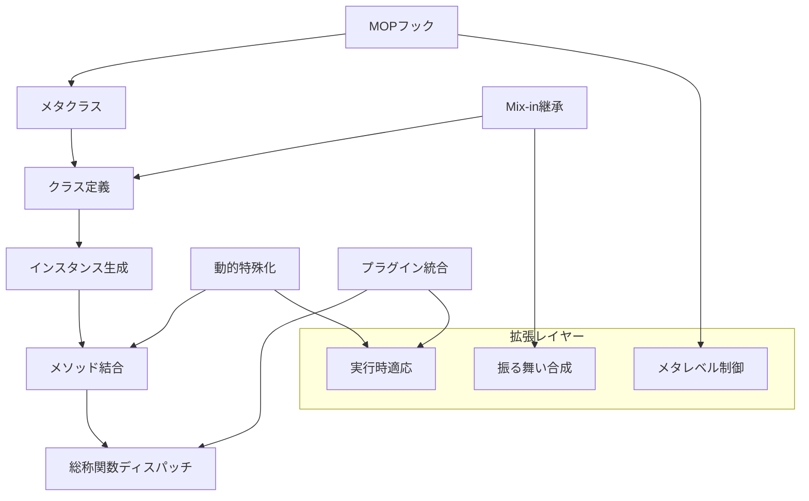
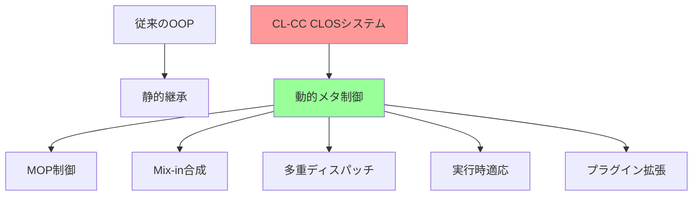

# チュートリアル第3章: CLOS無限拡張 - メタオブジェクトプロトコルによる高い拡張性

## 🎯 学習目標

この章では、Common Lisp Object System (CLOS) の高い拡張性を活用し、コンパイラアーキテクチャに柔軟性をもたらす技術を習得します。

### 習得する技術
- **メタオブジェクトプロトコル (MOP)** - オブジェクトシステム自体の制御
- **多重ディスパッチ** - 複数引数による動的振る舞い決定
- **Mix-inアーキテクチャ** - 機能の合成による柔軟な組み合わせ
- **動的クラス生成** - 実行時オブジェクトシステム拡張
- **プラグインシステム** - 完全な動的拡張フレームワーク

### 実装するアーキテクチャ


## 📋 前提知識・環境

### 必須スキル
- 第1-2章の内容完全理解
- CLOSの基本概念（クラス、総称関数、メソッド）
- メタプログラミングの理解

### 新規依存関係
```lisp
;;;; CLOS拡張依存関係を追加
(defsystem :cl-cc-clos-tutorial
  :depends-on (:alexandria
               :trivial-types
               :closer-mop        ; MOP実装
               :trivia
               :iterate
               :named-readtables
               :c2mop            ; 追加のMOP機能
               :contextl)        ; 動的バインディング拡張
  ...)
```

## 🔧 ステップ1: メタオブジェクトプロトコル基盤

COSの内部動作を制御するMOPシステムを構築します。

```lisp
;;;; src/metaobject-protocol.lisp
(in-package :cl-cc-tutorial)

;; コンパイラコンポーネント用メタクラス
(defclass compiler-component-metaclass (standard-class)
  ((compilation-hooks :initform '()
                      :accessor class-compilation-hooks
                      :documentation "コンパイル時フック")
   (optimization-level :initform 1
                       :accessor class-optimization-level
                       :documentation "クラスレベル最適化")
   (type-constraints :initform '()
                     :accessor class-type-constraints
                     :documentation "型制約")
   (performance-annotations :initform (make-hash-table)
                            :accessor class-performance-annotations
                            :documentation "性能注釈"))
  (:documentation "コンパイラコンポーネント用メタクラス"))

;; メタクラス有効化
(defmethod validate-superclass ((class compiler-component-metaclass)
                               (superclass standard-class))
  t)

;; クラス定義時のカスタマイゼーション
(defmethod initialize-instance :around ((class compiler-component-metaclass)
                                       &rest initargs
                                       &key optimization-hints
                                            type-safety
                                            compilation-hooks
                                       &allow-other-keys)
  "クラス初期化時にコンパイラ固有の処理を実行"
  (call-next-method)

  ;; 最適化ヒントの処理
  (when optimization-hints
    (process-optimization-hints class optimization-hints))

  ;; 型安全性の設定
  (when type-safety
    (setup-type-safety class type-safety))

  ;; コンパイルフックの登録
  (when compilation-hooks
    (setf (class-compilation-hooks class) compilation-hooks))

  ;; 自動的な性能測定の設定
  (setup-performance-monitoring class)

  class)

;; スロット定義の拡張
(defclass compiler-effective-slot-definition (standard-effective-slot-definition)
  ((type-checker :initarg :type-checker
                 :accessor slot-type-checker
                 :initform nil
                 :documentation "型チェック関数")
   (optimization-hints :initarg :optimization-hints
                       :accessor slot-optimization-hints
                       :initform '()
                       :documentation "スロット最適化ヒント")
   (cache-strategy :initarg :cache-strategy
                   :accessor slot-cache-strategy
                   :initform :none
                   :documentation "キャッシュ戦略"))
  (:documentation "コンパイラ拡張スロット定義"))

(defmethod compute-effective-slot-definition
    ((class compiler-component-metaclass) name direct-slots)
  "効果的スロット定義の計算"
  (let ((effective-slot (call-next-method)))
    ;; 型チェッカーの設定
    (setup-slot-type-checker effective-slot direct-slots)

    ;; 最適化ヒントの統合
    (merge-optimization-hints effective-slot direct-slots)

    ;; キャッシュ戦略の決定
    (determine-cache-strategy effective-slot)

    effective-slot))

;; メソッド結合のカスタマイゼーション
(defclass compiler-generic-function (standard-generic-function)
  ((optimization-enabled :initarg :optimization-enabled
                         :accessor gf-optimization-enabled
                         :initform t
                         :documentation "最適化有効フラグ")
   (type-specialization :initarg :type-specialization
                        :accessor gf-type-specialization
                        :initform nil
                        :documentation "型特殊化情報")
   (call-statistics :initform (make-hash-table :test 'equal)
                    :accessor gf-call-statistics
                    :documentation "呼び出し統計"))
  (:metaclass funcallable-standard-class)
  (:documentation "コンパイラ総称関数"))

(defmethod compute-applicable-methods :around
    ((gf compiler-generic-function) arguments)
  "適用可能メソッドの計算に最適化を追加"
  (let ((methods (call-next-method)))
    ;; 呼び出し統計の更新
    (update-call-statistics gf arguments methods)

    ;; 型特殊化の適用
    (when (gf-type-specialization gf)
      (setf methods (apply-type-specialization gf methods arguments)))

    ;; 最適化有効時の処理
    (when (gf-optimization-enabled gf)
      (setf methods (optimize-method-list methods arguments)))

    methods))

;; 動的クラス生成システム
(defclass dynamic-class-builder ()
  ((class-name :initarg :class-name
               :accessor builder-class-name
               :documentation "生成するクラス名")
   (superclasses :initarg :superclasses
                 :accessor builder-superclasses
                 :initform '()
                 :documentation "スーパークラス")
   (slot-definitions :initform '()
                     :accessor builder-slot-definitions
                     :documentation "スロット定義")
   (method-definitions :initform '()
                       :accessor builder-method-definitions
                       :documentation "メソッド定義")
   (class-options :initform '()
                  :accessor builder-class-options
                  :documentation "クラスオプション"))
  (:documentation "動的クラス構築器"))

(defmethod add-slot ((builder dynamic-class-builder) slot-name &rest options)
  "スロットを追加"
  (push (list* slot-name options) (builder-slot-definitions builder))
  builder)

(defmethod add-method ((builder dynamic-class-builder) method-name lambda-list &body body)
  "メソッドを追加"
  (push (list method-name lambda-list body) (builder-method-definitions builder))
  builder)

(defmethod build-class ((builder dynamic-class-builder))
  "動的クラスを構築"
  (let ((class-form
         `(defclass ,(builder-class-name builder)
              ,(builder-superclasses builder)
            ,(reverse (builder-slot-definitions builder))
            ,@(builder-class-options builder)
            (:metaclass compiler-component-metaclass))))

    ;; クラスを定義
    (eval class-form)

    ;; メソッドを定義
    (dolist (method-def (reverse (builder-method-definitions builder)))
      (destructuring-bind (name lambda-list body) method-def
        (eval `(defmethod ,name ,lambda-list ,@body))))

    ;; 生成されたクラスを返す
    (find-class (builder-class-name builder))))

;; ユーティリティマクロ
(defmacro define-compiler-class (name superclasses slots &rest options)
  "コンパイラコンポーネントクラスを定義"
  `(defclass ,name ,superclasses ,slots
     (:metaclass compiler-component-metaclass)
     ,@options))

(defmacro define-compiler-generic (name lambda-list &rest options)
  "コンパイラ総称関数を定義"
  `(defgeneric ,name ,lambda-list
     (:generic-function-class compiler-generic-function)
     ,@options))
```

## 🎨 ステップ2: Mix-inアーキテクチャシステム

機能の合成による柔軟なアーキテクチャを実装します。

```lisp
;;;; src/mixin-architecture.lisp
(in-package :cl-cc-tutorial)

;; 基本Mix-inクラス群
(define-compiler-class loggable-mixin ()
  ((logger :initarg :logger
           :accessor component-logger
           :initform (make-default-logger)
           :documentation "ログ出力器")
   (log-level :initarg :log-level
              :accessor component-log-level
              :initform :info
              :documentation "ログレベル"))
  (:documentation "ログ機能Mix-in"))

(define-compiler-class cacheable-mixin ()
  ((cache :initform (make-hash-table :test 'equal)
          :accessor component-cache
          :documentation "キャッシュ")
   (cache-strategy :initarg :cache-strategy
                   :accessor component-cache-strategy
                   :initform :lru
                   :documentation "キャッシュ戦略")
   (cache-size-limit :initarg :cache-size-limit
                     :accessor component-cache-size-limit
                     :initform 1000
                     :documentation "キャッシュサイズ上限"))
  (:documentation "キャッシュ機能Mix-in"))

(define-compiler-class configurable-mixin ()
  ((configuration :initform (make-hash-table :test 'eq)
                  :accessor component-configuration
                  :documentation "設定値")
   (config-source :initarg :config-source
                  :accessor component-config-source
                  :initform nil
                  :documentation "設定ソース"))
  (:documentation "設定可能Mix-in"))

(define-compiler-class monitorable-mixin ()
  ((metrics :initform (make-hash-table :test 'eq)
            :accessor component-metrics
            :documentation "メトリクス")
   (monitoring-enabled :initarg :monitoring-enabled
                       :accessor component-monitoring-enabled
                       :initform t
                       :documentation "監視有効フラグ"))
  (:documentation "監視可能Mix-in"))

(define-compiler-class extensible-mixin ()
  ((extensions :initform (make-hash-table :test 'eq)
               :accessor component-extensions
               :documentation "拡張機能")
   (extension-hooks :initform '()
                    :accessor component-extension-hooks
                    :documentation "拡張フック"))
  (:documentation "拡張可能Mix-in"))

;; Mix-in操作の総称関数
(define-compiler-generic log-message (component level message &rest args)
  (:documentation "ログメッセージを出力"))

(defmethod log-message ((component loggable-mixin) level message &rest args)
  "ログ機能Mix-inでのログ出力"
  (when (log-level-enabled-p (component-log-level component) level)
    (apply #'log-to-logger (component-logger component) level message args)))

(define-compiler-generic get-cached (component key)
  (:documentation "キャッシュから値を取得"))

(defmethod get-cached ((component cacheable-mixin) key)
  "キャッシュから値を取得"
  (gethash key (component-cache component)))

(define-compiler-generic set-cached (component key value)
  (:documentation "キャッシュに値を設定"))

(defmethod set-cached ((component cacheable-mixin) key value)
  "キャッシュに値を設定"
  (manage-cache-size component)
  (setf (gethash key (component-cache component)) value))

(define-compiler-generic get-config (component key &optional default)
  (:documentation "設定値を取得"))

(defmethod get-config ((component configurable-mixin) key &optional default)
  "設定値を取得"
  (gethash key (component-configuration component) default))

(define-compiler-generic set-config (component key value)
  (:documentation "設定値を設定"))

(defmethod set-config ((component configurable-mixin) key value)
  "設定値を設定"
  (setf (gethash key (component-configuration component)) value))

;; 複合Mix-inクラス
(define-compiler-class full-featured-component-mixin
    (loggable-mixin cacheable-mixin configurable-mixin
     monitorable-mixin extensible-mixin)
  ()
  (:documentation "全機能搭載Mix-in"))

;; Mix-in組み合わせマクロ
(defmacro define-component-class (name base-class mixins slots &rest options)
  "Mix-inを組み合わせたコンポーネントクラスを定義"
  (let ((all-superclasses (list* base-class mixins)))
    `(define-compiler-class ,name ,all-superclasses ,slots ,@options)))

;; 実際のコンパイラコンポーネント例
(define-component-class advanced-lexer
    lexer
    (loggable-mixin cacheable-mixin configurable-mixin)
  ((token-cache-enabled :initarg :token-cache-enabled
                        :accessor lexer-token-cache-enabled
                        :initform t)
   (optimization-level :initarg :optimization-level
                       :accessor lexer-optimization-level
                       :initform 2))
  (:documentation "専門的な字句解析器"))

(define-component-class adaptive-optimizer
    optimizer
    (full-featured-component-mixin)
  ((learning-rate :initarg :learning-rate
                  :accessor optimizer-learning-rate
                  :initform 0.1
                  :documentation "学習率")
   (adaptation-history :initform '()
                       :accessor optimizer-adaptation-history
                       :documentation "適応履歴"))
  (:documentation "適応的最適化器"))

;; Mix-in機能の統合メソッド
(defmethod initialize-instance :after ((component full-featured-component-mixin)
                                      &key &allow-other-keys)
  "全機能Mix-inの初期化"
  ;; ログ設定
  (log-message component :info "Component ~A initialized" (class-name (class-of component)))

  ;; 監視設定
  (when (component-monitoring-enabled component)
    (setup-monitoring component))

  ;; 拡張機能初期化
  (initialize-extensions component))

;; 専門的なメソッド結合例
(defmethod compile-node :around ((node ast-node) (compiler advanced-lexer))
  "拡張字句解析器でのコンパイル（ログ・キャッシュ付き）"
  (log-message compiler :debug "Compiling node: ~A" (type-of node))

  (let ((cache-key (compute-cache-key node)))
    (or (get-cached compiler cache-key)
        (let ((result (call-next-method)))
          (set-cached compiler cache-key result)
          (log-message compiler :debug "Cached result for: ~A" cache-key)
          result))))
```

## 🧠 ステップ3: 多重ディスパッチシステム

複数引数による専門的な振る舞い制御を実装します。

```lisp
;;;; src/multiple-dispatch.lisp
(in-package :cl-cc-tutorial)

;; 多重ディスパッチによるコード生成
(define-compiler-generic generate-optimized-code (ir-node target-arch optimization-level)
  (:documentation "IR、ターゲット、最適化レベルに基づくコード生成"))

;; x86-64 + 高最適化
(defmethod generate-optimized-code ((node binary-op-ir)
                                  (target (eql :x86-64))
                                  (opt-level (eql 3)))
  "x86-64向け高度最適化コード生成"
  (let ((op (ir-operator node))
        (left (ir-left-operand node))
        (right (ir-right-operand node)))
    (case op
      (:add (generate-x86-64-optimized-add left right))
      (:mul (generate-x86-64-simd-mul left right))
      (:div (generate-x86-64-fast-div left right))
      (otherwise (call-next-method)))))

;; ARM64 + 中最適化
(defmethod generate-optimized-code ((node binary-op-ir)
                                  (target (eql :arm64))
                                  (opt-level (eql 2)))
  "ARM64向け中レベル最適化"
  (let ((op (ir-operator node)))
    (case op
      (:add (generate-arm64-add node))
      (:mul (generate-arm64-vectorized-mul node))
      (otherwise (generate-arm64-generic node)))))

;; WebAssembly + 最小最適化
(defmethod generate-optimized-code ((node ir-node)
                                  (target (eql :wasm))
                                  (opt-level (eql 1)))
  "WebAssembly向け最小最適化"
  (generate-wasm-code node :optimization-level 1))

;; 最適化パス選択の多重ディスパッチ
(define-compiler-generic select-optimization-passes (compiler source-language target-arch)
  (:documentation "言語とターゲットに基づく最適化パス選択"))

(defmethod select-optimization-passes ((compiler adaptive-compiler)
                                     (source (eql :lisp))
                                     (target (eql :x86-64)))
  "Lisp→x86-64の最適化パス"
  (list (make-instance 'lisp-specific-optimization)
        (make-instance 'common-subexpression-elimination)
        (make-instance 'x86-64-peephole-optimization)
        (make-instance 'register-allocation-optimization)))

(defmethod select-optimization-passes ((compiler adaptive-compiler)
                                     (source (eql :c))
                                     (target (eql :arm64)))
  "C→ARM64の最適化パス"
  (list (make-instance 'c-specific-optimization)
        (make-instance 'loop-vectorization)
        (make-instance 'arm64-instruction-scheduling)))

;; 型システムの多重ディスパッチ
(define-compiler-generic unify-types (type1 type2 context)
  (:documentation "型の単一化"))

(defmethod unify-types ((type1 primitive-type) (type2 primitive-type) context)
  "基本型同士の単一化"
  (when (eq (type-name type1) (type-name type2))
    type1))

(defmethod unify-types ((type1 function-type) (type2 function-type) context)
  "関数型同士の単一化"
  (let ((unified-args (mapcar (lambda (t1 t2) (unify-types t1 t2 context))
                              (function-arg-types type1)
                              (function-arg-types type2)))
        (unified-return (unify-types (function-return-type type1)
                                   (function-return-type type2)
                                   context)))
    (when (and unified-args unified-return)
      (make-function-type unified-args unified-return))))

(defmethod unify-types ((type1 generic-type) (type2 t) context)
  "総称型と他の型の単一化"
  (instantiate-generic-type type1 type2 context))

;; エラーハンドリングの多重ディスパッチ
(define-compiler-generic handle-compilation-error (error phase context)
  (:documentation "コンパイルエラーのハンドリング"))

(defmethod handle-compilation-error ((error syntax-error)
                                   (phase (eql :parsing))
                                   context)
  "構文解析フェーズでの構文エラー"
  (format-syntax-error error context)
  (suggest-syntax-fixes error)
  (attempt-error-recovery error phase))

(defmethod handle-compilation-error ((error type-error)
                                   (phase (eql :type-checking))
                                   context)
  "型チェックフェーズでの型エラー"
  (format-type-error error context)
  (suggest-type-annotations error)
  (attempt-type-inference error))

;; 動的最適化の多重ディスパッチ
(define-compiler-generic adapt-optimization-strategy (compiler performance-data execution-context)
  (:documentation "性能データに基づく最適化戦略適応"))

(defmethod adapt-optimization-strategy ((compiler adaptive-compiler)
                                      (perf-data hot-path-data)
                                      (context (eql :cpu-intensive)))
  "CPU集約的コンテキストでの適応"
  (increase-optimization-level compiler)
  (enable-aggressive-inlining compiler)
  (optimize-for-speed compiler))

(defmethod adapt-optimization-strategy ((compiler adaptive-compiler)
                                      (perf-data memory-pressure-data)
                                      (context (eql :memory-constrained)))
  "メモリ制約コンテキストでの適応"
  (optimize-for-size compiler)
  (enable-dead-code-elimination compiler)
  (reduce-inlining-threshold compiler))

;; 特殊化された総称関数マクロ
(defmacro define-specialized-generic (name specialized-on lambda-list &rest options)
  "特定の引数で特殊化された総称関数を定義"
  (let ((generic-name (intern (format nil "~A-SPECIALIZED-ON-~A" name specialized-on))))
    `(progn
       (define-compiler-generic ,generic-name ,lambda-list ,@options)
       (defmethod ,name ,lambda-list
         (,generic-name ,@(mapcar (lambda (arg)
                                   (if (symbolp arg) arg (first arg)))
                                 lambda-list))))))
```

## 🚀 ステップ4: プラグインシステム

完全に動的な拡張フレームワークを構築します。

```lisp
;;;; src/plugin-system.lisp
(in-package :cl-cc-tutorial)

;; プラグイン基底クラス
(define-compiler-class plugin (extensible-mixin)
  ((name :initarg :name
         :accessor plugin-name
         :documentation "プラグイン名")
   (version :initarg :version
            :accessor plugin-version
            :documentation "プラグインバージョン")
   (dependencies :initarg :dependencies
                 :accessor plugin-dependencies
                 :initform '()
                 :documentation "依存プラグイン")
   (capabilities :initarg :capabilities
                 :accessor plugin-capabilities
                 :initform '()
                 :documentation "提供機能")
   (hooks :initform (make-hash-table :test 'eq)
          :accessor plugin-hooks
          :documentation "フック関数")
   (state :initform :unloaded
          :accessor plugin-state
          :documentation "プラグイン状態"))
  (:documentation "プラグイン基底クラス"))

;; プラグインマネージャー
(define-compiler-class plugin-manager (full-featured-component-mixin)
  ((loaded-plugins :initform (make-hash-table :test 'eq)
                   :accessor manager-loaded-plugins
                   :documentation "ロード済みプラグイン")
   (plugin-registry :initform (make-hash-table :test 'eq)
                    :accessor manager-plugin-registry
                    :documentation "プラグイン登録情報")
   (dependency-graph :initform (make-hash-table :test 'eq)
                     :accessor manager-dependency-graph
                     :documentation "依存関係グラフ")
   (hook-registry :initform (make-hash-table :test 'eq)
                  :accessor manager-hook-registry
                  :documentation "フック登録簿"))
  (:documentation "プラグインマネージャー"))

;; プラグイン操作の総称関数
(define-compiler-generic load-plugin (manager plugin-spec)
  (:documentation "プラグインをロード"))

(define-compiler-generic unload-plugin (manager plugin-name)
  (:documentation "プラグインをアンロード"))

(define-compiler-generic register-hook (manager hook-name function)
  (:documentation "フックを登録"))

(define-compiler-generic call-hooks (manager hook-name &rest args)
  (:documentation "フックを呼び出し"))

;; プラグインロード実装
(defmethod load-plugin ((manager plugin-manager) (plugin-spec pathname))
  "ファイルからプラグインをロード"
  (let ((plugin-code (load-plugin-file plugin-spec)))
    (evaluate-plugin-code manager plugin-code)))

(defmethod load-plugin ((manager plugin-manager) (plugin-spec symbol))
  "シンボルからプラグインをロード"
  (let ((plugin-class (find-class plugin-spec)))
    (unless plugin-class
      (error "Plugin class not found: ~A" plugin-spec))
    (load-plugin manager (make-instance plugin-class))))

(defmethod load-plugin ((manager plugin-manager) (plugin plugin))
  "プラグインインスタンスをロード"
  (log-message manager :info "Loading plugin: ~A" (plugin-name plugin))

  ;; 依存関係チェック
  (check-dependencies manager plugin)

  ;; プラグイン初期化
  (initialize-plugin plugin manager)

  ;; フック登録
  (register-plugin-hooks manager plugin)

  ;; ロード完了
  (setf (gethash (plugin-name plugin) (manager-loaded-plugins manager)) plugin)
  (setf (plugin-state plugin) :loaded)

  (log-message manager :info "Plugin loaded successfully: ~A" (plugin-name plugin))
  plugin)

;; プラグイン定義マクロ
(defmacro define-plugin (name &key
                              version
                              dependencies
                              capabilities
                              hooks
                              initialization
                              cleanup)
  "プラグインを定義"
  `(progn
     (define-compiler-class ,name (plugin)
       ()
       (:documentation ,(format nil "Plugin: ~A" name)))

     (defmethod initialize-plugin ((plugin ,name) manager)
       "プラグイン初期化"
       (log-message manager :debug "Initializing plugin: ~A" ',name)
       ,@initialization)

     (defmethod cleanup-plugin ((plugin ,name) manager)
       "プラグインクリーンアップ"
       (log-message manager :debug "Cleaning up plugin: ~A" ',name)
       ,@cleanup)

     ;; フック関数の定義
     ,@(mapcar (lambda (hook-def)
                 (destructuring-bind (hook-name lambda-list &body body) hook-def
                   `(defmethod register-plugin-hooks :after ((manager plugin-manager)
                                                            (plugin ,name))
                      (register-hook manager ',hook-name
                                   (lambda ,lambda-list ,@body)))))
               hooks)

     ;; プラグイン登録
     (register-plugin-class ',name)))

;; 実用的なプラグイン例
(define-plugin optimization-plugin
  :version "1.0.0"
  :dependencies '()
  :capabilities '(:optimization :performance-tuning)

  :hooks ((before-optimization (ir-node)
            (format t "Optimizing: ~A~%" (type-of ir-node)))

          (after-optimization (ir-node optimized-node)
            (format t "Optimization complete: ~A -> ~A~%"
                    (type-of ir-node) (type-of optimized-node))))

  :initialization
  ((setf (plugin-capabilities plugin) '(:optimization :performance-tuning))
   (format t "Optimization plugin initialized~%"))

  :cleanup
  ((format t "Optimization plugin cleaned up~%")))

(define-plugin language-frontend-plugin
  :version "2.0.0"
  :dependencies '(optimization-plugin)
  :capabilities '(:parsing :language-support)

  :hooks ((before-parsing (source-code)
            (preprocess-source source-code))

          (after-parsing (ast)
            (validate-ast ast)))

  :initialization
  ((register-language-frontend plugin 'my-language)
   (setup-syntax-rules plugin))

  :cleanup
  ((unregister-language-frontend plugin 'my-language)))

;; プラグイン実行フレームワーク
(defclass plugin-execution-context ()
  ((manager :initarg :manager
            :accessor context-manager
            :documentation "プラグインマネージャー")
   (current-phase :initarg :phase
                  :accessor context-current-phase
                  :documentation "現在のフェーズ")
   (data :initform (make-hash-table :test 'eq)
         :accessor context-data
         :documentation "コンテキストデータ"))
  (:documentation "プラグイン実行コンテキスト"))

(defmacro with-plugin-context ((manager phase) &body body)
  "プラグインコンテキストで実行"
  `(let ((*plugin-context* (make-instance 'plugin-execution-context
                                          :manager ,manager
                                          :phase ,phase)))
     ,@body))

;; フック呼び出しシステム
(defmethod call-hooks ((manager plugin-manager) hook-name &rest args)
  "登録されたフックを順次呼び出し"
  (let ((hooks (gethash hook-name (manager-hook-registry manager))))
    (dolist (hook hooks)
      (handler-case
          (apply hook args)
        (error (e)
          (log-message manager :error "Hook error in ~A: ~A" hook-name e))))))

(defmacro with-hooks ((manager hook-name) &body body)
  "フック呼び出しと組み合わせた実行"
  (let ((args-var (gensym "ARGS")))
    `(let ((,args-var (list ,@(extract-variables body))))
       (call-hooks ,manager ,(intern (format nil "BEFORE-~A" hook-name)) ,@args-var)
       (let ((result (progn ,@body)))
         (call-hooks ,manager ,(intern (format nil "AFTER-~A" hook-name)) result ,@args-var)
         result))))
```

## 🔬 ステップ5: 実行時クラス操作

動的なクラス操作と実行時適応を実装します。

```lisp
;;;; src/runtime-class-manipulation.lisp
(in-package :cl-cc-tutorial)

;; 実行時クラス操作システム
(defclass runtime-class-manipulator (full-featured-component-mixin)
  ((class-cache :initform (make-hash-table :test 'eq)
                :accessor manipulator-class-cache
                :documentation "クラスキャッシュ")
   (modification-history :initform '()
                         :accessor manipulator-modification-history
                         :documentation "変更履歴")
   (hot-swapping-enabled :initarg :hot-swapping-enabled
                         :accessor manipulator-hot-swapping-enabled
                         :initform t
                         :documentation "ホットスワッピング有効フラグ"))
  (:documentation "実行時クラス操作器"))

;; 動的スロット追加
(define-compiler-generic add-slot-dynamically (manipulator class-name slot-name slot-options)
  (:documentation "実行時にスロットを追加"))

(defmethod add-slot-dynamically ((manipulator runtime-class-manipulator)
                                class-name slot-name slot-options)
  "クラスに動的にスロットを追加"
  (let ((class (find-class class-name)))
    (unless class
      (error "Class not found: ~A" class-name))

    ;; 既存のスロット定義を取得
    (let* ((existing-slots (class-direct-slots class))
           (new-slot-def (make-instance 'standard-direct-slot-definition
                                       :name slot-name
                                       :initargs (getf slot-options :initargs)
                                       :initform (getf slot-options :initform)
                                       :initfunction (getf slot-options :initfunction)
                                       :readers (getf slot-options :readers)
                                       :writers (getf slot-options :writers)
                                       :allocation (getf slot-options :allocation :instance))))

      ;; クラスを再定義
      (ensure-class class-name
                    :direct-slots (append existing-slots (list new-slot-def))
                    :metaclass (class-name (class-of class)))

      ;; 既存インスタンスの更新
      (update-existing-instances class slot-name slot-options)

      ;; 履歴記録
      (record-modification manipulator :add-slot class-name slot-name slot-options)

      (log-message manipulator :info "Added slot ~A to class ~A" slot-name class-name))))

;; 動的メソッド追加
(define-compiler-generic add-method-dynamically (manipulator generic-function-name specializers body)
  (:documentation "実行時にメソッドを追加"))

(defmethod add-method-dynamically ((manipulator runtime-class-manipulator)
                                  generic-function-name specializers body)
  "総称関数に動的にメソッドを追加"
  (let ((gf (fdefinition generic-function-name)))
    (unless gf
      (error "Generic function not found: ~A" generic-function-name))

    ;; メソッドを作成・追加
    (let ((method (make-instance 'standard-method
                                :lambda-list (extract-lambda-list body)
                                :specializers (mapcar #'find-class specializers)
                                :function (compile nil body))))
      (add-method gf method)

      ;; 履歴記録
      (record-modification manipulator :add-method generic-function-name specializers)

      (log-message manipulator :info "Added method to ~A with specializers ~A"
                   generic-function-name specializers))))

;; クラス継承階層の動的変更
(define-compiler-generic modify-class-hierarchy (manipulator class-name new-superclasses)
  (:documentation "クラス継承階層を動的に変更"))

(defmethod modify-class-hierarchy ((manipulator runtime-class-manipulator)
                                  class-name new-superclasses)
  "クラスの継承階層を変更"
  (let ((class (find-class class-name)))
    (unless class
      (error "Class not found: ~A" class-name))

    ;; 循環継承チェック
    (check-inheritance-cycles class-name new-superclasses)

    ;; クラス再定義
    (ensure-class class-name
                  :direct-superclasses (mapcar #'find-class new-superclasses)
                  :metaclass (class-name (class-of class)))

    ;; インスタンス更新
    (update-instances-for-hierarchy-change class new-superclasses)

    ;; 履歴記録
    (record-modification manipulator :modify-hierarchy class-name new-superclasses)

    (log-message manipulator :info "Modified hierarchy of ~A: ~A" class-name new-superclasses)))

;; ホットスワッピング
(define-compiler-generic hot-swap-class (manipulator old-class-name new-class-definition)
  (:documentation "クラスをホットスワップ"))

(defmethod hot-swap-class ((manipulator runtime-class-manipulator)
                          old-class-name new-class-definition)
  "実行中のクラスをホットスワップ"
  (unless (manipulator-hot-swapping-enabled manipulator)
    (error "Hot swapping is disabled"))

  (let ((old-class (find-class old-class-name)))
    (unless old-class
      (error "Old class not found: ~A" old-class-name))

    ;; 既存インスタンスのバックアップ
    (let ((existing-instances (find-all-instances old-class)))

      ;; 新しいクラス定義を評価
      (eval new-class-definition)

      ;; インスタンスの移行
      (migrate-instances existing-instances old-class (find-class old-class-name))

      ;; 履歴記録
      (record-modification manipulator :hot-swap old-class-name new-class-definition)

      (log-message manipulator :info "Hot swapped class: ~A" old-class-name))))

;; 実行時リフレクション機能
(define-compiler-generic introspect-class (manipulator class-name)
  (:documentation "クラスを内省"))

(defmethod introspect-class ((manipulator runtime-class-manipulator) class-name)
  "クラスの詳細情報を取得"
  (let ((class (find-class class-name)))
    (unless class
      (error "Class not found: ~A" class-name))

    (list :name class-name
          :superclasses (mapcar #'class-name (class-direct-superclasses class))
          :slots (mapcar #'slot-definition-name (class-direct-slots class))
          :methods (collect-class-methods class)
          :metaclass (class-name (class-of class))
          :instances-count (count-class-instances class))))

;; 条件付きクラス修正
(defmacro when-class-exists (class-name &body modifications)
  "クラスが存在する場合のみ修正を適用"
  `(when (find-class ',class-name nil)
     ,@modifications))

(defmacro ensure-class-capabilities (class-name required-capabilities &body enhancement)
  "クラスが要求された機能を持つことを保証"
  `(unless (class-has-capabilities-p ',class-name ',required-capabilities)
     ,@enhancement))

;; 使用例：適応的コンパイラの実行時拡張
(defun demonstrate-runtime-manipulation ()
  "実行時クラス操作のデモンストレーション"
  (let ((manipulator (make-instance 'runtime-class-manipulator)))

    ;; 動的スロット追加
    (add-slot-dynamically manipulator 'compiler 'performance-counter
                         '(:initform 0 :accessor compiler-performance-counter))

    ;; 動的メソッド追加
    (add-method-dynamically manipulator 'compile-node '(ast-node adaptive-compiler)
                           '(lambda (node compiler)
                              (incf (compiler-performance-counter compiler))
                              (call-next-method)))

    ;; クラス階層変更
    (modify-class-hierarchy manipulator 'basic-compiler
                           '(extensible-mixin loggable-mixin))

    ;; 内省
    (introspect-class manipulator 'compiler)))
```

## 🧪 ステップ6: 統合テストと実証

実装したCLOS拡張システムの包括的テストを行います。

```lisp
;;;; src/clos-integration-tests.lisp
(in-package :cl-cc-tutorial)

;; MOP機能のテスト
(deftest metaobject-protocol-test ()
  "メタオブジェクトプロトコルのテスト"

  ;; カスタムメタクラス
  (define-compiler-class test-component ()
    ((value :initarg :value :accessor test-value))
    (:optimization-hints (:speed 3)))

  (let ((instance (make-instance 'test-component :value 42)))
    (is (= (test-value instance) 42))
    (is (typep (class-of (class-of instance)) 'compiler-component-metaclass))))

;; Mix-in機能のテスト
(deftest mixin-architecture-test ()
  "Mix-inアーキテクチャのテスト"

  ;; Mix-in組み合わせ
  (define-component-class test-mixed-component
      test-component
      (loggable-mixin cacheable-mixin)
    ((additional-data :initarg :data :accessor additional-data)))

  (let ((instance (make-instance 'test-mixed-component
                                :value 100
                                :data "test")))
    ;; 基本機能
    (is (= (test-value instance) 100))
    (is (string= (additional-data instance) "test"))

    ;; キャッシュ機能
    (set-cached instance "key1" "cached-value")
    (is (string= (get-cached instance "key1") "cached-value"))

    ;; ログ機能
    (is (not (null (component-logger instance))))))

;; 多重ディスパッチのテスト
(deftest multiple-dispatch-test ()
  "多重ディスパッチのテスト"

  ;; テスト用クラス
  (define-compiler-class test-ir-node () ())
  (define-compiler-class test-binary-ir (test-ir-node) ())

  ;; 多重ディスパッチメソッド
  (defmethod generate-optimized-code ((node test-ir-node)
                                    (target (eql :test-arch))
                                    (opt-level (eql 1)))
    "test-code-level-1")

  (defmethod generate-optimized-code ((node test-binary-ir)
                                    (target (eql :test-arch))
                                    (opt-level (eql 2)))
    "test-binary-code-level-2")

  ;; テスト実行
  (let ((node1 (make-instance 'test-ir-node))
        (node2 (make-instance 'test-binary-ir)))
    (is (string= (generate-optimized-code node1 :test-arch 1)
                 "test-code-level-1"))
    (is (string= (generate-optimized-code node2 :test-arch 2)
                 "test-binary-code-level-2"))))

;; プラグインシステムのテスト
(deftest plugin-system-test ()
  "プラグインシステムのテスト"

  (let ((manager (make-instance 'plugin-manager)))

    ;; テストプラグイン定義
    (define-plugin test-plugin
      :version "1.0.0"
      :capabilities '(:testing)
      :hooks ((test-hook (data)
                (format nil "Processed: ~A" data)))
      :initialization
      ((format t "Test plugin loaded~%")))

    ;; プラグインロード
    (let ((plugin (make-instance 'test-plugin)))
      (load-plugin manager plugin)
      (is (eq (plugin-state plugin) :loaded))

      ;; フック呼び出し
      (register-hook manager 'test-hook
                     (lambda (data) (format nil "Hook result: ~A" data)))
      (call-hooks manager 'test-hook "test-data"))))

;; 実行時操作のテスト
(deftest runtime-manipulation-test ()
  "実行時クラス操作のテスト"

  (let ((manipulator (make-instance 'runtime-class-manipulator)))

    ;; テスト用クラス
    (define-compiler-class dynamic-test-class ()
      ((initial-slot :initarg :initial :accessor initial-slot)))

    ;; 動的スロット追加
    (add-slot-dynamically manipulator 'dynamic-test-class 'dynamic-slot
                         '(:initform "dynamic" :accessor dynamic-slot))

    ;; インスタンス作成（新しいスロット付き）
    (let ((instance (make-instance 'dynamic-test-class :initial "test")))
      (is (string= (initial-slot instance) "test"))
      (is (string= (dynamic-slot instance) "dynamic")))))

;; 性能テスト
(deftest performance-test ()
  "CLOS拡張機能の性能テスト"

  ;; Mix-inのオーバーヘッド測定
  (define-component-class performance-test-class
      ()
      (loggable-mixin cacheable-mixin configurable-mixin)
    ((data :initarg :data :accessor test-data)))

  (let ((instances (loop repeat 1000
                        collect (make-instance 'performance-test-class
                                              :data (random 1000)))))

    ;; キャッシュ操作性能
    (time
     (loop for instance in instances
           for i from 0
           do (set-cached instance (format nil "key-~A" i)
                         (test-data instance))))

    ;; アクセス性能
    (time
     (loop for instance in instances
           for i from 0
           sum (get-cached instance (format nil "key-~A" i))))))

;; 統合デモンストレーション
(defun demonstrate-clos-extensions ()
  "CLOS拡張機能の包括的デモンストレーション"

  (format t "=== CL-CC CLOS拡張システムデモ ===~%")

  ;; 1. 専門的なコンパイラクラス作成
  (define-component-class demo-compiler
      compiler
      (full-featured-component-mixin)
    ((demo-data :initform "demo" :accessor demo-data)))

  (let ((compiler (make-instance 'demo-compiler)))
    (format t "1. 高度コンパイラ作成: ~A~%" (type-of compiler))

    ;; 2. 設定操作
    (set-config compiler :optimization-level 3)
    (set-config compiler :target-arch :x86-64)
    (format t "2. 設定完了: 最適化レベル=~A, ターゲット=~A~%"
            (get-config compiler :optimization-level)
            (get-config compiler :target-arch))

    ;; 3. キャッシュ操作
    (set-cached compiler "compilation-result" "optimized-code")
    (format t "3. キャッシュ結果: ~A~%" (get-cached compiler "compilation-result"))

    ;; 4. プラグインシステム
    (let ((manager (make-instance 'plugin-manager)))
      (define-plugin demo-plugin
        :version "1.0.0"
        :capabilities '(:demo)
        :initialization ((format t "4. デモプラグイン初期化完了~%")))

      (load-plugin manager (make-instance 'demo-plugin)))

    ;; 5. 実行時操作
    (let ((manipulator (make-instance 'runtime-class-manipulator)))
      (add-slot-dynamically manipulator 'demo-compiler 'runtime-slot
                           '(:initform "runtime-value" :accessor runtime-slot))
      (format t "5. 実行時スロット追加: ~A~%" (runtime-slot compiler))))

  (format t "デモ完了！~%"))

;; すべてのテストを実行
(defun run-all-clos-tests ()
  "すべてのCLOS拡張テストを実行"
  (run-tests 'metaobject-protocol-test
             'mixin-architecture-test
             'multiple-dispatch-test
             'plugin-system-test
             'runtime-manipulation-test
             'performance-test))
```

## 🎉 ステップ7: 次世代への飛躍

おめでとうございます！CLOS拡張システムの極致を習得しました。

### 🌟 習得した技術

1. **メタオブジェクトプロトコル制御**
   - オブジェクトシステムのメタレベル制御
   - クラス定義・初期化のカスタマイゼーション
   - スロット定義・アクセスの最適化

2. **Mix-inアーキテクチャ**
   - 機能の合成による柔軟な設計
   - 横断的関心事の自然な実装
   - コードの再利用性最大化

3. **多重ディスパッチシステム**
   - 複数引数による振る舞い決定
   - 型とコンテキストによる最適化
   - 拡張可能な分岐ロジック

4. **動的プラグインシステム**
   - 実行時コンポーネント拡張
   - フック・イベントシステム
   - 依存関係管理

5. **実行時クラス操作**
   - ホットスワッピング
   - 動的継承変更
   - ライブリフレクション

### 🚀 設計の革新性



### 📈 次章での活用

この章で構築したCLOS拡張システムは、以降の核心技術を支えます：

- **第4章**: CLOSとS式Prologの統合による推論システム
- **第5章**: 動的最適化パスの自動生成・適応
- **第6章**: メタレベルテストフレームワーク

## 💡 発展課題

### 基礎レベル
1. **継承チェーン分析**: 複雑な継承関係の可視化
2. **メソッド結合最適化**: ディスパッチ性能の向上
3. **プラグイン検証**: 安全性チェック機構

### 応用レベル
1. **分散オブジェクト**: ネットワーク越しのCLOS
2. **永続化システム**: オブジェクトの自動永続化
3. **トランザクション**: ACID特性を持つオブジェクト操作

### 発展レベル
1. **量子計算統合**: 量子状態を持つオブジェクト
2. **AI駆動最適化**: 機械学習による自動最適化
3. **形式検証**: オブジェクト不変条件の証明

## 🔗 関連リソース

### 内部リンク
- [第4章: S式Prolog統合](04-prolog-integration.md) - 論理推論との融合
- [How-to: クラス階層実装](../how-to/implement-class-hierarchy.md) - 実践テクニック
- [説明: CLOS活用戦略](../explanation/philosophy/clos-utilization.md) - 設計思想

### 参考文献
- [The Art of the Metaobject Protocol](https://mitpress.mit.edu/books/art-metaobject-protocol) - MOP詳説
- [Object-Oriented Programming in Common Lisp](https://www.cs.cmu.edu/Groups/AI/html/cltl/clm/node260.html) - CLOS仕様
- [Closer to MOP](https://github.com/pcostanza/closer-mop) - 実装詳細

---

*このチュートリアルで習得したCLOS拡張システムにより、CL-CCは動的に進化し続ける生きたコンパイラへと変貌しました。次章では、この柔軟な拡張性の上に論理推論の力を統合していきます。*