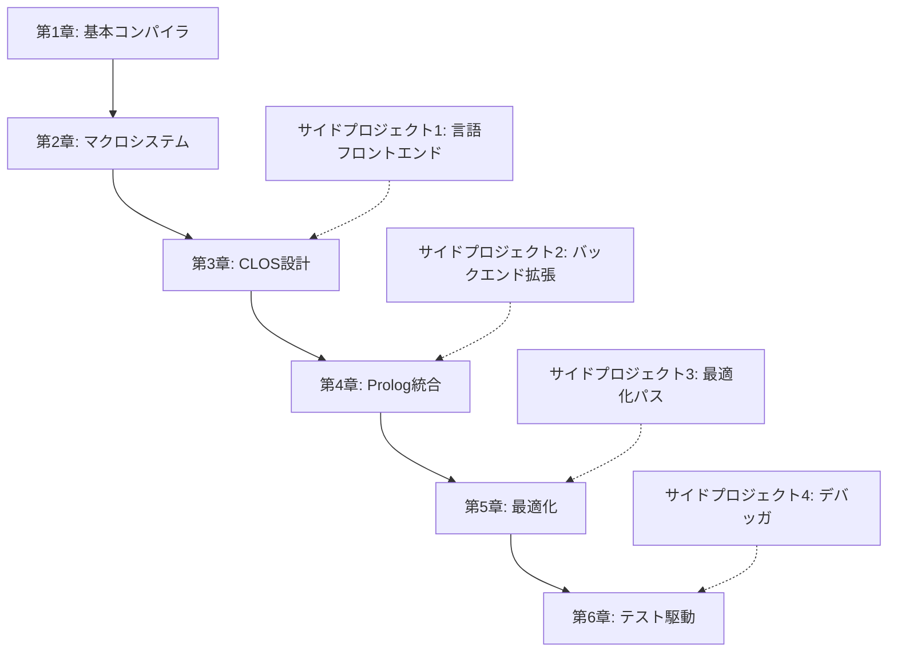

# CL-CC チュートリアル: コンパイラコレクション習得への道

## 🎯 学習目標

このチュートリアルシリーズでは、Common Lispを使ってコンパイラコレクションを構築する技術を段階的に習得します。理論と実践を組み合わせ、プロダクション品質のコンパイラを開発する能力を身につけることが目標です。

### 習得する核心技術
- **マクロ駆動開発**: コンパイル時計算と言語拡張の極致
- **CLOS活用**: 多重ディスパッチによる柔軟な拡張性
- **S式Prolog**: 制約ベースの型推論と最適化
- **Property-Based Testing**: 数学的証明に基づく品質保証
- **メタプログラミング**: 言語の境界を超えた抽象化

## 📚 学習パス

### 🌱 初級レベル（基礎習得）
学習時間目安: 20-30時間

#### [第1章: 最小コンパイラの実装](01-first-compiler.md) ⭐⭐☆☆☆
**学習時間**: 4-6時間
**前提知識**: Common Lispの基礎、簡単なマクロ理解

Common Lispを使った最初のコンパイラを実装します。S式の威力とCLOSによる拡張可能な設計を学びます。

**学習内容**:
- プロジェクトセットアップとモジュール構成
- CLOSによるAST（抽象構文木）設計
- S式パーサーの実装
- 中間表現（IR）の設計
- 基本的なコード生成（C/LLVM）
- マルチターゲット対応の基礎

**成果物**: 算術式を処理する基本コンパイラ

**習得技術**:
```lisp
;; CLOSによる拡張可能なAST設計
(defclass ast-node () (...))
(defclass binary-op-node (ast-node) (...))

;; 総称関数による段階的な処理
(defgeneric compile-to-ir (node))
(defmethod compile-to-ir ((node binary-op-node)) ...)

;; マクロによるDSL構築
(defmacro defcompiler (name &rest options) ...)
```

#### [第2章: マクロシステムの理解](02-macro-system.md) ⭐⭐⭐☆☆
**学習時間**: 5-7時間
**前提知識**: 第1章完了、マクロの基本概念

マクロを駆使した言語拡張とDSL（ドメイン特化言語）の構築方法を学びます。

**学習内容**:
- コンパイル時計算の活用
- 構文マクロとコンパイラマクロ
- DSL設計パターン
- マクロによる最適化
- リーダーマクロの応用

**成果物**: 独自構文をサポートする拡張可能コンパイラ

#### [第3章: CLOSによるアーキテクチャ設計](03-clos-extension.md) ⭐⭐⭐☆☆
**学習時間**: 6-8時間
**前提知識**: 第1-2章完了、CLOSの理解

CLOSの専門的な機能を活用した、に拡張可能なコンパイラアーキテクチャを設計します。

**学習内容**:
- 多重ディスパッチの活用
- Mix-inクラスによるモジュラー設計
- メタオブジェクトプロトコル（MOP）
- 動的クラス生成
- プラグインアーキテクチャ

**成果物**: プラグイン対応の高度にモジュラーなコンパイラ

### 🚀 中級レベル（実践応用）
学習時間目安: 30-40時間

#### [第4章: S式Prologの統合](04-prolog-integration.md) ⭐⭐⭐⭐☆
**学習時間**: 8-10時間
**前提知識**: 第1-3章完了、論理プログラミングの基礎

S式Prologを統合し、制約ベースの型推論と最適化を実現します。

**学習内容**:
- S式Prologエンジンの実装
- 単一化アルゴリズム
- 制約ベース型推論
- 論理的最適化ルール
- バックトラッキングと効率化

**成果物**: 論理推論による専門的な型システムと最適化

#### [第5章: 最適化パイプライン](05-optimization-pipeline.md) ⭐⭐⭐⭐☆
**学習時間**: 10-12時間
**前提知識**: 第1-4章完了、データフロー解析の基礎

プロダクション品質の最適化パイプラインを構築します。

**学習内容**:
- データフロー解析
- SSA（Static Single Assignment）変換
- 定数畳み込みとデッドコード除去
- ループ最適化
- インライン展開
- 関数間最適化

**成果物**: 専門的な最適化を行うコンパイラ

### 🎓 上級レベル（品質保証）
学習時間目安: 15-20時間

#### [第6章: テスト駆動開発](06-test-driven-development.md) ⭐⭐⭐⭐⭐
**学習時間**: 8-10時間
**前提知識**: 第1-5章完了、テスト理論の基礎

Property-Based TestingとTDDによる、数学的証明レベルの品質保証を実現します。

**学習内容**:
- Property-Based Testingの実践
- 生成的テストとシュリンキング
- メタモルフィックテスト
- ファズテストとカバレッジ解析
- 継続的テスト環境の構築

**成果物**: 証明レベルの品質を持つテストスイート

## 🗺️ 学習ロードマップ

### 段階的学習計画



### 習熟度チェックリスト

各章完了時に以下を確認してください：

#### 第1章完了時
- [ ] CLOSクラス階層を理解できる
- [ ] 総称関数と特殊化の概念を把握している
- [ ] 基本的なIR設計ができる
- [ ] 複数バックエンドの抽象化ができる

#### 第2章完了時
- [ ] マクロによるDSL設計ができる
- [ ] コンパイル時計算を活用できる
- [ ] 構文拡張の実装ができる
- [ ] リーダーマクロを使える

#### 第3章完了時
- [ ] 多重ディスパッチを適切に使える
- [ ] Mix-inによるモジュラー設計ができる
- [ ] MOPを使った動的プログラミングができる
- [ ] プラグインアーキテクチャを設計できる

#### 第4章完了時
- [ ] Prologエンジンを実装できる
- [ ] 単一化アルゴリズムを理解している
- [ ] 制約ベース型推論を実装できる
- [ ] 論理的最適化ルールを記述できる

#### 第5章完了時
- [ ] データフロー解析を実装できる
- [ ] SSA変換を理解している
- [ ] 各種最適化パスを実装できる
- [ ] パフォーマンス測定ができる

#### 第6章完了時
- [ ] Property-Based Testingを実践できる
- [ ] メタモルフィックテストを設計できる
- [ ] ファズテストを実装できる
- [ ] 継続的テスト環境を構築できる

## 🛠️ 開発環境

### 必須ツール
- **SBCL 2.3.0以降**: 最高のパフォーマンスとデバッグ機能
- **Quicklisp**: ライブラリ管理システム
- **SLIME/Sly**: Emacs統合開発環境
- **Git**: バージョン管理

### 推奨ツール
- **sb-cover**: コードカバレッジ測定
- **sb-profile**: プロファイリング
- **trivial-benchmark**: ベンチマーク測定

### 環境構築
```bash
# SBCL のインストール
curl -O https://prdownloads.sourceforge.net/sbcl/sbcl-2.3.9-x86-64-linux-binary.tar.bz2
tar xjf sbcl-2.3.9-x86-64-linux-binary.tar.bz2
cd sbcl-2.3.9-x86-64-linux
sudo sh install.sh

# Quicklisp のインストール
curl -O https://beta.quicklisp.org/quicklisp.lisp
sbcl --load quicklisp.lisp --eval "(quicklisp-quickstart:install)" --quit

# CL-CC のクローン
git clone https://github.com/yourusername/cl-cc.git
cd cl-cc
sbcl --eval "(ql:quickload :cl-cc)" --quit
```

## 📋 前提知識

### 必須知識
- **Common Lisp基礎**: リスト操作、関数定義、基本的なマクロ
- **関数型プログラミング**: 再帰、高階関数、不変性
- **オブジェクト指向**: クラス、継承、ポリモーフィズム

### 推奨知識
- **コンパイラ理論**: 字句解析、構文解析、意味解析の基礎
- **データ構造とアルゴリズム**: グラフ、木構造、探索アルゴリズム
- **論理プログラミング**: Prologの基本概念

### 学習リソース
- [Practical Common Lisp](https://gigamonkeys.com/book/) - Common Lisp入門
- [On Lisp](http://www.paulgraham.com/onlisp.html) - マクロの深い理解
- [The Art of the Metaobject Protocol](https://mitpress.mit.edu/books/art-metaobject-protocol) - CLOS/MOP詳説

## 🎯 学習効果を最大化するコツ

### 1. 実践重視のアプローチ
各章で学んだ技術を即座に実装に取り入れ、動作するコードを書き続けることが重要です。

### 2. コードレビューの活用
可能であれば、経験豊富な開発者からフィードバックを得ることで、品質の高いコードを書く習慣を身につけます。

### 3. テスト駆動の実践
最初から品質を意識し、テストファーストの開発習慣を身につけることで、確実性の高いコンパイラを構築できます。

### 4. パフォーマンス意識
常にパフォーマンスを測定し、理論と実測の両面からコンパイラの性能を評価する習慣を身につけます。

## 🔗 関連リソース

### 内部リンク
- [ハウツーガイド](../how-to/README.md) - 具体的な実装方法
- [リファレンス](../reference/README.md) - 技術仕様の詳細
- [説明](../explanation/README.md) - 設計思想と理論背景

### 外部リソース
- [Common Lisp HyperSpec](http://www.lispworks.com/documentation/HyperSpec/)
- [LLVM Tutorial](https://llvm.org/docs/tutorial/)
- [Crafting Interpreters](https://craftinginterpreters.com/)

## 📊 進捗追跡

### 学習ログテンプレート
```markdown
## 学習記録: 第X章

**学習開始日**: YYYY/MM/DD
**学習完了日**: YYYY/MM/DD
**実際の学習時間**: X時間

### 理解できたこと
-
-
-

### 苦労したポイント
-
-
-

### 実装した機能
-
-
-

### 次回への課題
-
-
-
```

### 成果物管理
各章で作成したコードは、適切なブランチで管理し、進捗を可視化することを推奨します。

```bash
git checkout -b tutorial/chapter-01
# 第1章の実装
git add -A && git commit -m "Complete chapter 01: Basic compiler"

git checkout -b tutorial/chapter-02
# 第2章の実装
git add -A && git commit -m "Complete chapter 02: Macro system"
```

---

*このチュートリアルシリーズを通じて、コンパイラコレクション開発技術を習得し、Common Lispとコンパイラ技術の真髄を体験してください。*